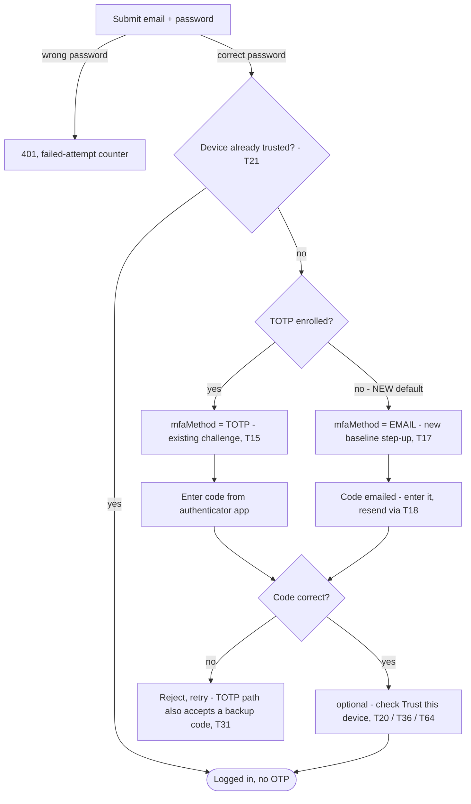
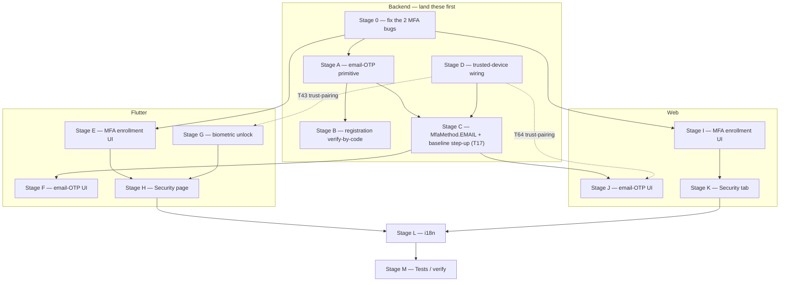

# convert-frontend-9-flutter — Strong auth: biometric unlock, real MFA management, and 6-digit email verification

**Date:** 2026-07-28 · **Planned against:** HEAD `9e3423d2` · **Status:** 📋 **PLANNING
ONLY — 0/73 tasks implemented.** Researched via 3 parallel deep-read passes (backend
auth/MFA surface, Next.js auth/MFA/security flows, Flutter current auth/MFA/security
state), each independently verifying file:line citations against current HEAD, plus
direct re-verification of the two highest-stakes claims (a backend MFA-enrollment bug
and a DTO length mismatch) before writing this doc, per this project's own
established "don't trust a single pass" discipline.

> Berkay: "Create a biometric authentication service — I need a detail md about
> biometric auth, mfa, login email verification 6 digit like strong auth mech in
> flutter." This doc is that plan. **No code has been changed yet.**

---

## Contents

1. How to use this doc
2. Executive summary — *2.1 what you'll actually be building, with flow diagrams*
3. Current state — Backend
4. Current state — Web
5. Current state — Flutter
6. Decisions (D1-D10)
7. Confirmed fine — no action needed (I1-I6)
8. Scope
9. Tasks — Stage 0 through Stage M, 73 tasks — *dependency diagram up top*
10. Verify loop
11. Open risks

---

## 1. How to use this doc

§3-§5 are the current-state picture per layer (backend, web, Flutter) — read these
for the "why" and the inventory of what's actually live vs. dead vs. simply absent.
§6 is decisions Berkay should make before or during implementation — this doc leans
more heavily on §6 than any predecessor in this chain, because unlike Settings/Feed/
Share (which had a Next.js source of truth to mechanically mirror), **two of this
doc's three features have no existing implementation on either platform to copy** —
biometric auth and 6-digit email codes are being designed here, not ported. §7 lists
things that look like gaps but are confirmed fine as-is. §9 is the actual
stage-ordered task list. §10 is the verify loop — read it before considering any
stage "done," since on-device biometric/TOTP/email verification cannot be proven by
`flutter test` or `flutter analyze` alone.

## 2. Executive summary

**The same "half-built next to fully-dead" pattern this project has now found in
auth/realtime (`convert-frontend-6`/`7`) and Settings/Feed/Share
(`convert-frontend-8`) recurs a third time here, on both platforms simultaneously.**
Web's `TwoFactorVerification.tsx` — a fully-built, segmented `InputOTP`-based 2FA
screen — has exactly one caller anywhere in `next-js-boilerplate/src`, and it's the
UI component gallery (`/v1/[lang]/ui/input-otp`), not the real login flow; its
"verification" is `code === "123456"` with zero network calls. Flutter's `InputOtp`
widget is the identical shape: fully built, zero real callers, only reachable from
its own demo route. **Both apps' actual login-time MFA challenge is a hand-rolled
plain 6-digit `<Input>`/`TextField`, not the segmented OTP component either app
already built for this exact purpose.** And both apps' "enable two-factor
authentication" toggle — web's Privacy tab, Flutter's Privacy tab, Flutter's
unreachable `/v1/:lang/security` page — is a `console.log`/no-op stub with zero
backend call. **MFA enrollment has never been built on any client, on either
platform, despite the backend fully supporting enroll/verify/disable since before
this doc's research began.**

Two new bugs, found and independently re-verified by direct file read (not just
relayed from research), block that gap from closing even if a client were built
today:

1. **`MfaService.verify()` cannot ever succeed on a fresh enrollment.**
   `enroll()` creates a new `MfaFactor` row with no `verifiedAt`
   (`nest-js-boilerplate/src/mfa/mfa.service.ts:41-47`). `verify()`'s first line
   calls `findVerifiedFactor(userId)`
   (`mfa.service.ts:53-54`), whose query requires **`verifiedAt: { not: null }`**
   (`mfa.service.ts:158-162`) — i.e. it looks for an *already-verified* factor to
   re-validate, not the pending one enrollment just created. Calling `verifyMfa`
   immediately after `enrollMfa`, the only order the resolver's own contract makes
   sense in, throws `NotFoundException('No verified TOTP factor found')` every
   time. The existing unit test doesn't catch this because it mocks
   `prisma.mfaFactor.findFirst` to return the factor unconditionally, ignoring the
   `where` clause (`mfa.service.spec.ts:122`), and the e2e test's MFA case
   (`test/auth.e2e-spec.ts:194-215`) was written against that same false
   assumption. **This must be fixed before any client enrollment UI is built** — a
   client built against the current API would work perfectly in a demo where the
   mock always returns success, and fail for every real user.
2. **Backup codes can never be submitted at the login MFA challenge.**
   `VerifyLoginMfaInput.code` is `@Length(6, 8)`
   (`nest-js-boilerplate/src/auth/dto/verify-login-mfa.input.ts:10-12`), but backup
   codes are **10 hex characters** (`randomBytes(5).toString('hex')`,
   `mfa.service.ts:191`). NestJS's global `ValidationPipe` rejects the input before
   `auth-login.service.ts`'s `verifyBackupCode()` fallback (`auth-login.service.ts:
   310-324`) is ever reached — confirmed by reading both files directly, not
   inferred. Backup-code recovery login is unreachable today, silently.

**Biometric auth is net-new everywhere** — zero references anywhere in the backend,
web, or Flutter (`grep -rniE "biometric|local_auth|webauthn|passkey|fido"` across all
three trees returns nothing beyond four unused Prisma columns shaped for a future
WebAuthn implementation nobody has built). This is correctly a Flutter-only,
device-local feature — web has no biometric hardware model to speak of, so there is
nothing to mirror from it, unlike every prior doc in this chain.

**"Login email verification 6 digit" has no existing precedent anywhere in this
stack to copy either.** Web's email verification is a 90-character opaque
**link** token (`/auth/verify-email?token=...`, 24h TTL) — a fine pattern for a
browser, but a well-known fragile one for mobile: this exact project already hit the
"a link opened from an email client doesn't reliably deep-link back into your app
instance" bug class once before, with OAuth redirects
([[convert-frontend-4-register]]). A 6-digit code the user reads from their inbox and
types back into the app sidesteps that whole failure class and is a genuinely
mobile-motivated improvement, not just parity theater. Recommended design (§6 D4):
build one shared backend "email OTP" primitive and use it for **two** call sites —
replacing/supplementing registration email verification, and finally implementing
`MfaMethod.EMAIL`, which has sat in the schema as a declared-but-100%-unimplemented
enum value since before this doc (`prisma/schema.prisma:72-77`; only `TOTP` has any
backing service code, confirmed by grep — `WEBAUTHN`/`SMS`/`EMAIL` are inert
literals).

**Recommended overall shape** (§6 has the individual decisions, none silently
assumed): password is always required; a device the backend doesn't already trust
additionally requires TOTP (if enrolled) or a 6-digit email code (if not) — actually
raising the security floor for every account, not just ones that opt into TOTP;
biometric authenticates *locally* against the device's already-issued,
already-secure-stored session, both as a fast app-unlock gate and as the mechanism
that proves "this is still the same person" when marking a device trusted. This ties
three previously-unrelated asks into one coherent story, but it is a real product
decision — most notably T17 (forcing email-OTP on any account without TOTP) changes
login behavior for every existing user, not just new opt-ins, and needs Berkay's
explicit sign-off, not just this doc's recommendation.

### 2.1 What you'll actually be building — the end-to-end flows

Before the file-by-file forensics in §3-§5, here's the shape of the actual
user-facing result. Task numbers here tie straight back to §9 — this section is a
map of it, not a substitute for it.

**Registration + email verification**
1. Submit email + password — unchanged.
2. The confirmation email now carries **both** the existing link and a new 6-digit
   code (T13).
3. Verify by clicking the link (unchanged, still works exactly as today) **or** by
   typing the code into a new segmented-entry screen (Flutter: T33, web: T63) —
   either one completes verification.

**Logging in — the one genuinely new decision**



Everything above the "correct password" branch already exists today. What changes
inside the TOTP/EMAIL boxes is *how* the code gets entered — both methods render
through the real `InputOtp`/`InputOTP` component instead of a plain text field
(Flutter: T35 rebuilds `_buildMfaState()` around it for both methods, not just a new
EMAIL-only screen sitting next to the old TOTP one; web: T61 does the same to
`login-form.tsx`). The two branches worth remembering because they're genuinely new
behavior, not a UI refresh:
- **No TOTP enrolled + device not yet trusted → an emailed code is now required
  too.** This is T17, **the single biggest behavior change in this entire doc** — it
  changes login for every existing account that's never touched MFA, not a new
  opt-in. Needs your explicit sign-off on the exact trigger condition, not just this
  diagram (§9 T17, §11).
- **Device already trusted → password alone is enough again, even with no TOTP.**
  The OTP step is skipped entirely (T20/T21).

**Turning on two-factor authentication — brand new, nobody has this today on either
platform**
1. Settings → Security → "Enable two-factor authentication" — this page currently
   either doesn't exist (web) or exists but is unreachable by tapping through the app
   (Flutter, §5.C) — T48/T65 fix that.
2. Scan the QR code (T26/T56) or copy the secret manually.
3. Enter the 6-digit confirm code from an authenticator app — this is where
   `InputOtp`/`InputOTP` gets its *first* real caller anywhere in either app (T27/T57).
4. See — and save — 10 one-time backup codes, shown exactly once (T28/T58).
5. Done: `mfaEnabled = true` server-side; every future login now follows the TOTP
   branch of the diagram above.

**Turning on biometric unlock — Flutter/mobile only, no web equivalent (D1)**
1. Settings → Security → "Enable biometric unlock" (T42/T50).
2. One `LocalAuthentication.authenticate()` prompt confirms the device actually has
   usable Face ID/fingerprint enrolled — fails closed with a clear message otherwise
   (T44), instead of silently flipping the toggle on for a device that can't back it.
3. From then on: every cold start or return from background shows a biometric prompt
   before the already-logged-in feed renders (T43). This gates access to a session
   that already exists — it doesn't create a new one or replace the password.

---

## 3. Current state — Backend (`nest-js-boilerplate`)

### 3.A Auth/MFA GraphQL & REST surface

`AuthResolver` (`src/auth/auth.resolver.ts`) exposes: `register`, `login`,
`verifyEmail`, `refresh` (CSRF-guarded), `logout` (CSRF-guarded),
`requestPasswordReset`, `resetPassword`, `loginWithOAuth`, `verifyLoginMfa`, plus a
dev-only `devActivateUser`. `MfaResolver` (`src/mfa/mfa.resolver.ts:1-35`, all behind
`SessionAuthGuard`) exposes `enrollMfa`, `verifyMfa(code)`, `disableMfa(code)` — no
`resetMfa` resolver, even though `MfaService.resetMfa()` exists
(`mfa.service.ts:129-156`, admin-shaped, unreachable via GraphQL today).
`SessionsResolver` (`src/sessions/sessions.resolver.ts:43-84`) exposes `mySessions`,
`revokeSession`, `revokeAllOtherSessions`.

`AuthPayload` (`src/auth/auth.types.ts:98-134`) carries `accessToken`, `refreshToken`,
`rbacToken`, `deviceToken`, `userToken`, `deviceId`, `user`, and the MFA-challenge
pair `mfaRequired`/`mfaToken`. There is no HTTP 202 anywhere in this — GraphQL is
always 200; "MFA required" is signalled purely by `mfaRequired: true` with the
session-token fields absent:

```ts
// src/auth/auth-login.service.ts:90-101
if (user.mfaEnabled) {
  const mfaToken = this.crypto.randomToken();
  const mfaTokenHash = this.crypto.sha256(mfaToken);
  await this.tokenStore.writeMfaChallenge(mfaTokenHash, {
    userId: user.id, email: user.email, role: user.role,
    tier: user.subscriptionTier ?? 'FREE',
  });
  return { mfaRequired: true, mfaToken, user };
}
```

The challenge itself lives in Redis, not Postgres — `TokenStoreService`
(`src/auth/token-store.service.ts:12-13, 273-302`) stores it under
`mfa:challenge:<sha256(mfaToken)>` for 300 seconds, single-use via `redis.getdel`.
This is the pattern §6/§9 propose reusing for the new email-OTP primitive — it
already solves short-TTL, single-use, opaque-key storage; email-OTP mainly adds
rate-limiting on top (a 6-digit space is far more guessable than this 90-char token).

Login itself already has abuse protection worth mirroring for the new OTP surface:
5 failed attempts locks the account 15 minutes (`MAX_FAILED_LOGINS`/`LOCK_MINUTES`,
`auth-login.service.ts:20-21`), and every mutation on `AuthResolver` is
`@Throttle`-decorated via `@nestjs/throttler` (`login`/`register`/`loginWithOAuth`/
`verifyLoginMfa` at 10/60s, password-reset at 5/300s —
`auth.resolver.ts:27,36,62,70,76,87`).

Also load-bearing for the biometric "trust this device" design (§6 D6): logging back
in when `user.status === 'PENDING_VERIFICATION'` is **blocked** with `"Please verify
your email first"` (`auth-login.service.ts:80-89`), even though registration itself
grants an immediate session (confirmed by `test/auth.e2e-spec.ts:94-123`: `register`
returns live tokens with `status: 'PENDING_VERIFICATION'`). So a user who registers,
then logs out before verifying, is fully locked out of logging back in until they
verify — this makes the "link is fragile on mobile" problem (§2) a real lockout risk,
not just friction, and strengthens the case for the 6-digit-code registration-verify
path (Stage B).

### 3.B MFA module — only TOTP is real

`MfaMethod` enum (`prisma/schema.prisma:72-77`): `TOTP | WEBAUTHN | SMS | EMAIL`.
Confirmed by grep and by direct read of `mfa.service.ts` and `auth-login.service.ts`:
**only `TOTP` has any backing logic** — `enroll()` hardcodes `method: 'TOTP'`
(`mfa.service.ts:44`), every factor lookup filters `method: 'TOTP'` explicitly.
`WEBAUTHN`/`SMS`/`EMAIL` are declared, unimplemented enum values.

Full TOTP lifecycle, direct-read-verified this session:

```ts
// src/mfa/mfa.service.ts:158-167 — used by BOTH verify() and disable()
private async findVerifiedFactor(userId: string) {
  const factor = await this.prisma.mfaFactor.findFirst({
    where: { userId, method: 'TOTP', verifiedAt: { not: null } },
    orderBy: { createdAt: 'desc' },
  });
  if (!factor?.secret) throw new NotFoundException('No verified TOTP factor found');
  return factor;
}
```

Using the *same* "must already be verified" helper is correct for `disable()` (you
can only disable a live factor) and wrong for `verify()` (which needs to find the
*pending* factor `enroll()` just created, in order to promote it) — this is §2's
bug 1, restated with the shared root cause visible: one helper, two callers, only one
of which its filter actually fits.

Backup codes: 10 codes, 10 hex chars each (`randomBytes(5).toString('hex')`,
`mfa.service.ts:187-196`), stored only as `sha256()` hashes, returned raw exactly
once from `verify()`'s `MfaVerifyPayload`. Single-use, checked only at the
**login-challenge** step (`verifyBackupCode()`, `auth-login.service.ts:310-324`) —
not reachable from `verifyMfa`/`disableMfa`, both of which require a live TOTP code.
Secret at rest: AES-256-GCM via `CryptoService` (`src/common/crypto/crypto.service.
ts:71-92`), key from the `ENCRYPTION_KEY` env var (already documented as required in
`requirements.md:44`).

### 3.C Email verification — link-based, not a code, no resend

`User.emailVerifiedAt: DateTime?` (`prisma/schema.prisma:244`) — "verified" is
non-null, there's no separate boolean. Verification uses the generic
`VerificationToken` model (`schema.prisma:442-456`) with `type:
'EMAIL_VERIFICATION'`, a **90-char opaque random token** (`CryptoService.
randomToken()`), 24h TTL (`EMAIL_TOKEN_TTL_MS`, `auth-registration.service.ts:24`),
delivered as a link:

```ts
// src/auth/auth-registration.service.ts:59-60, 97-104
const rawToken = this.crypto.randomToken();
const tokenHash = this.crypto.sha256(rawToken);
...
const verifyUrl = `${this.config.get('FRONTEND_URL', ...)}/auth/verify-email?token=${rawToken}`;
await this.mail.enqueue({ to: email, userId: user.id, subject: 'Confirm your email',
  template: 'email-verification', variables: { url: verifyUrl, name: user.name } });
```

Only 3 mail templates exist at all (`src/mail/templates/render.ts:45-138`):
`'email-verification'`, `'welcome-social'`, `'password-reset'` — no MFA/OTP template
of any kind. **No resend mutation exists** (confirmed by grep — `requestPasswordReset`
has a resend-equivalent for passwords, email verification does not). A dev-only
`devActivateUser` mutation (SUPERADMIN + `ALLOW_DEV_ACTIVATE=true`) exists to bypass
this entirely in dev/test.

**Nothing resembling a 6-digit code exists anywhere in the backend today** —
confirmed by grep for `sendCode|resendCode|6.digit|sixDigit|loginCode|emailCode`
across `src/` and `test/`: zero hits outside this doc's own research notes.

### 3.D Sessions, devices, and the unwired `trusted` column

`TokenStoreService.buildKey()` (`token-store.service.ts:38-49`) hashes all 4 session
tokens (access/rbac/device/user) into one compound Redis key; sessions are entirely
Redis-resident (sliding TTL, default 900s) — there is no Postgres session table.

`Device` (`prisma/schema.prisma:382-397`):

```prisma
model Device {
  id String @id @default(uuid(7)) @db.Uuid
  userId String @db.Uuid
  name String?
  token String @unique
  type DeviceType @default(WEB)
  ip String? @db.Inet
  fingerprint String?
  trusted Boolean @default(false)
  lastSeenAt DateTime? @db.Timestamptz(6)
  createdAt DateTime @default(now()) @db.Timestamptz(6)
}
```

`trusted` is schema-ready and **completely unwired** — confirmed by grepping `src/`
(excluding generated code) for `trusted`: zero matches outside the schema and its
generated types. No mutation sets it, no guard reads it, there is no "skip MFA on a
device I already trust" logic anywhere. This is the natural foundation for both
biometric-skip-MFA and "don't email-OTP a device I already know" (§6 D6) — but it
needs new logic built from nothing, not just wiring.

Similarly, `DeviceType` already has `MOBILE_IOS`/`MOBILE_ANDROID` values
(`schema.prisma:88-95`), but `DeviceService` hardcodes `type: 'WEB'` on every device
it creates (`device.service.ts:107,133,146`) — no server-side platform detection is
ever persisted, only used transiently for structured logging
(`common/utils/device-type.ts`).

`MfaFactor` (`schema.prisma:412-429`) already has WebAuthn-shaped columns
(`credentialId`, `publicKey`, `counter`, `transports`) sitting unused next to the
real TOTP `secret` column — a real WebAuthn implementation would slot into this
table, but building one is out of scope here (§8).

### 3.E Biometric/WebAuthn — confirmed absent

`grep -rniE "webauthn|passkey|fido|biometric" src/ prisma/ test/` (excluding
generated code) returns exactly the 4 `MfaFactor` column comments and the
`WEBAUTHN` enum literal — no npm package (`@simplewebauthn/*` or similar), no
service, no resolver, no test. Nothing to build on here beyond the schema shape.

---

## 4. Current state — Web (`next-js-boilerplate`)

### 4.A Login/MFA — inline, hand-rolled, no route change

`login-form.tsx` renders the MFA challenge **inline** via local component state, not
a route change:

```tsx
// src/features/auth/ui/login-form.tsx:54-60
} catch (err) {
  if ((err as Error & { mfaRequired?: boolean }).mfaRequired) {
    setMfaState({ mfaToken: ..., user: ... });
    return;
  }
```

The BFF's contract is explicit in its own doc comment:

```ts
// src/app/api/auth/login/route.ts:23-25
* When the user has MFA enabled, the backend returns mfaRequired:true instead of
* tokens. The BFF returns 202 with { mfaRequired: true, mfaToken } so the
* frontend can show the TOTP challenge form.
```

200 = `{ user, accessToken }` + 5 Set-Cookie headers. 202 = `{ mfaRequired: true,
mfaToken, user }`, no cookies yet (cookies are only set by the follow-up
`/api/auth/login/mfa` call). The actual code-entry field is a plain input, not the
`InputOTP` component:

```tsx
// src/features/auth/ui/login-form.tsx:153-158
<Input id="mfa-code-input" type="text" inputMode="numeric" pattern="[0-9]*" maxLength={6} .../>
```

### 4.B `TwoFactorVerification` — gallery-only, confirmed by grep

```tsx
// src/views/ui/input-otp/TwoFactorVerification.tsx:12
const MOCK_CODE = "123456";
```

`grep -rn "TwoFactorVerification" src` returns exactly 2 real hits beyond its own
definition, both inside `src/views/ui/input-otp/examples.tsx` — the UI component
gallery (`/v1/[lang]/ui/input-otp`). It has never been imported by `login-form.tsx`
or anything under `src/features/auth`. Success is checking `code === MOCK_CODE`, with
zero network calls in the file. This is web's exact mirror of Flutter's dead
`InputOtp` widget (§5.A) — same bug shape, independently on both platforms.

### 4.C Email verification and forgot-password — both link-based

`src/app/auth/` has exactly 6 files: `layout.tsx`, `login`, `register`,
`forgot-password`, `reset-password`, `verify-email` — no `mfa` page, no `oauth`
page (OAuth is pure API routes with no dedicated callback page component).
`verify-email/page.tsx` auto-verifies on mount from a `?token=` query param
(`src/features/auth/ui/verify-email-form.tsx:20-31`) — no code-entry input exists in
the file. `grep -rniE "resend" src` matches only inside the gallery mock
(`TwoFactorVerification.tsx`) — there is no real "resend" of anything in the shipped
app. Forgot-password (`src/views/auth/forgot-password/PageContent.tsx`) is the same
shape: email in, generic "check your email" out, real reset happens on a second page
reached via the emailed link's token.

**There is no precedent anywhere in the web app for "email a 6-digit code, user
types it into a segmented OTP UI"** — confirmed by exhausting every candidate file.
This mechanic has to be designed fresh on both platforms, not ported from web.

### 4.D Settings — no "Security" tab; Privacy's 2FA toggle is fully fake

`SettingsNav` (`src/components/settings/SettingsNav.tsx:14-21`) has exactly 6 tabs:
general, account, privacy, billing, api-keys, sessions. No security tab exists.

Privacy's 2FA toggle (`src/views/settings/privacy/FreePageView.tsx:17-27`) is a pure
stub:

```tsx
async function handleSave(toast, hideProfilePicture, useNickname, nickname, enable2FA) {
  const payload = { hideProfilePicture, useNickname, nickname, enable2FA };
  console.log("Saving privacy preferences:", payload);
  toast({ title: "Preferences saved", variant: "success" });
}
```

No API call, nothing persisted, and all 3 non-free tiers just re-export
`FreePageView` — every tier gets the identical fake toggle. The Sessions tab, by
contrast, is real and functional (`src/views/settings/sessions/FreePageView.tsx`) —
lists real sessions via `listSessionsServer`, supports revoke/revoke-all. This is
web's closest existing analog to a "trusted devices" UI, just filed under Sessions
instead of a Security concept. A `src/views/security/csp/` pair of files also exists
but is an unrelated CSP-nonce demo page, not an account-security page — don't
conflate the two (§7 I5 covers Flutter's identical false-cognate).

**Conclusion: there is no working MFA backend integration on web to port.** Both the
enrollment gap and the fake-toggle gap are pre-existing on web too, not something
this doc's Flutter focus is "behind" on (§6 D9).

### 4.E Session storage — httpOnly cookies, no client refresh-and-retry

`src/lib/api-client.ts:18-29`'s `apiFetch` only dispatches an `auth:logout` event on
401 and returns — it never calls a refresh endpoint or retries. `useAuth.tsx:109-119`
handles that event by clearing state and hard-redirecting to `/auth/login`, no retry.
Confirms the already-documented finding ([[convert-frontend-7-register]] Rev 15) that
web's own client is the *simpler*, not the more battle-tested, of the two apps here —
worth remembering while designing this feature so "web already solved this" isn't
assumed without checking, again.

### 4.F Biometric/WebAuthn — confirmed absent

`grep -rniE "webauthn|passkey|fido|navigator\.credentials"` across `src` returns zero
matches. Nothing to mirror; this is correctly a Flutter-native addition.

---

## 5. Current state — Flutter (`flutter-boilerplate`)

### 5.A Login/MFA — real `LoginResult` union, but the MFA field is hand-rolled too

Login is genuinely well-built: a sealed union type drives an exhaustive switch.

```dart
// lib/types/auth/auth_request_types.dart:3-16
sealed class LoginResult {}
class LoginSuccess extends LoginResult { final LoginResponse response; ... }
class LoginMfaRequired extends LoginResult {
  final String mfaToken; final AuthenticatedUser user; ...
}
```

```dart
// lib/views/auth/login/page_content.dart:88-109
switch (result) {
  case LoginSuccess(:final response):
    await ref.read(authProvider.notifier).setSession(...);
    if (mounted) context.go('/v1/$locale/feed');
  case LoginMfaRequired(:final mfaToken):
    setState(() { _mfaMode = true; _mfaToken = mfaToken; });
}
```

This correctly matches web's *actual* mechanic (inline state flip, not a route change
— §7 I1) — the earlier project decision to delete a separate `/auth/mfa` route
([[convert-frontend-4-register]]) was right and should stay that way.

But the MFA-verify step (`_buildMfaState()`, `page_content.dart:313-378`) uses a
plain `LabeledField`/`TextField` with a digits-only formatter and `maxLength: 6` —
**not** the `InputOtp` component. Grepped `InputOtp` across `lib/` excluding its own
folder: the only hits are its own demo route (`app/router.dart:895-899`,
`/v1/:lang/ui/input-otp`). Zero real callers — the identical shape as web's
`TwoFactorVerification.tsx` (§4.B), independently confirmed on both platforms.

The MFA-verify response itself is **untyped**: `MfaServer.call()`
(`lib/api/server/auth/mfa.dart:27-56`) returns `Map<String, dynamic>`, which
`page_content.dart:150` manually force-fits into `LoginResponse.fromJson(...)` — no
dedicated MFA-verify response type exists, unlike every other auth call in this
directory.

**No MFA-enrollment (enable/setup) call exists anywhere client-side** — grepped
`lib/api/server/auth/` and `lib/api/client/auth/`: only login-time *verification* is
implemented (`mfa.dart`), nothing calls `enrollMfa`/`verifyMfa`(setup)/`disableMfa`.

### 5.B Routes

`/auth/login`, `/auth/register`, `/auth/forgot-password`, `/auth/reset-password`,
`/auth/verify-email` (`lib/app/router.dart:225-253`, mirrored in
`lib/constants/routes.dart:9-13`) — no `/auth/mfa` (correct, matches web, §7 I1), no
OAuth-callback route (uses the `flutterboilerplate://` deep-link scheme instead,
`lib/lib/oauth_link_handler.dart`). One extra, non-`/auth/*` route:
`/v1/:lang/security` (§5.C).

### 5.C `/v1/:lang/security` — routed, but unreachable from any real navigation

Full render body of `lib/views/security/page_view.dart:17-52`: a `Card` with 3 rows —
a 2FA `SwitchListTile` hardcoded `value: false, onChanged: (_) {}`; a "Change
Password" `ListTile` with `onTap: () {}`; an "Active Sessions" `ListTile`, also
`onTap: () {}` (notably does **not** link to the real, working
`/v1/:lang/settings/sessions` page even though that page already exists and works).

Checked every plausible navigation source for a way in — `settings_shell.dart`'s
6-tab list (§5 below), `v1_nav.dart`'s 13-entry sidebar, `profile_section.dart`'s
footer links — **none of them reference this route or `SecurityPageContent` at all.**
It is reachable only by typing the URL manually. A second, same-shaped dead widget,
`SecurityFallback` (`lib/views/fallbacks/app/security_fallback.dart:6-7`), also has
zero call sites anywhere.

Separately, an *unrelated*, similarly-named feature exists and could cause naming
confusion during implementation: `lib/views/security/csp/nonce_panel.dart` and
`lib/api/server/security/nonce.dart` are a CSP-nonce (web security header) demo, not
an account-security page — same false-cognate as web's own `views/security/csp/`
(§4.D). Leave that alone; don't rename around it (§7 I5).

**No "change password" flow exists to link to, on either platform** — confirmed:
Flutter's only reference to it is this dead label string; `grep -rln -iE
"changepassword|change-password" next-js-boilerplate/src` returns zero files at all.
Web has never built one either (only the logged-out forgot-password → emailed-link
reset flow exists). This is a real, adjacent gap this research surfaced
incidentally, not something either of the 3 named asks (biometric/MFA/email-code)
covers — flagged as explicitly out of scope below (§8), not silently built.

### 5.D Privacy settings 2FA toggle — same fake shape as web

```dart
// lib/views/settings/privacy/page_view.dart:44, 95-101, 58-60
bool _enable2FA = false;
...
PrivacyToggleRow(title: t.settingsPrivacyTwoFactor, value: _enable2FA,
  onChanged: (v) => setState(() => _enable2FA = v), ...),
...
void _save() { showToast(context, 'Privacy settings saved'); }
```

Local `setState` only, no `ref.read(...)` action, no backend call, no persistence —
matches web's `console.log` stub behaviorally (both are fake), just implemented in
Dart instead of TypeScript.

### 5.E Auth API/type layer — full inventory

`lib/api/server/auth/` (11 files): `device_handshake`, `login` (branches
`LoginSuccess`/`LoginMfaRequired`), `logout`, `me`, `mfa` (untyped, §5.A), `oauth`,
`refresh_token`, `register`, `request_password_reset`, `reset_password`,
`verify_email` (token/link-based, matches web). `lib/api/client/auth/`: `actions.dart`
(wraps all of the above), `oauth.dart`, `queries.dart`. `lib/types/auth/`:
`auth_request_types.dart` (`LoginResult`/`LoginRequest`/`LoginResponse`/
`RegisterRequest`/`RegisterResponse` — no MFA-specific response type),
`oauth_types.dart`, `user.dart` (`AuthenticatedUser` — no MFA-enabled flag, no
biometric flag, no session-list field on the user model itself).

### 5.F Session storage

`lib/hooks/use_auth.dart:11-18` — `flutter_secure_storage` keys: `access_token`,
`refresh_token`, `rbac_token`, `device_token`, `user_token`, `session_user`.
`getAuthTokens()` (lines 70-87) returns the 4-token bundle or `null`. This is the
store biometric unlock will gate access *to*, not replace (§6 D1, §7 I6) — no new secret
needs to be introduced, only a new local boolean flag (§9 T41).

### 5.G Biometric readiness — zero scaffolding, but the platform floor is fine

`grep -rniE "biometric|local_auth|LocalAuthentication|FaceID|fingerprint|passkey|
webauthn"` across `lib/`, `test/`, `pubspec.yaml`, `pubspec.lock` returns **zero
hits** — nothing dead or otherwise to build on. `pubspec.yaml` has no `local_auth`
dependency; `flutter_secure_storage: ^10.3.1` is already present (§5.F). `crypto` is
only a transitive dependency today, unused directly anywhere in `lib/`.

Directly re-verified this session (not just relayed): `android/app/build.gradle`
inherits `minSdk = flutter.minSdkVersion`, which resolves to **24**
(`/opt/flutter/packages/flutter_tools/gradle/src/main/kotlin/FlutterExtension.kt:25`,
this server's actual installed Flutter 3.44.2 toolchain) — comfortably above the
API 23 floor `local_auth_android`'s modern `BiometricPrompt`-based implementation
needs. **No gradle/manifest SDK bump required** (§7 I4). `AndroidManifest.xml`
currently declares only `INTERNET`; `ios/Runner/Info.plist` has no
`NSFaceIDUsageDescription` key (required for Face ID access) — both need a new entry
(§9 T39), and no QR-code rendering package exists anywhere in `pubspec.yaml` (needed
for Stage E's TOTP-enrollment screen, §6 D10).

### 5.H Existing test baseline

`test/views/auth/login_test.dart` (275 lines, 7 tests) already has a real MFA test —
`'MFA flow renders challenge, validates code, verifies'` (line 206) — that mocks
`LoginMfaRequired`, asserts the challenge UI, validates the length-error path, then
completes login. This is the pattern to extend for Stage E/F/G's new tests, not
invent a new one.

---

## 6. Decisions

Every one of these is a real fork found during research; several (D5, D7, D9) are
genuine product-scope choices this doc explicitly refuses to assume silently, per
this project's own established discipline. All have a recommendation.

- **D1 — Biometric = a device-local re-authentication gate around the already-issued
  session, not a server-recognized WebAuthn/passkey credential.** Recommended:
  local-only. `local_auth` + `flutter_secure_storage` gives the standard mobile
  pattern (bank-app-style unlock) with zero backend changes. A real WebAuthn/passkey
  implementation is a much larger, separate project — the schema has placeholder
  columns for it (`MfaFactor.credentialId/publicKey/counter`, §3.D) but zero backing
  logic anywhere, and building it is out of scope here (§8) unless Berkay
  specifically wants that instead of (not in addition to) the local-gate approach.
- **D2 — Fix both §2 backend bugs as a Stage 0 prerequisite, before any client
  enrollment UI is built.** Not really optional — a client built against the current
  broken `verifyMfa` contract would appear to work in any mocked test and fail for
  every real user; recommend treating this as a blocking bugfix independent of the
  rest of this doc's timeline, the same way *`convert-frontend-8-flutter.md`'s own*
  Stage K (reaction/comment field bugs — an unrelated stage in that other document,
  not to be confused with this doc's own Stage K below) was flagged as a pull-forward
  priority.
- **D3 — Widen `VerifyLoginMfaInput.code`'s `@Length(6, 8)` to accommodate 10-char
  backup codes**, rather than shrinking backup codes to fit the existing DTO.
  Recommended: backup codes are a recovery-of-last-resort mechanism; narrowing their
  entropy to satisfy a validation decorator is optimizing the wrong side of that
  trade-off.
- **D4 — Build one shared backend "email OTP" primitive (6-digit numeric, short TTL,
  rate-limited) and use it for two call sites**: registration email verification
  (§9 Stage B) and a new, finally-real `MfaMethod.EMAIL` (§9 Stage C) — instead of
  two independent one-off mechanisms. Recommended because it retires a dead enum
  value instead of adding a fourth parallel auth concept, and because the mobile
  deep-link fragility argument (§2, §3.C) applies equally to both use cases.
- **D5 — Is email-OTP an *enrolled alternative* to TOTP (user explicitly picks one
  factor) or an *automatic default* for any account without TOTP enrolled (raises
  the floor for every user, not just opt-ins), or both?** Recommended: **both** —
  this is what actually makes the feature "strong auth" for the whole user base
  rather than a power-user opt-in; see D5's implementation in T17, which is flagged
  there as the single biggest behavior change in this doc and needs explicit sign-off
  before shipping, not just this recommendation.
- **D6 — Build out `Device.trusted` now, not later.** Recommended: yes — both
  biometric-skip-on-a-known-device and "don't email-OTP a device I already know"
  depend on it, and the column already exists doing nothing (§3.D). Needs one new
  design choice alongside it: the schema only has a boolean, no expiry — recommend
  adding a `trustedUntil: DateTime?` column for a rolling trust window (e.g. 30 days)
  rather than "trusted forever until manually revoked," matching common
  remember-this-device UX conventions elsewhere.
- **D7 — Biometric covers both app-unlock (gate re-entry to an already-valid session
  after cold start/background) and step-up trust-pairing at login (mark this device
  trusted after a successful password+OTP login, confirmed via biometric).**
  Recommended: build both, staged — unlock first (§9 Stage G), trust-pairing second
  (depends on D6/Stage D landing first).
- **D8 — Resurrect `/v1/:lang/security` as the real home for all of this**: fold it
  into `SettingsNav` as a 7th tab (`settings_shell.dart:56-93` already has the exact
  pattern to extend, §5.C), replace its 3 stub rows with real MFA status/biometric
  toggle/a working sessions link, and remove the now-redundant fake toggle from the
  Privacy tab rather than leaving two switches for one concept. Recommended: mirrors
  `convert-frontend-8`'s own D2 in shape — mount the already-routed, already-named
  thing instead of inventing a new page or leaving the feature scattered.
- **D9 — Flutter-only, or also fast-follow web?** Web has the *identical* gap
  (fake toggle, gallery-only OTP component, §4) — this isn't "Flutter catching up to
  web," it's "neither platform has this yet." **Decided 2026-07-28: yes, build both.**
  Berkay confirmed both clients ship together, not Flutter-first-web-later — §9 Stages
  I/J/K now fully task-spec web's client work at the same detail level as Flutter's
  Stages E/F/H, instead of the placeholder sketch this bullet originally pointed to.
  Backend Stages 0/A/B/C/D were always shared regardless; this decision only changes
  the client-side scope. Note this does **not** extend to biometric (D1) — that stays
  Flutter/mobile-only. A browser-side equivalent exists in principle (WebAuthn
  platform authenticators — Face ID via Safari, Windows Hello via Chrome/Edge), but
  it's a materially bigger lift than the MFA/email-OTP parity work below (real
  WebAuthn registration/assertion ceremony, `@simplewebauthn/server` on the backend,
  a new browser-API integration) and wasn't part of what Berkay asked to mirror to
  web — flagged here rather than silently included or silently dropped; say the word
  if you want it scoped too.
- **D10 — Add `qr_flutter`** (small, standard, actively maintained) **for TOTP
  enrollment's QR code**, rather than shipping the `otpauthUrl`/`secret` as
  copy-paste-only text. Recommended: this is a one-time-per-user screen, so a small
  new dependency is easy to justify against the real UX cost of manual secret entry
  (error-prone, and every competing app in this space scans a QR).

## 7. Confirmed fine — no action needed

- **I1** — Flutter's login-MFA challenge is correctly inline (state flip, not a
  route), matching web's actual mechanic. The earlier decision to delete a separate
  `/auth/mfa` route ([[convert-frontend-4-register]]) was correct — don't reintroduce
  one for this feature either; the new email-OTP step-up (Stage F) should extend
  `_buildMfaState()`'s existing branch, not add a route.
- **I2** — CSRF handling for `refresh`/`logout` is already correctly implemented in
  Flutter ([[convert-frontend-7-register]] Rev 15) — nothing in this doc touches or
  needs to touch that path.
- **I3** — Registration granting an immediate session without waiting for email
  verification (§3.A, §3.C) is existing, intentional behavior matching web exactly.
  This doc's Stage B (email-OTP for registration verification) should change *how*
  verification happens, not *whether* login is gated on it beforehand.
- **I4** — `android/app/build.gradle`'s inherited `minSdk` already resolves to 24
  (directly confirmed against the installed Flutter SDK, §5.G) — no manifest/gradle
  version bump needed for `local_auth_android`.
- **I5** — The CSP-nonce "security" pages (`views/security/csp/` on both platforms)
  are an unrelated meaning of the word and don't need renaming — different route
  namespace, no real collision risk, just don't get confused mid-implementation.
- **I6** — `flutter_secure_storage` (already a dependency, already holding session
  tokens, §5.F) is sufficient as the store biometric unlock gates access to — no need
  for the separate `biometric_storage` package some guides suggest; `local_auth`'s
  `authenticate()` challenge plus the existing secure storage gives the same
  effective security property for this use case.

## 8. Scope

**In scope:** every gap in §3-§5 with a corresponding task in §9.

**Out of scope, deliberately:**
- A real WebAuthn/passkey implementation (D1's non-default option) — the schema has
  placeholder columns for it, but building real credential registration/assertion is
  a much larger, separate project.
- The `SMS` `MfaMethod` enum value — stays unimplemented; this repo has no SMS
  provider integrated anywhere, and nothing in Berkay's ask mentioned SMS.
- A real "change password" flow (logged-in, not the forgot-password reset) — a
  genuine gap found incidentally (§5.C) on **both** platforms, but not one of the 3
  named asks and not built here; the resurrected Security page's row for it (§9 T49)
  should say so honestly rather than silently ship a second dead tap target.
- `resetMfa`'s admin-facing exposure (service method already exists, no resolver,
  §3.A) — unrelated to end-user strong auth.
- A real WebAuthn/passkey implementation **on web** (D9's browser-biometric aside) —
  same reasoning as the Flutter-side exclusion above, bigger project than what's
  scoped here.
- Replacing web's 24h link-based email verification — Stage J adds the 6-digit code
  as an **additional** option alongside the existing link (§4.C: web has none of
  Flutter's mobile deep-link fragility problem, so there's no forcing reason to drop
  the link there the way there was motivation to lead with a code on Flutter).

---

## 9. Tasks

Sizes: **S** ≈ ≤2h, **M** ≈ ≤half day, **L** ≈ ≥1 day or blocked on a §6 decision.

**Stage dependency map** — backend stages (top) gate both client columns; within a
column, top-to-bottom order matters, but the two columns themselves are peers that
can run in parallel once their backend prerequisite lands (D9: Flutter and web ship
together, not sequentially):



In words, the same graph: **Stage 0 blocks Stages E and I entirely** — don't build
enrollment UI on either platform against a backend that can't complete enrollment.
**Stage A blocks Stages B and C**, which in turn block Stages F and J. **Stage D
should land before Stage C's T17, Stage G's T43, and Stage J's T64** specifically
(the solid arrows above are hard blockers; the dotted ones are just those two tasks).
Stages L and M are last regardless, since they consume everything above them.

### Stage 0 — Backend: fix the two bugs blocking any client MFA work (§2, D2)

*Nothing downstream can be built or tested against an enrollment API that's
currently broken for every real user — this lands first, before any UI work.*

- [ ] **T1 (S) — Fix `MfaService.verify()`'s factor lookup.** Replace the
  `findVerifiedFactor(userId)` call at `mfa.service.ts:54` with a lookup for the
  *pending* factor `enroll()` just created (newest `TOTP` factor for this user,
  `verifiedAt: null`, ordered by `createdAt desc`) — leave `findVerifiedFactor` (the
  `verifiedAt: {not: null}` version) as-is for `disable()`'s use at
  `mfa.service.ts:102`, where "must already be verified" is correct.
- [ ] **T2 (S) — Add a regression test proving enroll→verify succeeds** in
  `mfa.service.spec.ts`, using a real (non-unconditional) mock of
  `prisma.mfaFactor.findFirst` that actually respects the `where` clause — the
  current test's unconditional mock is *why* T1's bug shipped undetected
  (`mfa.service.spec.ts:122`). Verify it fails against pre-fix code before confirming
  it passes post-fix, per this project's established bar.
- [ ] **T3 (S) — Resolve the backup-code-length DTO mismatch** (D3): widen
  `VerifyLoginMfaInput.code`'s `@Length(6, 8)` to `@Length(6, 10)`
  (`src/auth/dto/verify-login-mfa.input.ts:11`).
- [ ] **T4 (S) — Add a regression test for backup-code login** at the
  `verifyLoginMfa` challenge step (`auth.service.spec.ts` or a new
  `auth-login.service.spec.ts` case) — log in as an MFA-enabled user, submit a real
  10-char backup code, confirm it's accepted and single-use (second attempt with the
  same code fails). Confirmed absent from `test/auth.e2e-spec.ts` today (§3.A).

### Stage A — Backend: shared email-OTP primitive (D4)

*One 6-digit-code primitive, built once (mirroring the existing Redis MFA-challenge
pattern), reused by Stage B and Stage C instead of two one-off mechanisms.*

- [ ] **T5 (M) — New `EmailOtpService`** (`src/auth/email-otp.service.ts` or
  `src/mfa/`, team's call on module boundary) generating a 6-digit numeric code
  (`crypto.randomInt(100000, 999999)`, not `randomToken()` — this needs to be
  short and human-typeable, unlike every existing token in this codebase).
- [ ] **T6 (S) — New Redis key pattern mirroring `writeMfaChallenge`/
  `consumeMfaChallenge`** (`token-store.service.ts:273-302`) — e.g.
  `email_otp:<purpose>:<sha256(subjectId)>`, short TTL (recommend 10 minutes,
  distinct from the MFA challenge's 5-minute `mfaToken` TTL, which wraps the *whole*
  challenge, not the code itself), single-use via `getdel`. `purpose` distinguishes
  registration-verify from login-step-up so the same primitive can't be replayed
  across contexts.
- [ ] **T7 (S) — Rate-limit code *attempts*, not just requests** — a 6-digit space
  (1,000,000 combinations) is far more guessable than this codebase's existing
  90-char tokens; mirror the existing `MAX_FAILED_LOGINS`/lockout shape
  (`auth-login.service.ts:20-21`) at the OTP-verify level: invalidate the challenge
  after N wrong attempts (recommend 5, matching login's own constant) rather than
  leaving it guessable for its full TTL. `@Throttle` alone (T5's mutation-level rate
  limit) caps *request rate*, not *attempts against one still-valid code* — both are
  needed.
- [ ] **T8 (S) — New mail template**, e.g. `'email-otp'`, added to
  `src/mail/templates/render.ts:45-138`'s existing 3-template set — plain "Your code
  is `123456`, expires in 10 minutes" content, following the existing templates'
  structure exactly (don't invent a new templating convention for one more
  template).
- [ ] **T9 (S) — Resend mutation** with its own cooldown (recommend 60s between
  sends, independent of the attempt-rate-limit in T7) — email verification currently
  has *no* resend at all (§3.C); this fixes that gap for both call sites (Stage B/C)
  in one place.
- [ ] **T10 (M) — Unit tests** for generation/verification/expiry/single-use/
  rate-limiting, following `mfa.service.spec.ts`'s existing structure.
- [ ] **T11 (S) — New env vars if needed** (OTP TTL, resend cooldown, max attempts) —
  check whether hardcoded constants (matching this module's existing style, e.g.
  `MFA_CHALLENGE_TTL`) are sufficient before adding new `Joi`-validated env entries;
  don't add config surface area this app doesn't otherwise have for comparable
  constants.

### Stage B — Backend: wire email-OTP into registration verification (D4, D9)

*Registration email verification gets a code option alongside its existing link —
mainly to sidestep Flutter's mobile deep-link fragility (§2), though web gets it
too per D9.*

- [ ] **T12 (M) — New resolver path**: either extend `verifyEmail` to accept a
  6-digit code in addition to a token, or add a parallel `verifyEmailCode(userId,
  code)` mutation — team's call based on whether Stage I (web) ever needs to
  disambiguate which mechanism a given account is using. Recommend the parallel
  mutation: keeps the existing token-based `verifyEmail` (web's contract, §7)
  completely untouched.
- [ ] **T13 (S) — Send the code alongside (or instead of) the link at registration**,
  gated by which client is registering if both link and code need to coexist (D9) —
  simplest: `AuthRegistrationService` sends both in the same email
  (`auth-registration.service.ts:97-104`) using T8's new template merged into the
  existing one, so either client can complete verification with whichever mechanism
  it supports, no client-type detection needed server-side.
- [ ] **T14 (S) — e2e test**: register, pull the code from the queued mail (mirroring
  `test/auth.e2e-spec.ts:136-152`'s existing token-extraction pattern), verify via
  the new mutation, confirm `emailVerifiedAt` set and status `ACTIVE` — same
  assertions as the existing link-based test, new entry path.

### Stage C — Backend: `MfaMethod.EMAIL` + baseline step-up (D4, D5)

*Makes the dormant `MfaMethod.EMAIL` real, and — the single biggest behavior change
in this doc (T17) — requires it by default for any account without TOTP enrolled,
on a device that isn't yet trusted.*

- [ ] **T15 (M) — Add a `mfaMethod` field to `AuthPayload`'s challenge shape**
  (`auth.types.ts:98-134`) so a client knows whether to render "enter your
  authenticator code" or "check your email" — extend the `mfaRequired` branch in
  `auth-login.service.ts:90-101` to read the user's configured method (recommend: a
  new nullable field is simplest — `User` has no `mfaMethod` scalar today, only
  `mfaEnabled`; a user's method is really "whichever `MfaFactor` row they have," so
  read it from there rather than duplicating it onto `User`). When the method is
  `EMAIL`, trigger T5's OTP send as part of returning `mfaRequired: true` (the
  existing TOTP path sends nothing at this point, since the code lives in an
  authenticator app the server never touches — EMAIL is different, the server must
  act here).
- [ ] **T16 (S) — Extend `verifyLoginMfa`** to validate an EMAIL-method code via
  Stage A's primitive instead of `verifyTotpCode`
  (`auth-login.service.ts:290-308`) when the challenge's method is EMAIL — same
  `mfaToken`-scoped challenge wrapper either way, just a different inner check.
- [ ] **T17 (L) — Baseline step-up (D5's "both" recommendation): if a user has no
  TOTP enrolled, require an EMAIL OTP at login too, at least from a device the
  backend doesn't already recognize as trusted** (depends on Stage D landing first,
  or this becomes "every login for every unenrolled user," which is real friction
  worth avoiding). This is **the single biggest behavior change in this doc** — it
  changes login for every existing account that has never touched MFA, not just new
  opt-ins. Needs Berkay's **explicit** sign-off on the exact trigger condition
  (every login? only new/unrecognized devices? only after N days since last login?)
  before implementation, not just this doc's recommendation to build it.
- [ ] **T18 (S) — Resend-code mutation** reusing T9, scoped to an in-progress login
  challenge (needs the `mfaToken` to identify which challenge to resend for, not a
  bare email address, to avoid leaking whether an email has an account).
- [ ] **T19 (M) — Tests**: EMAIL-method challenge end-to-end, resend, and — once
  T17's exact trigger is settled — the new baseline-step-up path specifically,
  including a check that it does *not* fire for a trusted device (depends on Stage
  D).

### Stage D — Backend: trusted-device wiring (D6)

*Gives the schema's already-existing, currently 100%-unused `Device.trusted`
column real logic, so a known device can skip the OTP step next time.*

- [ ] **T20 (M) — New `trustCurrentDevice` mutation** (`SessionAuthGuard`-protected),
  settable right after a successful MFA/OTP verification (matches the common
  "remember this device for 30 days" UX convention) — sets `Device.trusted = true`
  plus a new `trustedUntil: DateTime?` column (schema migration needed, per D6 — the
  existing boolean alone can't express a rolling window).
- [ ] **T21 (S) — Read `Device.trusted`/`trustedUntil`** in T17's step-up decision to
  skip the forced OTP for a device that's both known (device-token match) and still
  within its trust window.
- [ ] **T22 (S) — Surface `trusted` on the existing `mySessions` query**
  (`SessionInfo` type, `src/sessions/sessions.resolver.ts:43-53`) so the Sessions
  settings page (already real, §4.D/§5.C) can show/label trusted devices — small,
  reuses an existing, working query rather than building a new one.
- [ ] **T23 (S) — Set `Device.type` to the real platform** instead of the hardcoded
  `'WEB'` literal (`device.service.ts:107,133,146`) — needed so a trusted-device list
  can show "iPhone" vs. "Chrome on Windows" meaningfully rather than "Web" for
  everything. Flagged as adjacent-but-worth-bundling with this stage rather than a
  strict requirement for T20-T22 to function.
- [ ] **T24 (M) — Tests** for trust-setting, trust-window expiry, and the
  step-up-skip behavior from T21.

### Stage E — Flutter: MFA enrollment/management UI (Stage 0 must land first)

*Flutter's first-ever MFA enrollment UI: scan a QR, confirm a code, save backup
codes, disable later — none of this exists on any client today.*

- [ ] **T25 (M) — New typed request/response models**, retiring the untyped
  `Map<String, dynamic>` MFA path (`lib/api/server/auth/mfa.dart:27-56`,
  `lib/api/client/auth/actions.dart:24-27`, §5.A): `MfaEnrollResponse{otpauthUrl,
  secret}`, `MfaVerifySetupResponse{enabled, backupCodes}` in `lib/types/auth/`, plus
  new server calls for `enrollMfa`/`verifyMfa`(setup)/`disableMfa` — currently zero
  client-side callers for any of the three (§5.A).
- [ ] **T26 (M) — Add `qr_flutter`** (D10); new enrollment screen rendering the QR
  from `otpauthUrl` + a manual-entry fallback showing `secret` as text.
- [ ] **T27 (M) — Code-confirm step calling the new `verifyMfa`** — this is where
  `InputOtp` (`lib/components/ui/input_otp/input_otp.dart`) finally gets a real
  caller, its first anywhere in the app (§5.A).
- [ ] **T28 (M) — Backup-codes-display screen**: show the 10 codes exactly once
  post-verify, with an explicit "I've saved these" confirm-to-continue gate (standard
  authenticator-app UX). No web equivalent exists to mirror (§4.D confirms web has
  never built this either) — design fresh; keep it simple (list + copy-all, optional
  share via the already-present `url_launcher`/share plumbing).
- [ ] **T29 (S) — Disable-MFA flow**: code-confirm (reuse T27's screen in a
  "disable" mode) → call `disableMfa`.
- [ ] **T30 (S) — Update `_verifyMfa()`** in `views/auth/login/page_content.dart:
  134-173` to consume T25's typed response instead of hand-reconstructing
  `LoginResponse.fromJson` from a raw map — a code-quality fix, not required for
  correctness, but touches this file anyway this stage.
- [ ] **T31 (M) — Backup-code entry at the login MFA challenge.** Today's
  `_buildMfaState()` only has one fixed 6-digit numeric field (§5.A) — add a
  "use a backup code instead" toggle switching to a length-flexible alphanumeric
  field (matching whatever T3 settled backup codes at — currently 10 hex chars).
- [ ] **T32 (M) — Widget tests** for enroll → QR-render → verify → backup-codes-shown
  → disable, mocking the new server calls — follow
  `test/views/auth/login_test.dart`'s existing MFA-mock pattern (§5.H).

### Stage F — Flutter: email-OTP UI (Stage A/B/C must land first)

*Real screens for the new 6-digit codes from Stages A-C — registration verify and
login step-up both render through `InputOtp`, and T35 finally retires the login
challenge's old plain-text field for TOTP too, not just for the new EMAIL path.*

- [ ] **T33 (M) — New segmented 6-digit entry screen for registration email
  verification**, using `InputOtp`, alongside (or replacing, per D9/T12's decision)
  the current token-based `VerifyEmailPageContent`.
- [ ] **T34 (S) — Resend button with a visible cooldown timer** (matches T9/T18's
  backend cooldown), localized countdown copy.
- [ ] **T35 (M) — Rebuild `_buildMfaState()`'s code-entry field around `InputOtp`
  for *both* methods, not a new EMAIL-only screen bolted next to the old one.**
  Branch on T15's new `mfaMethod` field for copy/affordances only — "enter your
  authenticator code" vs. "check your email" (+ resend, EMAIL only), wired to
  `verifyLoginMfa`'s EMAIL branch (T16) — while TOTP and EMAIL share the same
  `InputOtp` widget underneath. Building this as two structurally different paths
  (new `InputOtp` screen for EMAIL, old plain `TextField` left untouched for TOTP)
  would leave §2's headline bug — a hand-rolled field sitting next to the unused
  proper component — half-fixed instead of actually fixed; the point of touching
  this file is retiring the old field for both methods, not adding a second one
  beside it.
- [ ] **T36 (S) — "Trust this device" checkbox** on the step-up screen, wired to
  T20's mutation (shown only once Stage D has landed).
- [ ] **T37 (S) — Update `LoginMfaRequired`** (`types/auth/auth_request_types.dart:
  3-16`) to carry the new `mfaMethod` field from T15.
- [ ] **T38 (M) — Widget tests** for both new OTP screens, the resend-cooldown
  behavior, and the method-branching copy.

### Stage G — Flutter: biometric local authentication (D1, D7)

*The one feature that's genuinely new on every platform, not just unbuilt on this
one: device-local biometric unlock via `local_auth`, gating the session Flutter
already has rather than replacing it.*

- [ ] **T39 (S) — Add `local_auth` to `pubspec.yaml`**; add
  `NSFaceIDUsageDescription` to `ios/Runner/Info.plist` (currently absent, §5.G);
  confirm at implementation time whether the plugin's current version wants an
  explicit `<uses-permission android:name="android.permission.USE_BIOMETRIC"/>` entry
  (varies by plugin version — Android's modern `BiometricPrompt` API generally
  doesn't require a manifest permission, but verify against the installed version's
  own docs rather than assuming). minSdk 24 already clears the floor (§7 I4).
- [ ] **T40 (M) — New `hooks/use_biometric.dart`** wrapping `LocalAuthentication`
  (`canCheckBiometrics`, `isDeviceSupported()`, `authenticate(reason: ...)`), exposed
  via a Riverpod provider through `riverpod_compat` per the repo-wide import rule.
  `local_auth` cannot run under `flutter test` on this headless server (no platform
  channel, no AVD — a standing limitation of this environment, not this feature) —
  the provider needs a fake/override seam from day one so Stage G's own tests (T47)
  aren't blocked on real hardware. Check `hooks/use_push_notifications.dart` (a
  comparable platform-channel-backed provider already in this codebase) for a
  reusable testing seam before inventing a new pattern.
- [ ] **T41 (S) — New secure-storage flag** (`biometric_enabled`, alongside the
  existing key constants in `hooks/use_auth.dart:11-16`) — persists opt-in only; no
  new secret is introduced (§7 I6) — biometric gates access to the already-stored
  session tokens, it doesn't replace them.
- [ ] **T42 (M) — "Enable biometric unlock" toggle** (lands on the resurrected
  Security page, Stage H) — on enable, runs one real `authenticate()` challenge
  before flipping the flag on, so a device with no biometrics actually enrolled fails
  closed with a clear message instead of silently "succeeding."
- [ ] **T43 (L) — App-unlock gate**: a wrapper shown on cold start and on
  `AppLifecycleState.resumed` (post-backgrounding) when `biometric_enabled` is true
  and a valid session already exists — blocks the authenticated route tree behind one
  `authenticate()` call. Needs care around composing with `app/router.dart`'s
  existing auth-redirect logic rather than racing it.
- [ ] **T44 (S) — Fallback path**: device biometrics later disabled/unenrolled at the
  OS level after the app's toggle was already on — detect via `canCheckBiometrics` at
  gate-check time and fall back to re-entering the password rather than a hard
  lockout.
- [ ] **T45 (S) — Disable-biometric entry** (clears the flag; no server call needed).
- [ ] **T46 (S) — i18n copy** for every new string (enable/disable, gate prompt
  reason, fallback messaging) — folded into Stage J's pass, listed here for
  completeness.
- [ ] **T47 (M) — Tests**: provider-level tests against T40's fake/override seam
  (flag persistence, gate show/hide logic under mocked auth state) — a real
  end-to-end biometric test needs physical hardware and belongs in §10's verify loop,
  not the automated suite.

### Stage H — Flutter: resurrect the Security settings page (D8)

*Gives the currently dead, unreachable `/v1/:lang/security` route a real reason to
exist — this is where Stage E's and Stage G's toggles actually live.*

- [ ] **T48 (S) — Add "Security" as a 7th tab** in `settings_shell.dart`'s tab list
  (`:56-93`), positioned after Privacy and before Billing (account-protection, not
  payment). Update `SettingsShellScaffold`'s callers per the same wrapper pattern
  `convert-frontend-8` established for this file.
- [ ] **T49 (M) — Replace `lib/views/security/page_view.dart`'s 3 stub rows**: 2FA row
  shows real enrolled/not-enrolled status and opens Stage E's enroll/disable flow;
  "Active Sessions" now actually navigates to the real, working
  `/v1/:lang/settings/sessions` page instead of `onTap: () {}`; "Change Password" —
  per §8, no real flow exists on either platform to link to — either remove this row
  entirely or replace its label with an honest "coming soon" state, don't ship a
  second dead tap target knowingly.
- [ ] **T50 (S) — Add the biometric-unlock toggle (T42) to this same page.**
- [ ] **T51 (S) — Remove the now-redundant fake 2FA toggle from
  `settings/privacy/page_view.dart`** (§5.D) — one real switch beats one real + one
  fake switch for the same concept. If D9's web fast-follow happens later, do the
  same on web's Privacy tab at that time.
- [ ] **T52 (S) — Delete `SecurityFallback`**
  (`lib/views/fallbacks/app/security_fallback.dart`) once a fresh grep at
  implementation time reconfirms zero call sites (§5.C) — remove rather than leave
  dead scaffolding behind, matching this project's established practice
  ([[convert-frontend-8-register]] D1).
- [ ] **T53 (S) — Widget test proving the Security tab is reachable by tapping
  through Settings nav** — regression-proofs the exact "routed but unlinked" bug
  class this doc's own §5.C (and multiple predecessor docs) found repeatedly.

### Stage I — Web: MFA enrollment/management UI (Stage 0 must land first; mirrors Stage E)

*Web's mirror of Stage E — same backend, same MFA enrollment capability, different
framework.*

- [ ] **T54 (S) — New BFF routes for enrollment**: `src/app/api/auth/mfa/enroll/
  route.ts`, `.../mfa/verify-setup/route.ts` (named distinctly from the existing
  login-time `login/mfa/route.ts` to avoid confusion between the two verify
  concepts), `.../mfa/disable/route.ts`. Mirror `login/mfa/route.ts`'s exact,
  already-established pattern directly:
  ```ts
  // src/app/api/auth/login/mfa/route.ts — the pattern to copy
  export const POST = withLogging(async (request, log) => {
    // parse+validate body -> { statusCode, exc, msg, key } on 400
    const { data, errors } = await graphqlFetch<...>(MUTATION, { input: ... });
    if (errors || !data) { const body = graphqlErrorBody(errors, "..."); return NextResponse.json(body, { status: body.statusCode }); }
    return NextResponse.json(data..., { status: 200 });
  });
  ```
  Unlike `login`/`register`, these three need the caller's *existing* session
  forwarded (enroll/verify/disable all require `SessionAuthGuard` server-side) — read
  the access token the same way any other authenticated BFF route already does rather
  than inventing new auth-forwarding logic.
- [ ] **T55 (S) — New `src/api/server/auth/mfa-enroll.ts`** with fetch wrappers for
  T54's 3 routes. `src/api/server/auth/mfa.ts` already exists but only wraps the
  login-time verify call (confirmed via `ls src/api/server/auth/`) — add a sibling
  file rather than overload it, matching this directory's existing one-file-per-call
  convention (`login.ts`/`register.ts`/`logout.ts` are all separate too).
- [ ] **T56 (S) — Add a QR-rendering package** — confirmed absent from
  `next-js-boilerplate/package.json` today (same gap as Flutter's D10). Recommend
  `qrcode.react` (small, actively maintained, idiomatic React component API matching
  this codebase's style).
- [ ] **T57 (M) — New enrollment UI**: QR render (T56) from `otpauthUrl` + manual
  secret fallback text + a code-confirm step. This is where `InputOTP`
  (`src/components/ui/input-otp/input-otp.tsx`) finally gets a real caller on web
  too — the same fix as Flutter's T27, independently confirmed dead-only-in-the-
  gallery on both platforms (§4.B).
- [ ] **T58 (S) — Backup-codes-display screen** — mirror Flutter's T28 UX exactly
  (list + copy-all + an explicit "I've saved these" confirm-to-continue gate) so the
  two platforms don't diverge on a screen neither had any existing precedent for
  (§4.D confirms web has never built this any more than Flutter had).
- [ ] **T59 (S) — Disable-MFA flow**: code-confirm (reuse T57's `InputOTP` step in a
  "disable" mode) → call T54's disable route.

### Stage J — Web: email-OTP UI (Stage A/B/C must land first; mirrors Stage F)

*Web's mirror of Stage F — plus the one place `login-form.tsx`'s old hand-rolled
`<Input>` finally gets swapped for the real `InputOTP` component (T61).*

- [ ] **T60 (S) — Forward the new `mfaMethod` field (backend T15) through the BFF.**
  `src/app/api/auth/login/route.ts`'s 202 response body (today `{ mfaRequired: true,
  mfaToken, user }`, `route.ts:111-117`) needs `mfaMethod` added so the client can
  branch UI copy. `login/mfa/route.ts`'s own `VERIFY_MFA_MUTATION` needs no shape
  change — `verifyLoginMfa` becomes method-agnostic server-side per backend T16, this
  route just forwards whatever it gets back today.
- [ ] **T61 (M) — Update `login-form.tsx`'s MFA branch** (`:110-199`): (a) branch UI
  copy on `mfaState.mfaMethod` — "enter your authenticator code" vs. "check your
  email"; (b) swap the current hand-rolled `<Input maxLength={6}>` (`:153-158`) for
  the real `InputOTP` component — same fix as T57, and this doc's own headline
  finding (§2) about the throwaway field sitting right next to the unused proper
  component, fixed on both platforms in the same pass; (c) add a resend button +
  cooldown, shown only when method is EMAIL.
- [ ] **T62 (S) — New resend BFF route** (e.g. `src/app/api/auth/login/mfa/resend/
  route.ts`) calling backend T18's resend mutation, scoped by `mfaToken` exactly as
  the backend expects.
- [ ] **T63 (M) — Registration email verification gets a code option**, added
  *alongside* (not replacing — §8) the existing token-link auto-verify in
  `verify-email-form.tsx`: "click the link in your email, or enter the code below,"
  an `InputOTP` field calling a new BFF route mirroring `verify-email/route.ts`'s
  existing shape against backend Stage B's new mutation.
- [ ] **T64 (S) — "Trust this device" checkbox** on T61's step-up UI, wired to a new
  `src/app/api/auth/trust-device/route.ts` calling backend T20's `trustCurrentDevice`
  mutation (shown only once Stage D has landed).

### Stage K — Web: resurrect a real Security tab (mirrors Stage H)

*Web's mirror of Stage H — a new Security tab in `SettingsNav`, replacing the fake
Privacy toggle it currently has instead.*

- [ ] **T65 (S) — Add "Security" as a 7th tab** to `SettingsNav.tsx`'s `TABS` array
  (`:14-21`), positioned after Privacy — matches Flutter T48's positioning so both
  platforms' settings nav order stays consistent with each other.
- [ ] **T66 (M) — New `src/app/v1/[lang]/settings/security/page.tsx` + `loading.tsx`**,
  mirroring `settings/privacy/page.tsx`'s exact, already-confirmed pattern:
  ```tsx
  const VIEWS = { FREE: FreePageView, BASIC: BasicPageView, MEDIUM: MediumPageView, PREMIUM: PremiumPageView };
  export default async function SecurityPage() {
    const user = await getSessionUser();
    return getTierView(user!.tier, VIEWS);
  }
  ```
  plus new `src/views/settings/security/FreePageView.tsx` (real content: MFA status +
  entry point into Stage I's enroll/disable flow, and a "Manage trusted devices" link
  pointing at the existing `/v1/[lang]/settings/sessions` tab — **not** a second,
  embedded device list; see T68) and `Basic/Medium/PremiumPageView.tsx` re-exporting
  `FreePageView` — matching every other settings tab's confirmed
  no-tier-differentiation pattern (`privacy/BasicPageView.tsx` etc. all do exactly
  this today).
- [ ] **T67 (S) — Remove the fake `enable2FA` toggle** and its `console.log` stub
  from `src/views/settings/privacy/FreePageView.tsx:17-27` (mirrors Flutter T51) —
  one real switch (the new Security tab) beats one real + one fake for the same
  concept.
- [ ] **T68 (S) — Surface `trusted` (backend T22) as a badge on the *existing*
  Sessions tab's device cards** (`SessionCard.tsx`) — matches Flutter's T49, which
  links its Security page's "Active Sessions" row out to the already-working Sessions
  settings page rather than rebuilding a second one. An earlier draft of this stage
  had web instead embed its own separate trusted-device list on the new Security
  page — caught on review as an unforced cross-platform inconsistency (and duplicate
  UI surface) with no real benefit over reusing the page that already does this job;
  corrected to match Flutter's link-out approach on both platforms.

### Stage L — i18n (both platforms)

*Every new string this doc introduces, added to both platforms' message files in
one pass.*

- [ ] **T69 (M) — Add every new string to both platforms' message files**: Flutter's
  `app_en.arb`/`app_tr.arb` **and** web's `messages/en/auth/messages.json`/
  `messages/tr/auth/messages.json` (confirmed existing namespace file, plus a new
  `messages/<lang>/settings/` entry for the Security tab's copy if that namespace
  doesn't already cover it) — MFA enrollment (QR screen, backup-codes screen,
  disable-confirm), email-OTP screens (registration + login step-up + resend
  cooldown), biometric (Flutter-only: enable/disable, gate prompt, fallback), the
  Security tab's new content on both platforms. Follow each platform's existing
  per-area naming convention (Flutter: `authFormLoginMfaXxx`/`securityXxx`/
  `settingsXxx`; web: existing key names inside the `auth`/`settings` namespaces) —
  check for a natural existing prefix per string before inventing a new one.

### Stage M — Tests / verification infra

*Prove all of the above actually works — automated gates first, then the
on-device/in-browser checklist in §10, which is the part gates can't cover.*

- [ ] **T70 (S) — Backend**: run existing `test/auth.e2e-spec.ts` plus all new specs
  from Stages 0/A/B/C/D, confirm zero regression in the untouched register/login/
  refresh contract.
- [ ] **T71 (M) — Flutter**: full-suite pass (`flutter analyze`, `dart format
  --set-exit-if-changed`, `flutter test`) after every stage — expect only the
  pre-existing, pre-disclosed `card_test.dart` flake as baseline noise (every prior
  doc in this project confirms the same one flake); anything else is a real
  regression from this work.
- [ ] **T72 (M) — Web**: `vitest run` component coverage for Stages I/J's new UI
  (enroll/verify/backup-codes/disable, both email-OTP screens, `login-form.tsx`'s new
  method-branching), plus new Playwright cases in the confirmed-existing
  `e2e/auth.spec.ts` and `e2e/settings.spec.ts` for the full enroll → login-challenge
  → disable loop and the Security tab's reachability from Settings nav — same
  reachability-regression intent as Flutter's T53.
- [ ] **T73 (M) — Confirm every new test (T32/T38/T47/T53/T72) actually asserts the
  real behavior, not an adjacent constant** — `convert-frontend-8`'s own §11.8 found
  a test sharing a name with the feature it claimed to cover while asserting
  something unrelated; keep this doc from repeating that shape by re-reading each new
  test's assertions against the actual staged/persisted state before considering a
  task done.

---

## 10. Verify loop (definition of done)

Per every register memory in this project's history: green gates and checked boxes
are not sufficient on their own here. Biometric/TOTP/email delivery specifically
**cannot** be verified by `flutter test`/`flutter analyze` at all — that half needs
Berkay's real device, the same standing limitation
[[flutter-apk-vs-web-preview-scope]] already documents (no AVD on this server). Web's
half, by contrast, **can** be driven in this environment via the `webapp-testing`
skill/Playwright against a real running backend — no excuse to skip it just because
it's easier than the mobile half.

### Mobile (Flutter, on-device only)

1. Fresh install, register a new account, receive the real email (check an actual
   inbox), verify via the new 6-digit code — not the link.
2. Enroll TOTP: scan the real QR with an actual authenticator app (Google
   Authenticator/Authy/1Password), confirm the live 30-second-window code verifies,
   confirm the 10 backup codes display exactly once and are usable afterward.
3. Log out, log back in: confirm the MFA challenge appears and a fresh TOTP code
   from the authenticator app completes login.
4. Use a backup code instead of TOTP at the login challenge; confirm it works once
   and is rejected on a second attempt with the same code.
5. Disable MFA via the real disable flow; confirm a subsequent login no longer
   challenges at all.
6. Re-enroll (or use a fresh account with no TOTP), trigger EMAIL-method OTP at
   login; confirm a real email arrives with a working 6-digit code, confirm resend
   cooldown behaves, confirm the code actually expires after its TTL (attempt a
   stale one on purpose).
7. Enable biometric unlock; force-quit the app; relaunch; confirm the biometric
   prompt gates access before the feed renders, and that declining/failing the
   prompt does **not** silently let the user through.
8. Disable the device's biometric enrollment entirely at the OS level after the
   app's toggle was already on; confirm T44's fallback (password re-entry) triggers
   instead of a crash or permanent lockout.
9. "Trust this device" at a login step-up; log out and back in on the same device;
   confirm the forced OTP step is skipped (T21) while password is still required.
   Confirm a different (or reset) device still gets challenged normally.
10. Confirm plain password-only login still works correctly for whatever T17 (D5)
    actually settled on for unenrolled accounts on a trusted device — this is the
    doc's single biggest behavior change, and needs to be checked against what
    Berkay actually intended, not just what this doc recommended.

### Web (Next.js — steps 1-9 mirror the mobile list above; no biometric/trust-device UI here per D9's scope)

11. Register via a real browser, receive the real email, verify via the new 6-digit
    code entered next to the still-present link (T63) — confirm the link still works
    too, unchanged (§8).
12. Enroll TOTP: scan the real QR (now rendered via T56's package) with an actual
    authenticator app, confirm verify succeeds, confirm backup codes display once.
13. Log out, log back in: confirm the challenge renders via the real `InputOTP`
    component (T61), not the old plain `<Input>`, and a fresh TOTP code completes
    login.
14. Use a backup code at the web login challenge; confirm accepted once, rejected on
    reuse — same backend primitive as mobile, so this mostly re-confirms Stage 0's
    fix is method-agnostic rather than testing new web-only logic.
15. Disable MFA; confirm a subsequent login no longer challenges.
16. Trigger EMAIL-method OTP at login on web; confirm a real email arrives, confirm
    resend cooldown and expiry both behave.
17. "Trust this device" at a web login step-up (T64); confirm a subsequent login on
    the same browser skips the forced step-up while password is still required.
18. Confirm the Security tab (T65-68) is reachable by clicking through Settings nav,
    shows correct MFA-enrolled status and the trusted-device list.
19. Confirm plain password-only login behavior for an unenrolled account matches
    whatever T17 settled on — same behavior-change check as mobile step 10, since
    T17 is backend logic shared by both clients.

## 11. Open risks — compact recap

- **Stage 0 is a hard blocker**, not a nice-to-have — the enrollment bug (§2) means
  no client-side MFA-enrollment UI can be meaningfully tested until it's fixed
  server-side first.
- **T17 (baseline email-OTP step-up for unenrolled accounts) is a real login-behavior
  change for every existing user**, not just new opt-ins — needs Berkay's explicit
  sign-off on the exact trigger condition before implementation, not just this doc's
  recommendation to build it "both ways" (D5).
- **Biometric can only be verified on real hardware** — this server has no AVD
  (standing limitation, not new to this doc) — budget for an on-device round same as
  every biometric/TOTP/email item in §10.
- **D9 is decided (both platforms ship together)**, which roughly doubles this doc's
  surface area (73 tasks, up from 57) — the two clients' work (Stages E-H and I-K) is
  parallelizable against shared backend stages, but don't under-budget the web half
  just because it reuses `InputOTP`/patterns that already exist; T61 in particular
  touches the same `login-form.tsx` MFA branch this whole feature revolves around.
- **Browser-side biometric (WebAuthn platform authenticators) stayed explicitly out
  of scope** even with D9 resolved — flagged in D9/§8, not silently included. Revisit
  only if Berkay asks for it specifically; it's a different, larger project than the
  MFA/email-OTP parity work above.
