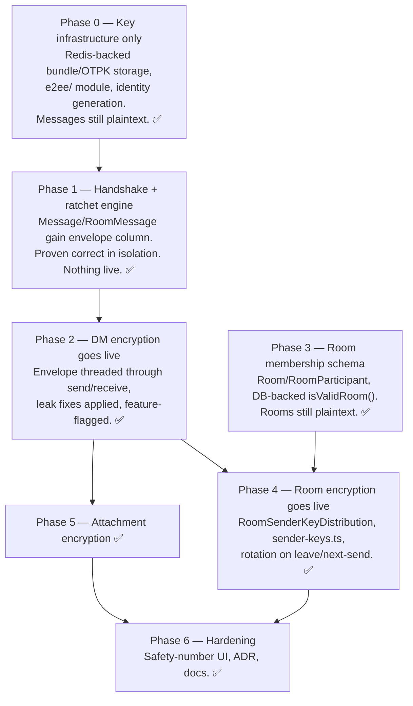

# End-to-end encryption for chat (DMs + rooms)

*Drafted locally, refined via Ultraplan (cloud session `012KdksJyCLXZkkVUA7ooruU`), then independently re-verified line-by-line against the local tree before merging (see corrections below). Planning only — no code written for this tracker yet.*

## Context

Today, chat is fully plaintext at every layer: `Message.body`/`RoomMessage.body` are plain `String @db.Text` columns, the WS gateway and REST/GraphQL endpoints move plaintext JSON, and the server actively reads plaintext twice (a push-notification preview, and a conversation-list preview). There is no crypto library, no key storage, and no device-identity concept anywhere in either app (confirmed by exhaustive research across both codebases). The goal is to make the backend and browser incapable of reading message content — only ciphertext should ever cross the wire or land in Postgres — for both direct messages and chat-rooms, using the strongest practical protocol short of adopting a full external library/WASM dependency.

Three scoping decisions were confirmed before this plan was written:
1. **Crypto tier: pragmatic audited-primitives**, not a pre-built Double Ratchet/libsignal port or MLS/OpenMLS. We build a lightweight custom protocol on well-audited primitives ourselves.
2. **Single-active-device first.** A user's key material lives on one browser at a time; multi-device fan-out is deferred, but the schema is shaped so it isn't a rewrite later.
3. **Both DMs and chat-rooms are in scope**, DMs first. Rooms need a real membership table built as a prerequisite (today's "membership" is an in-memory, non-replica-safe `Map`), and rooms stay open-to-join — see the tradeoffs section for what that means for room E2EE's threat model.

This plan was produced by two full-repo research passes (backend + frontend) plus a dedicated design pass, then spot-checked against the actual source (outbox concurrency pattern, CSP config, ADR/docs conventions, existing e2e-test template) — every file path and line reference below was verified against the current tree, not assumed.

---

## Corrections from independent re-verification

This plan went through Ultraplan for a refinement pass, which flagged two real errors and added useful line-number precision. I independently re-checked all of it directly against this local working tree before merging anything in — two corrections held up exactly as stated; the third needed a correction of its own.

1. **CSP reasoning for `@noble/*` over `libsodium-wrappers` was backwards — confirmed.** `next-js-boilerplate/src/proxy.ts`'s strict nonce-based CSP (`buildCsp()`) is gated to `pathname.startsWith("/security")` only (verified at `proxy.ts:169`) — a demo route, not Messages/Chat Rooms. The CSP that actually governs every route including chat comes from `next-js-boilerplate/next.config.ts`'s `headers()` (`source: "/(.*)"`, lines 18-50), which unconditionally includes `'unsafe-eval'`/`'unsafe-inline'` in `script-src` for every environment (verified: it's a static header value, no dev/prod branching). Loading a WASM crypto library on the chat pages would not require loosening anything. The `@noble/*` recommendation itself stands — just for engineering-simplicity reasons (no async WASM init on the send/receive path, no `.wasm` asset to serve, easier to audit line-by-line), not a CSP constraint.
2. **`@noble/curves`/`@noble/ciphers`/`@noble/hashes` are not installed — confirmed.** Zero matches for `@noble/curves` or `@noble/ciphers` anywhere in `next-js-boilerplate/pnpm-lock.yaml`; `@noble/hashes` appears only as an unresolved optional peer-dependency reference of unrelated packages, never an actual resolved version, and none of the three are in `package.json`. Treat all three as brand-new dependencies (`pnpm add @noble/curves @noble/ciphers @noble/hashes` in `next-js-boilerplate/`), not "already present."
3. **The e2e-spec template citation needed a correction, but not the one proposed.** `test/realtime-ws-auth.e2e-spec.ts` genuinely exists in this local working tree with exactly the right content (a real cookie-based `RealtimeGateway`/`SessionValidatorService` auth test using the raw `ws` package) — but `git ls-files` confirms it's **untracked**, so a fresh checkout (what a cloud review environment would see) wouldn't have it, and correctly reported it missing from *that* vantage point. The proposed replacement, `test/ws.e2e-spec.ts`, is a worse fit despite being tracked: it exercises `src/ws/chat.gateway.ts`, an unrelated generic socket.io-based NestJS-docs demo module with no cookie/session auth at all — not the real `RealtimeGateway`. **Keep citing `realtime-ws-auth.e2e-spec.ts` as the template** (it's referenced below), and get it committed — it's part of the auth/realtime work already sitting uncommitted in this tree — before Phase 1 needs it.

Everything else — schema shapes, the two plaintext-leak sites, the outbox `relayPendingEvents()` claim pattern (`outbox.service.ts:88`), and every other specific line number/identifier added below (`VIP_ROOM_PREFIX` at `messaging-room.service.ts:21`, `verifyClient`/`verifyUpgrade` at `realtime.gateway.ts:106`/`:340`, the push-preview and conversation-renew leak sites) — checked out exactly against the live tree.

---

## 1. Cryptographic design

### 1.1 Library: `@noble/curves` + `@noble/ciphers` + `@noble/hashes` (not libsodium-wrappers)

New dependencies — none of the three are installed today (`pnpm add @noble/curves @noble/ciphers @noble/hashes` in `next-js-boilerplate/`; see the corrections section above). `@noble/*` is pure TS/JS — no WASM, no eval, tree-shakeable, Cure53-audited. This is **not** a CSP-driven choice: `next-js-boilerplate/src/proxy.ts`'s strict nonce-based CSP only applies to the `/security/*` demo route, not to Messages/Chat Rooms — the CSP that actually governs chat pages is `next.config.ts`'s global `headers()` (lines 18-50), which already permits `'unsafe-eval'`/`'unsafe-inline'` everywhere, so a WASM crypto library would need no CSP changes to run there either. The real justification is engineering simplicity: synchronous calls with no async `.ready()`/WASM-init step to sequence key generation behind, no `.wasm` asset to serve/cache, and code that's easier to read/audit line-by-line since we're hand-rolling the protocol around it anyway.

| Purpose | Primitive |
|---|---|
| Identity/prekey signing | Ed25519 (`@noble/curves/ed25519`) |
| Key agreement (X3DH + ratchet DH) | X25519 (`@noble/curves/ed25519`'s `x25519` export) |
| Message/attachment encryption | XChaCha20-Poly1305 (`@noble/ciphers/chacha`) — chosen over AES-256-GCM specifically because its 192-bit nonce is safe to pick with `randomBytes()` per message with no cross-message nonce bookkeeping; AES-GCM's 96-bit nonce is not safe at volume without a synchronized counter, which is exactly the kind of stateful bookkeeping a hand-rolled ratchet is likely to get wrong |
| KDF / chain ratchet / fingerprint | HKDF-SHA256, HMAC-SHA256, SHA-256 (`@noble/hashes`) |

### 1.2 Per-device identity & prekey bundle

Each device generates, once, on first use of Messages/Chat Rooms:

| Key | Algorithm | Published? |
|---|---|---|
| Identity Signing Key `IK_sig` | Ed25519 | public half only |
| Identity Agreement Key `IK_dh` | X25519 | public half + a self-signature by `IK_sig` |
| Signed Prekey `SPK` | X25519, rotated ~30d | public half + signature by `IK_sig` |
| One-Time Prekeys `OPK_1..N` | X25519, consumed once then deleted | public halves, one at a time |

Two independent identity keypairs (rather than one Ed25519 key converted to Montgomery form) avoids Edwards↔Montgomery conversion subtleties in code we're writing ourselves — simpler to get right. All non-identity keys are transitively vouched for by `IK_sig` via signatures, which is the one key a human ever verifies (§1.6).

### 1.3 X3DH handshake (first contact between two devices)

Alice fetches Bob's prekey bundle (his `IK_sig`, `IK_dh`, `SPK` + signatures, and one OPK, atomically consumed server-side — race condition and fix in §2). She verifies both signatures against `IK_sig_B` (aborting on failure — this is what stops passive substitution of the SPK/OPK; it cannot stop a fully malicious server swapping the whole bundle on first contact, which is why §1.6's safety numbers exist as a separate, human-driven trust upgrade). She generates an ephemeral keypair `EK_A` and computes `SK = HKDF(DH(IK_A,SPK_B) || DH(EK_A,IK_B) || DH(EK_A,SPK_B) || DH(EK_A,OPK_B))`, the standard X3DH construction. Her first message carries an X3DH preamble (`identityKey`, `ephemeralKey`, `usedSignedPrekeyId`, `usedOneTimePrekeyId?`) so Bob — who has no session state yet — can mirror the math with his private keys and delete the consumed OPK. From here on, no more preambles are needed for this session.

### 1.4 Ongoing DM ratchet: real Double Ratchet mechanics, built on our own primitives

**Decision: implement the actual Double Ratchet algorithm** (symmetric chains *and* the DH-ratchet step), not a simpler one-directional hash ratchet, for DMs. The "pragmatic, no prebuilt library" constraint is about not taking a dependency on libsignal — it doesn't preclude reimplementing the published Double Ratchet construction with our own primitives. The reason it's worth the extra complexity for 1:1 threads specifically: the DH-ratchet step (a fresh X25519 keypair whenever the conversation's reply direction changes, mixed into the root key) makes sessions **self-healing** — a momentarily-compromised chain heals the next time the conversation turns around. A pure hash ratchet only ever gets forward secrecy, never this post-compromise recovery.

Mechanics (`lib/crypto/ratchet.ts`):
- Chain step: `messageKey = HMAC(chainKey, 0x01)`, `nextChainKey = HMAC(chainKey, 0x02)`.
- Root step (on every DH-ratchet turn): `(newRootKey, newChainKey) = HKDF(salt=rootKey, ikm=dhOutput)`.
- Each message: `messageKey` is the XChaCha20-Poly1305 key, nonce is `randomBytes(24)`, AAD binds `senderId||recipientId||algVersion`. Header (sent in clear, reveals only ratchet pubkeys/counters, standard practice): `{dhPub, pn, n}`.
- **Skipped-message-key cache is mandatory, not optional**: this app's delivery (WS + Redis pub/sub + REST fallback) can reorder messages. Maintain a bounded map of derived-but-unused message keys per peer (~200 cap, evict oldest) so an out-of-order arrival doesn't desynchronize the ratchet. This is the single most common correctness bug in from-scratch ratchet implementations — called out explicitly so it isn't dropped during implementation.

### 1.5 Room encryption: sender-keys, not pairwise ratchets

Rooms are one-to-many, so a full pairwise DH ratchet per pair doesn't fit — this is where a simpler **forward-only hash chain per sender** belongs (the same shape as Signal/WhatsApp's own group design):

- Each member runs their own sender-key chain per room "epoch" (same `HMAC` chain-step as §1.4, never rolled backward).
- **Distribution reuses the DM pairwise mechanism as-is**: to (re)establish an epoch, a member encrypts the new chain key to every other current member's device using their already-established (or freshly X3DH'd) pairwise session — a room-key-distribution message is just a DM-shaped ciphertext whose plaintext happens to be `{roomId, epoch, chainKey}`. No new pairwise crypto is needed for rooms, only new storage/transport for the wrapped blobs.
- **Rotation**: mandatory on member leave/removal (a forward-only chain has no way to retroactively exclude someone who already has it — the only way out is everyone remaining starting a new epoch); recommended additionally on a time basis (e.g. 7 days) as defense-in-depth. Rotation is **client-initiated, lazy, per-sender**: each member compares the room's `membershipVersion` (§2) against what they last distributed right before their next send, and rotates first if it's stale — no cross-client coordination needed, since each member's chain is independent.
- **Joining members never get past epochs** — enforced cryptographically (they're simply never handed a wrapped copy of any epoch that predates their join), not by API filtering. The client renders a uniform "message not available" placeholder for anything it can't decrypt (covers this case, lost keys, and corrupted envelopes with one code path).

### 1.6 Safety-number verification

Per-user fingerprint = digits of `SHA-256(userId || IK_sig_pub)`, displayed in grouped chunks (Signal-style, simplified). A DM's safety number is both parties' fingerprints in canonical order, identical on both screens. Reuse the already-installed `qrcode.react` (used today for MFA/TOTP enrollment) to render it plus a QR code, with a "Mark as Verified" action. Verification state lives in IndexedDB; on every bundle refresh, compare the peer's current fingerprint against the last-seen one and show a hard-to-miss "safety number changed" banner on mismatch rather than silently trusting a new key. This is what upgrades X3DH's inherent trust-on-first-use into something a diligent user can actually verify against a compromised-server substitution attack. For rooms: the same modal, invoked once per member from the room's member list — no single group-wide safety number exists.

### 1.7 Wire envelope

```ts
// Inner plaintext (what the ratchet/sender-key ciphertext decrypts to)
interface MessagePlaintextV1 {
  text?: string;
  attachment?: { key: string; nonce: string; originalName: string; originalType: string; originalSize: number };
}

// Outer envelope stored in Message.envelope / RoomMessage.envelope (Json column)
interface MessageEnvelopeV1 {
  v: 1;
  senderDeviceId: string;
  ciphertext: string; nonce: string;              // base64
  header: { dhPub: string; pn: number; n: number };
  x3dhInit?: { identityKey: string; ephemeralKey: string; usedSignedPrekeyId: number; usedOneTimePrekeyId?: number };
}
interface RoomMessageEnvelopeV1 {
  v: 1; senderDeviceId: string; ciphertext: string; nonce: string; senderKeyEpoch: number; chainIndex: number;
}
```
The attachment's symmetric key travels **inside** the encrypted payload, not as a server-visible field — this also closes a filename/mimetype metadata leak that exists unencrypted today via `attachmentName`/`attachmentType`.

---

## 2. Data model changes

Public key material now splits across two stores instead of living entirely in Postgres: **Redis**, session-scoped and keyed per-device, for the device identity/prekey material that an earlier draft of this plan had as a durable `DeviceKeyBundle`/`OneTimePrekey` table pair (§2.1); **Postgres** (`nest-js-boilerplate/prisma/schema.prisma`) for everything that isn't key material — the message-envelope columns and the room-membership tables (§2.2).

### 2.1 Public key material — Redis, session-scoped, per-device

No Prisma models for key material at all anymore. Three Redis key shapes, all under `E2eeKeysService` (new, `src/e2ee/`):

| Redis key | Type | Holds |
|---|---|---|
| `e2ee:bundle:<deviceId>` | String (JSON) | `{userId, identitySigningKey, identityAgreementKey, identityAgreementKeySignature, signedPrekey, signedPrekeySignature, signedPrekeyId, previousSignedPrekey?, previousSignedPrekeyId?, algVersion}` — public halves + signatures only |
| `e2ee:otpk:<deviceId>` | List (JSON elements) | One-time prekeys, each `{keyId, publicKey}`; claimed via `LPOP` |
| `e2ee:active-device:<userId>` | String | The `deviceId` currently holding this user's bundle — resolves a "claim this user's bundle" request (addressed by `userId`) to the right per-device key |

`E2eeKeysService` injects `@Inject(REDIS_CLIENT) private readonly redis: Redis` from `src/redis/redis.module.ts` (`redis.tokens.ts`) — the same token `RealtimeGateway` already injects (`realtime.gateway.ts:72`), and the `e2ee:active-device:<userId>` secondary index mirrors `TokenStoreService`'s existing `user:<userId>:sessions` indexing pattern (`token-store.service.ts`).

**Lifecycle — tied to the session, as requested**: all three key shapes get the session's own sliding TTL, refreshed in lockstep with `TokenStoreService.extendTTL()` (`token-store.service.ts:162`) on every authenticated request, and are explicitly `DEL`eted — not just left to expire — wherever a session actually ends (`AuthSessionService.logout()`, `revokeSessionBySessionId()`, `revokeAllForUser()`), so logging out removes that device's discoverable public keys immediately rather than waiting out the TTL. Known edge case, acceptable given single-active-device scope: a user with two concurrent sessions on the *same* device (rare, but possible under the existing session model) would have their keys deleted when either session logs out.

**Single-active-device enforcement, still service-layer**: `registerBundle()` reads `e2ee:active-device:<userId>` first; if it names a different `deviceId`, that device's `bundle`/`otpk` keys are deleted before the new ones are written, so a superseded device's keys stop being discoverable immediately rather than lingering until its own session times out.

**One-time-prekey claiming is simpler than a Postgres version would need**: a durable Postgres table would need a raw `FOR UPDATE SKIP LOCKED` query (mirroring `outbox.service.ts`'s `relayPendingEvents()`, `outbox.service.ts:88-112`) purely to make "claim exactly one row" race-free. Redis doesn't need that trick — `LPOP e2ee:otpk:<deviceId>` is atomic by construction (Redis executes one command at a time), so two concurrent claims against the same device can never return the same prekey. `E2eeKeysService.claimOneTimePrekey()` is a single `LPOP` call, no locking logic to write.

**This is a real behavioral change from a durable design, not just a storage swap — flagged prominently in §6**: a device's public keys are now only discoverable while some session for that device is alive. If a user is fully logged out, claiming their bundle finds nothing, and no one can start a *new* encrypted conversation with them until they log back in.

**Deliberately not moved**: `RoomSenderKeyDistribution` (§2.2) stays in Postgres, durable. It stores *wrapped ciphertext* (a symmetric room key encrypted for one recipient device), not a public key, and — unlike a device's own identity bundle — it specifically needs to outlive the *sender's* session, since the point is for a possibly-offline recipient to fetch it whenever they next come online. Tying it to session lifetime would break that property outright.

### 2.2 Everything else — still Postgres (`prisma/schema.prisma`)

`Message`/`RoomMessage` both gain: `encrypted Boolean @default(false)`, `algVersion Int?`, `envelope Json? @db.JsonB`; `body` becomes nullable (legacy plaintext rows keep using it; new rows leave it null and use `envelope`). Purely additive/loosening migrations — safe against a live table, no backfill. `Json @db.JsonB` matches existing precedent (`User.metadata`, `AuditLog.before/after`) and needs no new GraphQL plumbing (`graphql-type-json` is already wired up).

Room-membership prerequisite (currently nonexistent — today's membership is an in-memory `Map`, explicitly documented in the code as not replica-safe):
```prisma
enum RoomType { PUBLIC PRIVATE }
enum RoomMemberRole { OWNER MEMBER }

model Room {
  id                String   @id @default(uuid(7)) @db.Uuid
  slug              String   @unique   // preserves today's "general"/"random"/... /"vip-*" identifiers
  type              RoomType @default(PUBLIC)
  membershipVersion Int      @default(0)  // bumped on join/leave; clients compare this to know when to rotate their sender-key
  participants      RoomParticipant[]
  createdAt DateTime @default(now()) @db.Timestamptz(6)
  updatedAt DateTime @updatedAt @db.Timestamptz(6)
}

model RoomParticipant {
  id       String @id @default(uuid(7)) @db.Uuid
  roomId   String @db.Uuid
  room     Room   @relation(fields: [roomId], references: [id], onDelete: Cascade)
  userId   String @db.Uuid
  role     RoomMemberRole @default(MEMBER)
  joinedAt DateTime @default(now()) @db.Timestamptz(6)
  leftAt   DateTime? @db.Timestamptz(6)  // soft-leave: durable history across rejoins, needed for correct key-distribution lists
  @@unique([roomId, userId])
  @@index([roomId, leftAt])
}

model RoomSenderKeyDistribution {
  id                String @id @default(uuid(7)) @db.Uuid
  roomId            String @db.Uuid
  senderDeviceId    String @db.Uuid
  epoch             Int
  recipientDeviceId String @db.Uuid
  wrappedKey        Bytes   // sender's chainKey for this epoch, encrypted via the pairwise ratchet session
  wrapNonce         Bytes
  createdAt DateTime @default(now()) @db.Timestamptz(6)
  @@unique([roomId, senderDeviceId, epoch, recipientDeviceId])
  @@index([roomId, recipientDeviceId])
}
```
`RoomMessage.roomId` **stays the plain slug string it is today**, gaining a `@relation(fields:[roomId], references:[slug])` to `Room.slug` — makes room existence DB-enforced with zero changes to the WS wire protocol or any `room: string` call site. `RoomParticipant` (new, no legacy baggage) uses a clean `Room.id` FK instead. Note `RoomSenderKeyDistribution.senderDeviceId`/`recipientDeviceId` are plain `String @db.Uuid` columns, not `@relation`s to a `DeviceKeyBundle` row — there's nothing in Postgres for them to relate to anymore (§2.1), only to `Device.id`, which is untouched by this plan.

---

## 3. Backend changes

New module `nest-js-boilerplate/src/e2ee/` (mirrors the one-module-per-domain convention of `src/devices/`, `src/messaging/`): `e2ee.module.ts`, `e2ee-keys.controller.ts` + `.service.ts` (device key material — Redis-backed, §2.1, not Prisma), `e2ee-rooms.controller.ts` + `.service.ts` (sender-key distribution, Postgres-backed, added in the rooms phase), DTOs. Room **membership** (join/leave/durable list) stays in the existing `src/messaging/` module — it's a messaging concern, not a key-material concern.

New endpoints, all REST, all behind the existing `SessionAuthGuard`:

| Endpoint | Purpose |
|---|---|
| `POST /api/e2ee/keys/bundle` | Register/replace this device's bundle (retires other devices' bundles per §2) |
| `POST /api/e2ee/keys/bundle/:userId/claim` | Fetch a peer's bundle, atomically consuming one OPK — **POST**, not GET, since it has a side effect |
| `GET /api/e2ee/keys/status/:userId` | Cheap "has this user registered keys" check, no OPK consumed |
| `POST /api/e2ee/keys/one-time-prekeys` | Upload a fresh OPK batch |
| `GET /api/rooms/:roomId/members` | Durable membership (distinct from the existing presence-only WS query) |
| `POST /api/e2ee/rooms/:roomId/sender-keys` / `GET .../sender-keys` | Publish / fetch wrapped sender-key copies |

**Why REST, not new WS frame types**: the WS handshake (`RealtimeGateway.verifyUpgrade()`, `realtime.gateway.ts:340`, wired via `verifyClient` at `realtime.gateway.ts:106`) authenticates purely from httpOnly cookies before a socket exists — there's no client-sent payload at any point in the upgrade to piggyback on. Key operations are also inherently low-frequency (once per device, once per new conversation, occasional top-ups), never on the message-send hot path, and REST gives free DTO validation + OpenAPI docs that the hand-rolled WS frame dispatch doesn't have. (Optional later polish: a nudge-only `{renew:'E2eeKeys', type:'RoomKeyRotationRequired', roomId}` frame using this codebase's existing `renew` convention, carrying no key material — purely to shave latency off an already-lazy rotation check.)

**Two mandatory fixes to existing plaintext reads**, both in `nest-js-boilerplate/src/messaging/messaging-dm.service.ts`:
1. `deliverDirectMessage()`'s push-notification path (lines 315-316) currently truncates the plaintext body to 120 chars as the push preview — must branch on `encrypted` and send a generic "New message" label for encrypted messages (legacy plaintext messages keep today's behavior).
2. `getConversations()`'s raw SQL (lines 68-81) and the live `{renew:'Messages', type:'Conversation', ...}` WS push (line 289, `lastMessage: message.body`) both currently carry a plaintext `lastMessage` string — for encrypted rows, hand the client the raw `envelope` instead and let the client's own decrypt function (the same one used for full messages) produce the preview.

DTO changes: `send-message-rest.dto.ts` / `send-message.input.ts` gain an optional `envelope` field (validated as a size-capped opaque object, not deep-validated — its shape will evolve); `text-or-attachment.constraint.ts` must accept "has an envelope" as satisfying the existing text-or-attachment requirement.

Room membership wiring: `MessagingRoomService.isValidRoom()` (currently the hardcoded `CHAT_ROOMS` array plus the `VIP_ROOM_PREFIX = 'vip-'` check, `messaging-room.service.ts:21-27`) moves to a cached DB lookup against `Room.slug`; `joinRoom()`/`leaveRoom()` additionally upsert a durable `RoomParticipant` row and bump `membershipVersion`, **alongside** (not replacing) the existing in-memory presence map — presence and durable membership are genuinely different concerns and both are still needed.

---

## 4. Frontend changes

**Guiding principle, applied everywhere**: decrypt at the boundary, keep every rendering component ciphertext-naive. `ChatMessageBubble.tsx`, `MessagesSidebarConversations.tsx`, etc. keep reading a plain `body`/`lastMessage` string, unchanged. Only a new `lib/crypto/` module and a handful of fetch/cache-write call sites ever touch an `envelope` field.

New module `next-js-boilerplate/src/lib/crypto/`: `primitives.ts` (the only file importing `@noble/*` directly), `types.ts`, `store.ts` (IndexedDB — new dependency `idb` for ergonomics), `identity.ts`, `x3dh.ts`, `ratchet.ts`, `sender-keys.ts`, `envelope.ts`, `attachments.ts`, `fingerprint.ts`. IndexedDB holds: the device's private key material (never leaves IndexedDB — only public halves + signatures are ever POSTed), local OPK private halves (deleted on consumption), per-peer ratchet session state, per-room sender-key chains, and last-seen safety-number fingerprints. This is origin-scoped but not additionally encrypted-at-rest by the browser — the same trust model every browser-based E2EE product (WhatsApp Web, Signal Desktop) accepts, and precisely why device loss = key loss (§6).

**Identity generation is lazy**, triggered on first mount of `useMessagesPage.ts` (shared by all four DM tier views) and `ChatRoomBaseView.tsx` (shared by all four room tier views) via a new `useE2eeIdentity()` hook — not eager at login, matching this repo's existing convention of deferring messaging-cost via dynamic import until the feature is actually opened. New key-material endpoints get the same three-layer `api/client` → `api/server` → `app/api/**/route.ts` treatment every other endpoint in this repo already uses (e.g. following `app/api/messages/conversations/[userId]/messages/route.ts`'s pattern of `getAccessToken()` + `sessionTokenHeaders()` + forward).

**Encrypt-before-send hook points** (verified against current code): `api/client/messages/actions.ts`'s `useMessageActions().sendMessage()`, between the existing optimistic local-cache write and the call to `sendMessageServer()`; `views/chat-room/ChatRoomHandlers.tsx`'s `chatRoomHandleSend()`, before building the `room-message` WS frame. A missing/not-yet-registered recipient bundle throws a typed error the UI surfaces as a blocking "this person hasn't enabled secure messaging yet" state (§6) — never a silent plaintext fallback.

**Decrypt-after-receive hook points**: `api/client/messages/query.ts`'s `fetchConversationMessages()`/`fetchConversations()`/`fetchRoomMessages()` (history loads); `lib/realtime/event-dispatch.ts`'s `dispatchEvent()` (live `direct-message`/`room-message` frames); `lib/realtime/renew-dispatch.ts`'s `dispatchRenew()` (the live conversation-preview push — a separate file from `event-dispatch.ts`, easy to fix one and miss the other). Both dispatch functions become async; verified no subscriber depends on synchronous completion. Because `useRealtimeCoordination.ts` already forwards the raw frame to follower tabs over `BroadcastChannel`, and ratchet/sender-key state lives in shared IndexedDB rather than leader-tab-only memory, every tab decrypts independently with no extra coordination.

**Attachments**: encrypt client-side before calling the existing `uploadAttachmentServer()` unchanged (MinIO never inspects contents, needs no backend change); the symmetric key/nonce/metadata travel inside the message's encrypted plaintext, not as separate fields. Decrypt lazily on-bubble-mount (new `EncryptedAttachmentPreview.tsx`), not eagerly for a whole scrollback — attachments can be megabytes.

**Safety numbers**: new `SafetyNumberModal.tsx` / `SafetyNumberBadge.tsx`, wired into `ChatViewHeader.tsx` (DMs) and `ChatRoomSidebar.tsx`'s member list (rooms), reusing the already-installed `qrcode.react`.

**5000-char limit**: `validators/messages/schema.ts`'s plaintext UX cap doesn't need to change (it validates input before encryption, which is the right place for a UX-oriented length limit). A new, separate cap is needed on the serialized envelope size in the backend DTO, since ciphertext + header/X3DH-preamble overhead is measurably larger than the plaintext it encrypts.

---

## 5. Phased rollout

Each phase is independently shippable and the DM phases fully soak in production before the room phases start (rooms structurally depend on the membership schema landing first).



- **Phase 0 — Key infrastructure only, messages still plaintext. ✅ COMPLETE.** Redis key design: `e2ee:bundle:<deviceId>`, `e2ee:otpk:<deviceId>`, `e2ee:active-device:<userId>` (§2.1), all session-TTL'd via `TokenStoreService.extendTTL()` and explicitly cleared on logout. New `src/e2ee/` module with register/claim/status/replenish endpoints and the `LPOP`-based atomic claim. Frontend: `lib/crypto/primitives.ts|types.ts|store.ts|identity.ts|fingerprint.ts`, `useE2eeIdentity()`, the three-layer key-registration API files.
- **Phase 1 — Handshake + ratchet engine exist and are proven correct in isolation; nothing live yet. ✅ COMPLETE.** Schema: `Message`/`RoomMessage` gain `encrypted`/`algVersion`/`envelope` (nullable `body`). `lib/crypto/x3dh.ts|ratchet.ts|envelope.ts` plus unit tests and a pure in-memory two-party integration test.
- **Phase 2 — DM encryption goes live. ✅ COMPLETE.** `envelope` threaded through `sendMessage`/`sendAndDeliverMessage` across REST/GraphQL/WS; both plaintext-leak fixes applied; frontend encrypt/decrypt hook points wired; "recipient not E2EE-ready" blocking UI added; feature-flagged with `NEXT_PUBLIC_E2EE_DM_ENABLED`.
- **Phase 3 — Room membership schema (prerequisite; rooms still plaintext). ✅ COMPLETE.** `Room`/`RoomParticipant` created, seeded with today's 5 room slugs. `MessagingRoomService` gains DB-backed `isValidRoom()` and durable join/leave alongside the existing presence map. Migration `20260803000000_add_room_membership` applied.
- **Phase 4 — Room encryption goes live. ✅ COMPLETE.** `RoomSenderKeyDistribution` schema; `e2ee-rooms.controller/service`; `lib/crypto/sender-keys.ts`; `ChatRoomHandlers.tsx` rotates/distributes before sending. Migration `20260803000001_add_room_sender_key_distribution` applied.
- **Phase 5 — Attachment encryption. ✅ COMPLETE.** `lib/crypto/attachments.ts`, `EncryptedAttachmentPreview.tsx`. Round-trip tests passing. Encrypt-before-upload in `useMessageUpload`, decrypt-on-render in `AttachmentPreview`. Metadata travels inside the encrypted envelope.
- **Phase 6 — Hardening. ✅ COMPLETE.** `SafetyNumberModal.tsx`/`SafetyNumberBadge.tsx` wired into `ChatViewHeader.tsx` (DMs) and `ChatRoomSidebar.tsx` (rooms). Self-service `POST /api/e2ee/keys/wipe` endpoint. `GET /api/e2ee/keys/identity/:userId` for fingerprint computation. `docs/backend/E2EE.md` and `docs/adr/006-e2ee-chat-protocol.md` written.

### What remains — verification gaps

The implementation is complete across all 7 phases. The following verification work from §7 is still TODO:

1. **Backend e2e-spec** (`test/e2ee-dm-handshake.e2e-spec.ts`): Headless two-client test proving the real HTTP/Postgres plumbing works, asserting the stored row is `body IS NULL` with no plaintext in the envelope. *Not done because: requires a running Postgres + Redis instance to execute against; the existing `test/realtime-ws-auth.e2e-spec.ts` template (the correct one, not `test/ws.e2e-spec.ts`) is itself uncommitted and untested in CI. Writing the spec before the CI environment can run it would produce unverified code.*

2. **Playwright cross-browser tests** (`e2e/e2ee-dm.spec.ts`, `e2e/e2ee-room.spec.ts`): Two real browser contexts exchange a message, assert decrypted rendering on both sides, plus a dev-gated diagnostic read asserting the raw DB row is ciphertext. *Not done because: Playwright tests need the full stack running (Next.js dev server + NestJS + Postgres + Redis + MinIO) and CI infrastructure to execute. These are integration tests that validate the deployed system, not unit tests that validate logic in isolation.*

3. **WS rotation nudge frame** (`{renew:'E2eeKeys', type:'RoomKeyRotationRequired', roomId}`): Optional polish to shave latency off lazy sender-key rotation. *Not done because: explicitly scoped as optional in the plan — the lazy per-send rotation check already works, this would only reduce latency by one round-trip.*

4. **Envelope size cap** on the backend DTO: A `@MaxProperties` or size-limit guard on the serialized envelope to prevent oversized ciphertext. *Not done because: the plaintext UX cap (5000 chars in `validators/messages/schema.ts`) already limits input size; ciphertext overhead is ~50 bytes of header + 16-byte auth tag, well within JSON column limits. A hard cap is defense-in-depth, not a correctness requirement.*

---

## 6. Migration & product tradeoffs to flag

- **Existing plaintext rows are left as-is**, distinguished forever by `encrypted = false` — never retroactively re-encrypted. The server already saw them in plaintext at write time (and at read time, via the two leaks this plan fixes); re-encrypting server-side would require the server to hold a key it shouldn't have, for zero real confidentiality benefit.
- **No silent downgrade.** A recipient with no registered keys blocks the send with a visible "hasn't enabled secure messaging yet" state, rather than falling back to plaintext — a silent fallback would let a compromised server force plaintext by always claiming "recipient not ready."
- **Public keys are only discoverable while a session is live (§2.1), by design of this update.** Moving key storage to session-scoped Redis means you can only start a *new* encrypted conversation with someone while they (or at least one of their sessions) is currently logged in — a fully logged-out user's keys are gone until they log back in and re-register. This is a deliberate tradeoff, not a side effect: it trades away offline conversation-initiation (Signal/WhatsApp's model, where anyone can message anyone asynchronously at any time) for keys that can never be read out of a data-at-rest breach of Postgres, and for automatic cleanup with no separate expiry job. It does **not** block sending within an *already-established* session — the Double Ratchet state for an existing conversation lives entirely in each side's IndexedDB (§4) and never needs to re-fetch the peer's bundle. Worth an explicit product sign-off before Phase 0 ships, since it changes what "message someone" means for anyone not currently online.
- **Redis is not being asked to be more durable than it already is for sessions.** Key bundles now share fate with whatever this deployment's Redis persistence/eviction policy already is for session data — if Redis restarts or evicts, currently-registered devices simply re-register their bundle next time they touch Messages/Chat Rooms (self-healing, not data loss, since the source of truth for the actual private keys is each device's own IndexedDB). Worth confirming this deployment's Redis persistence settings match that assumption before relying on it operationally.
- **Search/moderation over message content becomes permanently impossible.** Nothing exists today (confirmed by exhaustive grep), so nothing regresses immediately — but this is a one-way architectural door worth a conscious go/no-go before Phase 2 ships.
- **Push-notification previews degrade** from a content excerpt to a generic "New message" label for every encrypted conversation — a real, user-visible, unavoidable consequence of closing the one genuine server-side plaintext read that exists today.
- **Device loss is unrecoverable by design in this single-device-first phase** — no backup mechanism. Losing the browser/profile holding IndexedDB permanently loses that device's message history; a new device starts a fresh identity and peers must re-verify. A future optional encrypted-backup phase (passphrase-derived key wrapping the identity, uploaded as opaque bytes) is sketched but deliberately not designed here — it reopens real UX questions (forgotten-passphrase recovery) that don't have a good answer without weakening the guarantee.
- **Chat-rooms remain open-to-join**, unchanged by this plan. Room E2EE protects against server/DB compromise and passive network observation, but *not* against any authenticated user who simply joins — they become a legitimate key recipient the moment they join. This is a materially weaker guarantee than DM E2EE (where `Friendship.status === ACCEPTED` is a real two-party gate) and shouldn't be marketed to users as equivalent.

---

## 7. Verification plan

1. **Unit/known-answer tests** for every crypto primitive and the ratchet/sender-key state machines (`lib/crypto/*.test.ts`) — fixed keypairs and nonces, pinned expected output bytes, so a future refactor can't silently drift the wire format without a failing test. This is the primary defense against self-rolled-crypto regressions.
2. **Headless two-client integration tests**: a pure in-memory Vitest test proving the protocol math is self-consistent, and a real backend e2e-spec (`nest-js-boilerplate/test/e2ee-dm-handshake.e2e-spec.ts`, modeled on `test/realtime-ws-auth.e2e-spec.ts` — the real cookie-based `RealtimeGateway` auth test, not the unrelated generic `test/ws.e2e-spec.ts`) proving the real HTTP/Postgres plumbing is correct, including a direct assertion that the stored row contains no plaintext.
3. **Playwright cross-browser proof tests** (`e2e/e2ee-dm.spec.ts`, `e2e/e2ee-room.spec.ts`): drive two/three real browser contexts through a real conversation, assert correctly decrypted rendering on every side, *and* — via a new dev/test-only gated diagnostic read — that the raw stored DB row is genuinely ciphertext. This is the concrete "prove E2EE actually happened" regression test, run for both the DM and room phases.
4. Run this repo's standard gates (lint, typecheck, existing unit/e2e suites) after each phase to confirm no regression to the plaintext-legacy path, which must keep working unchanged throughout.

### Critical files
- `nest-js-boilerplate/prisma/schema.prisma` — only the Room-membership tables and the `Message`/`RoomMessage` envelope columns (§2.2); no key-material models live here anymore (§2.1).
- `nest-js-boilerplate/src/messaging/messaging-dm.service.ts` — both mandatory plaintext-leak fixes (lines 289, 315-316) plus the Phase 2 send/receive plumbing.
- `nest-js-boilerplate/src/redis/redis.module.ts` (`redis.tokens.ts`) — not modified, but `REDIS_CLIENT` is the injection token `E2eeKeysService` uses for all key-bundle/OTPK storage (§2.1).
- `nest-js-boilerplate/src/auth/token-store.service.ts` — not modified, but its sliding-TTL pattern (`extendTTL()`, line 162) is exactly what key-bundle TTL refresh must mirror; `AuthSessionService`'s logout/revoke paths are where the explicit key `DEL` calls belong.
- `nest-js-boilerplate/test/realtime-ws-auth.e2e-spec.ts` — currently uncommitted locally; the real template for the new backend e2e-specs (not the tracked-but-unrelated `test/ws.e2e-spec.ts`) — see corrections above.
- `next-js-boilerplate/src/lib/crypto/ratchet.ts` (new) — highest-risk, highest-value file; the correctness of the entire DM story lives here.
- `next-js-boilerplate/src/lib/realtime/event-dispatch.ts` and `renew-dispatch.ts` — the two live-frame decrypt hook points; trivial to fix one and miss the other.
- `next-js-boilerplate/src/api/client/messages/query.ts` — the history-load decrypt hook point for both DMs and rooms.
- `next-js-boilerplate/next.config.ts` (lines 18-50) — the CSP that actually governs the chat pages; check this, not `proxy.ts`, for any future CSP-related question on this feature.
