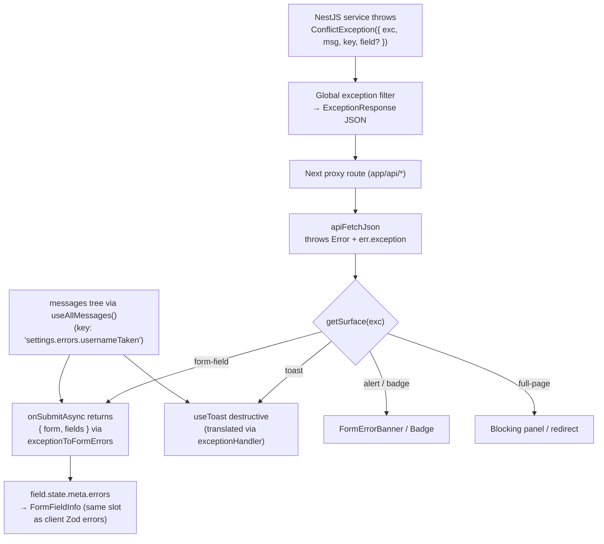

# Forms Gallery — Implementation Plan

> **Revision 3** — re-audited after revision 2, now with (a) a web + local check of the latest
> TanStack Form v1.33 APIs against what's actually installed in this repo, (b) four additional
> real-life tabs (Checkout & Addresses, Content Editor, Admin Form Builder, Inline Editable
> Table), (c) an AGENTS.md-compliance pass that corrected several file placements and API-call
> layering from rev 2, and (d) verified-source corrections (`getMessages` argument order, the
> real server-page pattern, the missing `/upload/multiple` proxy route, and the officially
> documented server-error→field mapping replacing rev 2's `setFieldMeta` workaround).
> **Revision 4** — a four-lens solidity pass (security / functionality / compatibility /
> ease): hardened simulation endpoint, secret & draft hygiene, sanitization rules, a
> functionality risk register with committed fallbacks, a verified compatibility matrix
> (Next 16.2.9 / React 19.2.4), and a copy-paste map. Corrections applied inline per tab.
> **Revision 5** — enhancement pass: two error-spine correctness fixes (parameter-free error
> messages — the envelope carries no interpolation `params`; dotted→bracket array-path
> normalization in `exceptionToFormErrors`), per-tab code-splitting via `next/dynamic`, a
> first-load JS budget in the DoD, single-source schema reuse for Tab 2, and `aria-live` on
> async validation states.
> **Revision 6** — structural change: the single 12-tab page becomes a `/ui`-style gallery —
> a main menu page at `/v1/:lang/forms` plus 12 sub-routes (`/v1/:lang/forms/<slug>`),
> mirroring the verified ui-gallery pattern (registry constant, client layout with back
> link, per-example server pages). Route-level splitting supersedes rev 5's `next/dynamic`.
> "Tab N" terminology is retained below and now means "example sub-page N".
> **Revision 7** — verification pass against the live repo: the duplicate-messages gate was
> unachievable as written (script already exits 1 repo-wide — DoD reworded, new keys nested
> to add zero hits); the ui layout's back-link depth check is an off-by-one bug that must
> not be cloned (`> 3`, not `> 4`); registry gains `mode` and the badge set gains `mixed`.
> **Revision 8** — implementation landed (commit `ae4e3a9`) and was audited against this plan
> on 2026-07-19: all repo gates pass (lint 0 errors, typecheck clean, depcruise 0 errors,
> production build green — all 14 routes present, i18n types current, en/tr key parity); the
> scaffold, both spines, and the upload/simulation infrastructure are **complete**, but
> roughly half the per-tab substance is missing and **3 bugs** were found. See
> [Implementation Status & Issue Register](#implementation-status--issue-register-rev-8-verified-2026-07-19)
> for the per-phase checkoff and the fix for each open item.

## Implementation Status & Issue Register (rev 8, verified 2026-07-19)

Audit method: file inventory against every "Files to Create/Modify" entry, grep-level feature
verification per tab, and the full gate suite. Gates: `pnpm lint` 0 errors · `pnpm typecheck`
clean · `pnpm depcruise` 0 errors (6 pre-existing warnings) · `pnpm build` green with all 14
routes in the manifest · `pnpm generate-i18n-types` produces no diff · full en/tr key parity
in the new `forms` and `apiKeys` namespaces.

### ✅ Verified complete

- **Routes & shell** — menu + 12 sub-pages + layout (correct `> 3` depth check), registry
  with `mode`, nav link + `navForms` (en/tr), per-example `generateMetadata`
- **Phase 0 prerequisites, all four** — `useAllMessages()`, `getSurface(exc: string)`,
  `settings.errors.usernameTaken` en+tr (live-bug fix), `labels?` consumed by both upload
  components (all four legacy call sites unaffected)
- **Composition spine** — `form-context.ts`, `form-hook.tsx`, all 11 bound field components
  with per-component types. *Placement deviation (accepted):* the hook + fields live in
  `src/features/forms/` (decision #6's stated alternative), not `src/components/forms/`
- **Error spine infra** — `exceptionToFormErrors` (with dotted→bracket normalization),
  `error-scenarios.ts` (10 scenarios incl. both unmapped-code fallback proofs), simulation
  route hardened exactly per S1 (session-gated, Zod-validated, `delayMs ≤ 10 s`,
  `failRate 0..1`), two-layer api wrappers, `FORMS_DEMO_SIMULATE_ERROR_URL`
- **Upload infra** — `xhr-upload.ts` with real progress + 401→`auth:logout` parity, api
  layers, `labels?` i18n prop plumbed through both components
- **3 ui-kit components** — `form-field-info` / `form-error-banner` / `step-indicator` with
  shims, barrel entries, `/ui` gallery pages + registry rows (decision #7 landed), and the
  specified a11y (`role="status"`/`aria-live="polite"`; `role="alert"`)
- **Tab 1 (profile) core** — real `useProfileActions().updateProfile`, canonical
  `onSubmitAsync` → `getSurface` → `exceptionToFormErrors` wiring, persisted vs demo split
- **Tab 8 (error-lab)** — scenario picker over `ERROR_SCENARIOS`, dual-locale
  `errorMessagesByLocale` loaded only by its own server page (R4 as designed), network
  conditions incl. `clientException()` offline path (its first real usage, as planned)
- **Tab 7 gallery section** — N parallel single-file XHR uploads with true per-file progress

### 🐞 Bugs (fix first)

The two tables below are the at-a-glance register; every row is expanded into numbered
steps, code, and a verification check in [Fix guide — step-by-step](#fix-guide--step-by-step).

| # | Bug | Where | How to solve |
|---|---|---|---|
| B1 | Filters tab hardcodes `/v1/en/forms/filters` in the URL writeback **and** reset — a `tr` user's URL is silently rewritten to the `en` route on the first keystroke | `views/forms/filters/PageContent.tsx:61,73` | Derive the path from the current location instead of a literal: use `usePathname()` (or `useParams().lang`) and replace only the query string — `window.history.replaceState(null, "", qs ? pathname + "?" + qs : pathname)` |
| B2 | 5 **new** duplicate top-level message keys beyond the baseline (`back`, `breadcrumbLabel`, `pageTitle`, `pageDescription`, `checkout`) — violates DoD 2 (rev 7 required nesting to add zero hits) | `messages/{en,tr}/forms/messages.json` | Move `pageTitle`/`pageDescription`/`back`/`breadcrumbLabel` under the existing `gallery` block; rename the per-tab `checkout` block to a non-colliding name (e.g. `checkoutTab`). Update consumers, rerun `pnpm generate-i18n-types`, confirm `check-duplicate-messages` output matches the pre-forms baseline |
| B3 | Registry `mode` mislabels: `team-invite` and `api-key` claim `"real"` but both are fully faked in-component (in-memory `STORE` + `setTimeout`) — the gallery badge lies | `constants/forms-gallery.ts` | Immediate: relabel both `"simulated"`. Proper fix: close G1/G8 below, then restore `"real"` |

### ⚠️ Plan gaps (how to close each)

| # | Gap | How to solve |
|---|---|---|
| G1 | **Tab 3** ignores the real backend: in-memory `STORE`, hand-rolled fake 409 — the plan's flagship *real* tab | Replace store + `mutationFn` with the existing `api/client/api-keys` layers and `apiKeyListQueryOptions()` cache key; keep the optimistic insert/rollback; `fullKey` stays component-state-only (S5) |
| G2 | Only Tab 8 calls the simulation endpoint — Tabs 2/4/9/10/12 hand-roll local errors, so the "byte-identical to a real 4xx" property is lost | Route every simulated failure through `useFormsDemoActions().simulateError(scenarioId)`; add the missing per-tab scenarios (`emailAlreadyMember`, `inviteQuotaExceeded`, `couponInvalid`, `couponExpired`, `postalCodeInvalid`, `paymentDeclined`, `rowRejected`) to `ERROR_SCENARIOS` — the `forms.errors.*` keys already exist in both locales |
| G3 | **Tab 6** has no TanStack Form at all: static input mockups; missing the validation-modes section (`revalidateLogic()`/`onDynamic`), linked fields (`onChangeListenTo` confirm-password), `setMeta`, `aria-invalid` inspection | Build per the Tab 6 spec: same 3-field form mounted three ways (eager / onBlur / dynamic), real bound components rendering real field states |
| G4 | **Tab 12** is plain `useState` rows — not the array-mode field API the tab exists to teach | Rebuild rows as one `mode="array"` field: `pushValue` / `insertValue` / `removeValue` / `moveValue` / `swapValues`, per-row Zod, per-row save badges via simulated `rowRejected` |
| G5 | **Tab 9** is a flat field list — no `withFieldGroup`, no shared `AddressFieldGroup`, no country→province/postal-regex logic, no `listeners` mirror for "same as shipping" | Extract one `AddressFieldGroup`, mount for `shippingAddress` + `billingAddress` (nested objects, not flat `shippingStreet` strings); country `listeners` reset province + swap postal Zod; postal-code server error via G2 proves group-prefixed paths |
| G6 | **Tab 10** missing submit intents and draft hygiene: no `onSubmitMeta`/`handleSubmit({ intent })`; draft is `sessionStorage["editor-draft"]` instead of localStorage `forms:draft:<userId>` cleared on `auth:logout` (S6) | Add `onSubmitMeta` typing `{ intent: "publish" \| "schedule" }` and branch on it; move draft to per-user localStorage key + `auth:logout` listener; keep text-only rule |
| G7 | **Tab 1** lacks the real debounced username availability check | `validators: { onChangeAsync }` on `username` calling `checkUsernameAvailableServer`, `onChangeAsyncDebounceMs: 500` |
| G8 | **Tab 2** missing its whole server story: no `createServerValidate`/`ServerValidateError`/`mergeForm` flow, no array-mode chips, no `emails[2]` per-chip error, no quota full-page panel | Run the R1 spike, then implement per the Tab 2 spec (fallback: JSON-string field). The chip error doubles as the R9 normalization proof |
| G9 | **Tab 7 avatar section uploads nothing** — `ImageUpload` has no upload wiring; files sit in client state under a caption claiming "auto-uploaded" | Wire to `uploadAvatarServer` (as settings already does) or pass an `onUpload` through; until wired, fix the caption |
| G10 | **i18n holes**: Tabs 6 and 7 contain zero `useMessages` — all UI text hardcoded English (incl. `GALLERY_LABELS`, doc-section labels, Tab 4's coupon strings, Tab 12's inline labels) — against the page's core en/tr promise | Add the missing keys to the `forms` namespace (nested per B2's rule), consume via `useMessages("forms")`; upload labels come from a `t.upload`-style block through the `labels` prop |
| G11 | **No client Zod schemas**: `src/validators/forms/` holds only `simulate-error.ts`; no per-form `*-options.ts` files — the "Zod per-field validation" spine and two Key Conventions are unmet | Add per-tab schemas under `src/validators/forms/` + `formOptions` files under `src/lib/forms/` (or `features/forms/`, matching the accepted placement); wire `validators: { onChange: schema }` per field |
| G12 | No colocated tests for the 3 new ui components (every other `components/ui/` folder has one; DoD 4 requires them written, not run) | Add `*.test.tsx` next to each, following `combobox.test.tsx`'s shape |
| G13 | **Tab 5** missing `category` multi-combobox + `dateRange`, and `searchParams` enter form state uncoerced/unclamped (S10) | Add the two fields; Zod-coerce and clamp `searchParams` (enums, `pageSize`, dates) before `defaultValues` |

### Fix guide — step-by-step

The tables above are summaries; this section expands every row into concrete steps with the
exact files, functions, and verification for each. All named exports below were verified to
exist in the repo on 2026-07-19 (e.g. `withFieldGroup` is already exported from
`features/forms/form-hook.tsx`; `simulateErrorServer` already throws through `apiFetchJson`,
so `err.exception` carries the envelope).

#### B1 — filters locale rewrite

**File:** `src/views/forms/filters/PageContent.tsx` (lines ~61 and ~73)

1. Add `import { usePathname } from "next/navigation";` and, inside the component,
   `const pathname = usePathname();` — it already resolves to the locale-correct
   `/v1/<lang>/forms/filters`.
2. In the `onChange` validator, replace the hardcoded literal:
   `const url = qs ? pathname + "?" + qs : pathname;`
3. In `handleReset`, replace the second literal with `pathname`.
4. Add `pathname` to the `formOpts` `useMemo` dependency array and the `handleReset`
   `useCallback` deps (both close over it).

**Verify:** open `/v1/tr/forms/filters`, type in search — the URL must keep `/v1/tr/`; press
reset — same.

#### B2 — duplicate message keys

**Files:** `messages/{en,tr}/forms/messages.json` + three consumers.

Collisions (top-level key ↔ other namespace): `back` (notification, posts, ui),
`breadcrumbLabel`/`pageTitle`/`pageDescription` (ui), `checkout` (the entire existing
`checkout` namespace folder).

1. In **both** locales' `forms/messages.json`: move `pageTitle`, `pageDescription`, `back`,
   `breadcrumbLabel` unchanged into the existing `gallery` block.
2. Rename the top-level per-tab block `"checkout"` → `"checkoutTab"` (both locales).
3. Update consumers:
   - `src/app/v1/[lang]/forms/layout.tsx:43,47` — `t.back` → `t.gallery.back`,
     `t.breadcrumbLabel` → `t.gallery.breadcrumbLabel`
   - `src/app/v1/[lang]/forms/page.tsx:13,14` — `t.pageTitle` → `t.gallery.pageTitle`,
     `t.pageDescription` → `t.gallery.pageDescription`
   - `src/views/forms/checkout/PageContent.tsx` — every `t.checkout.` → `t.checkoutTab.`
   - Catch stragglers: `grep -rn "t\.checkout\.\|t\.pageTitle\|t\.pageDescription" src/views/forms "src/app/v1/[lang]/forms"`
4. `pnpm generate-i18n-types`, then `pnpm typecheck`.

**Verify:** `pnpm check-duplicate-messages 2>&1 | grep forms` — the only remaining `forms`
hit must be the deliberate top-level `errors` block.

#### B3 — registry mode labels

**File:** `src/constants/forms-gallery.ts`

Change `team-invite` and `api-key` from `mode: "real"` to `mode: "simulated"` now (the badge
must not lie). Flip `api-key` back to `"real"` when G1 closes, and `team-invite` per its
G8 outcome (the plan always intended it simulated-with-server-actions, so it stays
`"simulated"`).

#### G1 — wire Tab 3 to the real backend

**File:** `src/views/forms/api-key/PageContent.tsx`. Real layers (all existing):
`useApiKeyActions()` from `@/api/client/api-keys/actions`, `apiKeyListQueryOptions()` from
`@/api/client/api-keys/query` (queryKey `["api-keys", "list"]`), server files
`api/server/api-keys/{create,list,revoke}.ts`.

1. Delete the module-level `STORE`, `nextId`, the local `ApiKey` interface, and both fake
   `mutationFn`s.
2. List: `const { data: keys, isLoading } = useQuery(apiKeyListQueryOptions());` — use the
   real list item type (list returns `keyPrefix` only; that's what powers reveal-once).
3. Create mutation: `mutationFn` calls the create function returned by `useApiKeyActions()`.
   `onMutate`: cancel queries, snapshot, optimistically insert a `keyPrefix`-only entry into
   the `apiKeyListQueryOptions().queryKey` cache. `onError`: restore snapshot, then keep the
   existing `getSurface`/`exceptionHandler` branch unchanged — the real 409
   (`EX_API_KEY_NAME_EXISTS`, unmapped → toast) flows through it as-is. `onSettled`:
   invalidate the same key.
4. Revoke mutation: same shape over the real revoke function; keep `ConfirmDialog`.
5. Secret hygiene (S5): the create result's `fullKey` goes **only** into `newKeySecret`
   component state — never the cache, never a toast, never logged; drop the `revealedSecrets`
   set if it duplicates secrets outside the single reveal panel.
6. Flip the registry entry back to `mode: "real"` (B3).

**Verify:** DoD 5 — create a duplicate-named key in en and tr; the translated
`apiKeys.errors.nameExists` toast must appear both times.

#### G2 — route all simulated errors through the endpoint

**Files:** `src/lib/forms/error-scenarios.ts` + Tabs 2, 4, 9, 10, 12 views.

1. Extend `ERROR_SCENARIOS` (shape: `{ id, status, exc, key, msg, field?, fields? }`) with
   the per-tab entries, reusing existing ones where present (e.g. `validation-form-field`
   already carries `forms.errors.postalCodeInvalid`). Needed ids ≈ `invite-email-member`
   (409, field `emails.2` — dotted on purpose, the spine normalizes it), `invite-quota`
   (`EX_TIER_INSUFFICIENT`), `coupon-invalid` (`EX_VALIDATION_FORM`, field `couponCode`),
   `coupon-expired` (`EX_CONFLICT_DUPLICATE`), `payment-declined`, `postal-code-group`
   (field `billingAddress.postalCode` — proves group-prefixed paths, G5), `row-rejected`,
   `scan-failed` (`EX_INTERNAL`). All keys already exist in `forms.errors.*` in both locales.
2. In each tab, replace the local `setTimeout` + hand-rolled error with the canonical wiring:

   ```ts
   const { simulateError } = useFormsDemoActions();
   // in the submit / onBlurAsync handler:
   try {
     await simulateError("coupon-invalid");        // throws: 4xx → err.exception
     return null;                                   // success path (failRate < 1)
   } catch (err) {
     const exc = (err as { exception?: ExceptionResponse }).exception;
     if (!exc) return { form: t.errors.unknown, fields: {} };
     if (getSurface(exc.exc) === "toast") {
       toast({ description: exceptionHandler(exc, messages), variant: "destructive" });
       return null;
     }
     return exceptionToFormErrors(exc, messages);   // field / form-banner surfaces
   }
   ```

   `simulateError(id, { delayMs })` gives real loading states; `failRate` < 1 exercises the
   retry paths. Delete every hand-rolled error object and the billing `validCoupons` map
   (its valid/invalid split becomes two scenario ids).

**Verify:** the browser network tab shows `POST /api/forms-demo/simulate-error` from every
tab's failure path; switch to `/v1/tr/...` and confirm translated text on each surface.

#### G3 — rebuild Tab 6 on the real spine

**File:** `src/views/forms/field-states/PageContent.tsx` (currently static `Input` mockups).

1. Keep the `StateCard` grid idea, but render the states through the bound components
   (`field.TextField` etc.) + `FormFieldInfo`, so the cards show the *real* error/validating
   rendering, not `className="border-error"` imitations.
2. Add the validation-modes section: one 3-field Zod schema (G11) mounted three ways —
   eager: `validators: { onChange: schema }`; classic: `validators: { onBlur: schema }`;
   dynamic: `useAppForm({ ..., validationLogic: revalidateLogic(), validators: { onDynamic:
   schema } })` (`revalidateLogic` imports from `@tanstack/react-form`).
3. Linked fields: password + confirm with
   `validators: { onChangeListenTo: ["password"], onChange: ({ value, fieldApi }) => ... }`.
4. A "set warning meta" button demonstrating `field.setMeta`, and an inspector line showing
   `aria-invalid`/`aria-describedby` on a focused field.
5. All strings via `t.fieldStates.*` (G10).

#### G4 — Tab 12 on the array-mode field API

**File:** `src/views/forms/editable-table/PageContent.tsx` (currently `useState<TableRow[]>`).

1. Replace the row state with one form:
   `useAppForm({ defaultValues: { rows: INITIAL_ROWS }, ... })` and
   `<form.AppField name="rows" mode="array">`.
2. Toolbar/row buttons call the field API: add → `field.pushValue(emptyRow)`, duplicate →
   `field.insertValue(i + 1, { ...row })`, delete → `field.removeValue(i)`, reorder →
   `field.moveValue(i, i ± 1)` / `field.swapValues(i, j)` (keyboard-accessible buttons, no
   DnD — out of scope).
3. Cells become subfields addressed with bracketed deep keys:

   ```tsx
   <form.AppField name={`rows[${i}].quantity`} validators={{ onChange: rowSchemas.quantity }}>
   ```

   — per-row Zod from G11 (quantity ≥ 1, price format).
4. Per-row save: each edited row PATCHes via `simulateError("row-rejected")` for the demo
   failure row (G2 wiring); pin the returned field error to that row's badge, others save.
5. Footer totals: `useStore(form.store, (s) => s.values.rows.reduce(...))`.

#### G5 — Tab 9 field groups

**File:** `src/views/forms/checkout/PageContent.tsx`. `withFieldGroup` is already exported
from `@/features/forms/form-hook` — nothing to build in the spine.

1. Restructure `defaultValues` from flat strings (`shippingStreet`, …) to nested objects:
   `{ shippingAddress: ADDRESS_DEFAULTS, billingAddress: ADDRESS_DEFAULTS, sameAsShipping,
   contact... }`.
2. Define the group once:
   `const AddressFields = withFieldGroup({ defaultValues: ADDRESS_DEFAULTS, render: ... })`
   with street/city/province/postalCode/country subfields; mount twice —
   `<AddressFields form={form} fields="shippingAddress" />` and `fields="billingAddress"`.
3. Country logic inside the group: `listeners: { onChange }` on `country` resets `province`
   and swaps its options; postal-code validator picks the TR/US/DE regex from the current
   country value (schemas in G11).
4. `sameAsShipping` SwitchField: `listeners.onChange` hides the billing mount and copies
   `shippingAddress` → `billingAddress`.
5. Email confirm pair via `onChangeListenTo: ["contact.email"]`.
6. Server error: submit through `simulateError("postal-code-group")` (G2) — the
   `billingAddress.postalCode` field error must land inside the second group instance,
   proving group-prefixed paths through `exceptionToFormErrors`.
7. Payment stays a saved-methods select or disabled stub — never raw card/CVC inputs (S9).

#### G6 — Tab 10 intents + draft hygiene

**File:** `src/views/forms/content-editor/PageContent.tsx`

1. Intents: add `onSubmitMeta: {} as { intent: "publish" | "schedule" }` to the form
   options; the Publish/Schedule buttons call `form.handleSubmit({ intent: "publish" })` /
   `({ intent: "schedule" })`; in `onSubmit: ({ value, meta }) => ...` branch on
   `meta.intent` — schedule additionally requires `publishAt` (conditional Zod, G11).
   "Save draft" stays outside `handleSubmit` (drafts may be invalid).
2. Draft storage: replace `sessionStorage["editor-draft"]` with
   `localStorage["forms:draft:" + userId]` (userId from the session context the shell
   already provides; if the view lacks it, pass it as a prop from the sub-page's server page
   via `getSessionUser()`). Keep text fields only, cap size (~100 KB), and register
   `window.addEventListener("auth:logout", clearDraft)` so a logout wipes it (S6).
3. Keep the restore banner; it now survives browser restarts (localStorage), which is the
   point of the safety net.

#### G7 — Tab 1 async username check

**File:** `src/views/forms/profile/PageContent.tsx`. `useProfileActions()` already returns
`checkUsername(username): Promise<boolean>`.

On the `username` `AppField`:

```tsx
validators={{
  onChangeAsyncDebounceMs: 500,
  onChangeAsync: async ({ value }) => {
    if (!value) return undefined;
    return (await checkUsername(value)) ? undefined : t.profile.usernameTakenHint;
  },
}}
```

Add the `usernameTakenHint` key (both locales, nested — B2 rule). `FormFieldInfo` already
renders `isValidating` with `role="status"`, so the a11y note (c) is satisfied for free.

**Verify:** type a seeded user's username — the hint appears ~500 ms after the last
keystroke, before submit; submitting still exercises the real 409 path.

#### G8 — Tab 2 server-action flow

**File:** `src/views/forms/team-invite/PageContent.tsx` + a new action file (mirror
`src/features/auth/actions/signup.ts`), e.g. `src/features/forms/actions/invite.ts`.

1. **Run the R1 spike first**: round-trip the `emails` array through
   `@tanstack/react-form-nextjs` `FormData` decoding. If awkward, use the committed
   fallback — serialize the list as one JSON-string field and re-parse it inside
   `onServerValidate`.
2. Action: `createServerValidate` reusing the same `src/validators/forms/` invite schema as
   the client (single source of truth); throw `ServerValidateError`; return `e.formState`.
3. Client: `useActionState(action, initialFormState)` +
   `mergeForm`/`useTransform` so `errorMap.onServer` merges into the client form — exactly
   the signup pattern.
4. Chips: make `emails` a real array-mode field (`pushValue` on Enter, `removeValue` on chip
   ×, dedupe before push) instead of `setFieldValue` + filter.
5. Simulated failures via G2: `invite-email-member` (field `emails.2` → after
   normalization the error must render on the **third chip** — this doubles as the R9
   proof) and `invite-quota` (`EX_TIER_INSUFFICIENT` → blocking inline upsell panel, the
   full-page-surface variant).
6. Per-step validation gates before advancing; `withForm` to split step components if the
   file passes ~150 lines.

#### G9 — Tab 7 avatar actually uploads

**File:** `src/views/forms/uploads/PageContent.tsx`. `useProfileActions()` already returns
`uploadAvatar(file)` (wraps `uploadAvatarServer`, as settings uses).

Either (a) call `uploadAvatar` when a file lands — in the `ImageUpload` `onChange`, detect
the newly added pending file, upload it, store the returned URL, and flip the file's status
to done/error; or (b) add an optional `onUpload` pass-through prop to `ImageUpload`
(additive, mirrors `FileUpload`'s) and use the same handler shape as the gallery section.
Option (b) is cleaner and benefits every future caller. Until wired, the section caption
must not say "auto-uploaded".

**Verify:** avatar appears in MinIO-backed URLs (the returned `urls.badge/medium/full`), not
just as a local object URL.

#### G10 — close the i18n holes

**Files:** `src/views/forms/{uploads,field-states,billing,editable-table,error-lab}/PageContent.tsx`
+ `messages/{en,tr}/forms/messages.json`.

1. Inventory per file: every string literal rendered to the user (headings, section
   descriptions, `GALLERY_LABELS`, the doc-section labels object, billing's coupon strings,
   editable-table's inline labels, error-lab's condition labels).
2. Add keys under each tab's existing nested block (`uploads.*`, `fieldStates.*`, …) in
   **both** locales — never top-level (B2 rule), parameter-free where they double as error
   text (rev 5 rule).
3. Consume via the tab's existing `const t = useMessages("forms")` (add it to uploads and
   field-states, which currently have none).
4. Upload `labels`: build the object from `t.uploads.labels.*`. The prop's function entries
   wrap translated strings — prefer parameter-free wording (`"Remove file"`) over
   interpolation, matching the rev 5 rule.
5. `pnpm generate-i18n-types` && `pnpm typecheck`.

**Verify:** browse `/v1/tr/forms/uploads` and `/v1/tr/forms/field-states` — zero English.

#### G11 — Zod schemas + options files

**Files (new):** `src/validators/forms/<tab>.ts` per tab needing validation (profile,
team-invite, billing, checkout, content-editor, editable-table, filters, field-states) and
per-form options files (either `src/lib/forms/<tab>-options.ts` or colocated in
`features/forms/` — match the accepted spine placement, pick one and stay consistent).

1. Schemas export per-field pieces (`fieldSchemas.firstName = z.string().min(1)...`) so
   fields wire `validators={{ onChange: fieldSchemas.firstName }}` — Zod v4 passes directly
   (Standard Schema, no adapter).
2. Options files: `export const profileFormOpts = formOptions({ defaultValues, ... })` with
   `defaultValues` typed against the schema (`satisfies z.input<typeof profileSchema>`), so
   shape drift fails `typecheck`.
3. Team-invite's server action (G8) imports the same schema — the no-drift rule.

#### G12 — colocated ui tests

Add `form-field-info/form-field-info.test.tsx`, `form-error-banner/form-error-banner.test.tsx`,
`step-indicator/step-indicator.test.tsx`, following `combobox/combobox.test.tsx`'s structure:
render, assert the key roles/states (`role="status"` + error text for FormFieldInfo,
`role="alert"` + dismiss for FormErrorBanner, current-step marking for StepIndicator).
Written as convention — **not** run as a gate (working agreement).

#### G13 — Tab 5 completeness + S10

**File:** `src/views/forms/filters/PageContent.tsx`

1. Add `category` (multi-select Combobox over the existing `ALL_CATEGORIES`) and
   `dateRange` (DatePicker range — follow the `datetime-inputs` conventions and
   `@/lib/date-time` helpers), both round-tripping through the query string.
2. S10: define `src/validators/forms/filters.ts` — a Zod schema that coerces and clamps
   `initialSearchParams` **before** it becomes `defaultValues`: enums for
   `sortBy`/`sortOrder`/`status`, `pageSize` coerced to one of the allowed sizes, dates
   parsed-or-dropped, tags/categories filtered to known values. A crafted URL must never
   inject arbitrary strings into form state.

### Per-phase checkoff

| Phase | Scope | Status |
|---|---|---|
| 0 | Prerequisites | ✅ complete |
| 1 | Scaffold (nav, namespaces, registry, menu, layout, sub-pages) | ✅ complete — B2 open |
| 2 | Composition + error spine + 3 ui components | ✅ complete — G11, G12 open |
| 3 | Tab 6 field states + validation modes | ❌ static placeholder (G3, G10) |
| 4 | Tab 8 error lab | ✅ complete |
| 5 | Tab 1 profile | 🔶 partial — G7 open |
| 6 | Tab 7 uploads | 🔶 partial — G9, G10 open |
| 7 | Tab 5 filters | 🔶 partial — B1, G13 open |
| 8 | Tab 3 API keys | ❌ simulated stand-in (B3, G1) |
| 9 | Tab 4 billing | 🔶 partial — no auto-save/dirty-diff PATCH, no `onBlurAsync` coupon; G2, G10 open |
| 10 | Tab 9 checkout | ❌ flat stand-in (G5) |
| 11 | Tab 10 editor + Tab 11 builder | 🔶 editor partial (G6); builder has sanitization (S8) + dynamic preview — verify reorder/JSON export at G-close |
| 12 | Tab 2 wizard + Tab 12 table | ❌ stand-ins (G8, G4) |

### DoD status (per the Verification section below)

1. lint/typecheck — ✅ · 2. duplicate-messages baseline — ❌ (B2) · 3. en/tr parity — ✅ for
existing keys, ❌ overall while G10 bypasses i18n · 4. ui-component tests written — ❌ (G12) ·
5. manual 409 smoke both locales — ⏳ pending (Berkay) · 6. depcruise — ✅ · 7. sim-route
hardening — code verified ✅, runtime 401/clamp smoke ⏳ pending · 8. a11y failed-submit pass —
roles present ✅, manual keyboard/SR pass ⏳ pending · 9. build — ✅ green (first-load JS
numbers not yet recorded — capture on next full `pnpm build`)

**Suggested fix order:** B1 → B2 → B3 (labels) → G1 (restores the flagship real tab) → G2
(unlocks 5 tabs' error stories) → G10/G11 (cross-cutting) → G3–G9, G13 tab by tab → G12.

## Overview

Add a top-level "Forms" section at `/v1/:lang/forms` that demonstrates complex real-world
form patterns using `@tanstack/react-form` (`^1.33.0` installed). Like the existing `/ui`
gallery, a main menu page links to 12 self-contained example sub-pages
(`/v1/:lang/forms/<slug>`), each usable as boilerplate — including file uploads and
async submission where the API returns a specific, structured error that renders fully
translated (en/tr).

Two spines run through every tab:

1. **The error spine** — every server failure flows through one pipeline:
   `apiFetchJson` → `err.exception` (`ExceptionResponse`) → `exceptionToFormErrors` +
   `getSurface` → field error / form banner / toast / badge / full-page, translated via the
   backend-provided `key` against the merged i18n tree.
2. **The composition spine** — every tab builds on one `useAppForm` hook
   (`createFormHook`) with pre-bound field components wrapping this repo's existing ui kit,
   so each example demonstrates a pattern, not re-derived wiring boilerplate.

## What Changed in Revision 3

- **New:** TanStack Form v1.33 capability audit (each feature verified against the installed
  package's type defs, not just docs) + mapping to the 17 official examples
- **New tabs 9–12:** Checkout & Addresses (field groups), Content Editor (submit intent /
  draft-publish), Admin Form Builder (schema-driven dynamic forms), Inline Editable Table
  (array-mode field API)
- **Architecture change:** adopt `createFormHook`/`useAppForm` composition (the officially
  recommended setup) instead of raw `useForm` per tab
- **Correction:** server-error→field mapping now uses the documented form-level
  `onSubmitAsync` returning `{ form, fields }` (matches the official
  `field-errors-from-form-validators` example) instead of rev 2's `form.setFieldMeta` poking
- **Correction:** `getMessages(locale, page)` — rev 2 had the arguments reversed
- **Correction:** there is **no Next proxy route for `/upload/multiple`** — only
  `app/api/upload/route.ts` (single). Gallery uploads become N parallel single-file calls
  (better per-file progress anyway); adding a multiple-proxy route is flagged optional
- **Dropped:** custom `async-validator.ts` debounce helper — v1.33 has built-in
  `asyncDebounceMs` / `onChangeAsyncDebounceMs` / `onBlurAsyncDebounceMs` (verified in
  `FieldApi.d.ts:59,81`, `FormApi.d.ts:138`)
- **AGENTS.md compliance fixes:** per-component types files (not one shared file), two-layer
  API wrappers for the simulation endpoint, URL constants, PascalCase shims + central barrel +
  colocated tests for the three new ui components, module-level handlers, ~150-line view split
  rule acknowledged
- **New:** verification/definition-of-done section wired to this repo's actual scripts
  (`generate-i18n-types`, `check-duplicate-messages`, lint, typecheck)

## What Changed in Revision 4

- **New:** Solidity Review section — security checklist (S1–S10), functionality risk register
  (R1–R7) with fallbacks, verified compatibility matrix, copy-paste map
- **Hardened:** simulation endpoint (session-gated via `getSessionUser`, Zod-validated body,
  `delayMs` clamped, `failRate` bounded); `xhrUpload` (401 → `auth:logout` parity with
  `apiFetch`, guarded JSON parsing); API-key secret and localStorage-draft hygiene rules
- **Corrected:** Tab 1 splits persisted fields (the real `updateProfile` payload) from
  demo-only fields; Tab 8 specifies how both locales' messages reach the client; Tab 10's nav
  guard is scoped to what App Router actually allows
- **Verified:** `revalidateLogic` is exported in the installed 1.33 (`ValidationLogic.d.ts:52`);
  Next 16.2.9 + React 19.2.4; dependency-cruiser config is active (added to the gates)

## What Changed in Revision 5

- **Correction (error spine):** `ExceptionResponse` carries no interpolation `params`, so a
  `{placeholder}` in a translated error message would render literally. All `*.errors.*`
  messages are now parameter-free — `apiKeys.errors.nameExists` reworded; extending the
  envelope with `params?` is flagged as an optional follow-up (R8)
- **Correction (error spine):** backend field paths are dotted (`emails.2`,
  `billingAddress.postalCode`) but TanStack deep keys address array indices with brackets
  (`emails[2]`) — `exceptionToFormErrors` now normalizes numeric segments; verified as part
  of the R1 spike (R9)
- **New:** per-tab code-splitting — `PageContent` loads each tab via `next/dynamic` with a
  skeleton fallback (optional hover prefetch); a first-load JS check added to the DoD
- **New:** Tab 2's `onServerValidate` reuses the same `src/validators/forms/` Zod schemas as
  the client fields — one source of truth, no server-side re-declaration
- **New:** `FormFieldInfo`'s async-validating state announces via `role="status"` /
  `aria-live="polite"` (behavioral note (c) in the error spine)

## What Changed in Revision 6

- **Structural:** the single 12-tab page (`ExampleTabs` + `?tab=` sync) is replaced by a
  `/ui`-style gallery — menu page at `/v1/:lang/forms` + 12 sub-routes
  (`/v1/:lang/forms/<slug>`), mirroring the verified ui-gallery pattern: registry constant
  (`forms-gallery.ts`), client layout with back link/breadcrumb, per-example server pages
- **Superseded:** rev 5's per-tab `next/dynamic` splitting — each example is now its own
  route chunk automatically (R10 re-closed); R7 (pill wrapping) is moot
- **Improved:** deep links are real URLs; Tab 5's filter params own their route's query
  string (no `?tab=` coexistence); Tab 8's dual-locale prop is loaded only by its own
  sub-page's server page
- **Adjusted:** Tab 10's unsaved-changes guard — switching examples is now a route change,
  which App Router cannot intercept (R2 updated); the localStorage draft remains the safety
  net
- **Terminology:** "Tab N" is retained throughout and now means "example sub-page N"

## What Changed in Revision 7

- **Corrected (verified):** `pnpm check-duplicate-messages` already exits 1 today on legacy
  cross-namespace duplicates (`title` in ~9 namespaces, `back` in 3, …) — DoD item 2 was
  unachievable as written; reworded to "no *new* duplicates beyond the baseline". The
  top-level `errors` block duplicated across `auth`/`settings`/`apiKeys`/`forms` is by
  design (backend `<namespace>.errors.<key>` contract); all other new `forms` keys nest
  under sub-objects (`gallery.*`, `examples.*`) so they add zero new hits
- **Corrected (verified):** `ui/layout.tsx`'s back-link check
  (`pathname.split("/").filter(Boolean).length > 4`) is an off-by-one bug —
  `/v1/:lang/ui/:component` is exactly 4 segments (no `basePath`), so the ui back link never
  renders today. The forms layout uses `> 3`; fixing the ui layout is flagged as an optional
  quick win
- **Corrected:** `FORMS_EXAMPLES` registry gains a `mode` field (it feeds the card badge the
  menu spec promised); badge label set gains `mixed` (Tabs 4 and 7 are mixed real/simulated)
- **Cosmetic:** doc title "Forms Page" → "Forms Gallery"; R4 mitigation wording updated to
  rev 6 placement

---

## Route & Nav

```
/v1/:lang/forms            → gallery menu (grid of 12 example cards)
/v1/:lang/forms/<slug>     → one example per sub-route
```

Slugs (rev 6): `profile`, `team-invite`, `api-key`, `billing`, `filters`, `field-states`,
`uploads`, `error-lab`, `checkout`, `content-editor`, `form-builder`, `editable-table`.

Verified against the real `src/views/v1/[lang]/V1Nav.tsx` (links array of
`{ href, label, Icon }`; icons from `@tabler/icons-react`):

- Add `navForms: "Forms"` to `messages/{en,tr}/v1-shell/messages.json`
- Insert into the `links` array between the existing `/ui` and `/boom` entries:
  `{ href: "/forms", label: t.navForms, Icon: IconForms }` (confirm `IconForms` exists in the
  installed tabler set at implementation time; `IconClipboardText` as fallback)

## Page Structure

**Rev 6 — gallery structure, mirroring `/v1/[lang]/ui` exactly.** Verified against the real
ui gallery (`app/v1/[lang]/ui/page.tsx` + `layout.tsx`, `views/ui/PageContent.tsx`,
`constants/ui-gallery.ts`):

- **Registry** — `src/constants/forms-gallery.ts`: `FORMS_EXAMPLES = [{ name, slug, mode }]`
  (the 12 slugs above; `mode: "real" | "simulated" | "mixed" | "none"` feeds the card badge —
  rev 7), the `UI_COMPONENTS` shape plus `mode`. Like the ui registry, it is the single
  place a new example gets added — the gallery card comes from the same edit. (The ui
  registry also feeds the e2e smoke/a11y walks; wiring `FORMS_EXAMPLES` into those specs is
  an optional follow-up — test files may be written but are not run by default, per the
  working agreement.)
- **Menu page** — `src/app/v1/[lang]/forms/page.tsx` (server; `generateMetadata` from the
  `forms` namespace, `getMessages(lang, "forms")` — locale first) renders
  `src/views/forms/PageContent.tsx` (client): heading + description + responsive card grid
  over the registry, one `Link` per example to `/v1/${lang}/forms/${slug}`. Forms cards carry
  two extras the ui cards don't: the example's one-line description and its backend-mode
  badge (real / simulated / mixed / none — from the registry's `mode`).
- **Layout** — `src/app/v1/[lang]/forms/layout.tsx`: client layout cloned from
  `ui/layout.tsx` — sticky header with back link to `/v1/:lang/forms` on sub-pages,
  breadcrumb label from the `forms` namespace, `ThemeToggle`, `useYSwipeGesture` scroll
  container. **Depth check (rev 7):** use
  `pathname.split("/").filter(Boolean).length > 3` (`/v1/:lang/forms` = 3 segments,
  `/v1/:lang/forms/<slug>` = 4) — do **not** clone the ui layout's `> 4` verbatim: that is
  an off-by-one bug (`/v1/:lang/ui/:component` is exactly 4 segments and no `basePath` is
  configured, so the ui back link never renders today). Fixing `ui/layout.tsx` to `> 3` is
  an optional quick win alongside this work.
- **Sub-pages** — `src/app/v1/[lang]/forms/<slug>/page.tsx`, one per example, mirroring the
  verified `ui/file-upload/page.tsx` pattern; per-example `title`/`description` in
  `generateMetadata`; each renders `src/views/forms/<slug>/PageContent.tsx`. The `error-lab`
  server page is the one that additionally loads `errorMessagesByLocale` (Tab 8's
  locale-compare prop) — no other route pays that cost.

**What this replaces:** `ExampleTabs` and `?tab=` searchParams handling are dropped —
deep links are now real routes. Rev 5's per-tab `next/dynamic` splitting is superseded by
route-level code-splitting: each sub-page is its own chunk automatically, and the
composition/error spines land in shared chunks. Per the AGENTS ~150-line rule, larger
examples (1, 2, 9, 10) still split into sibling sub-components inside their
`views/forms/<slug>/` folder.

---

## Codebase Audit — What Already Exists

Verified directly against source. Carried from rev 2 with rev 3 corrections marked.

### 1. The error pipeline is fully built — and has zero real callers

`nest-js-boilerplate` normalizes every thrown exception (custom, Prisma, bare `Error`) into one
JSON shape via a global filter (`src/exception-filters/global-http-exception.filter.ts` →
`src/common/exceptions/to-exception-response.ts`):

```ts
// nest-js-boilerplate/src/common/exceptions/exception-response.interface.ts
export type ExceptionFieldError = { field: string; msg: string; key: string };
export type ExceptionResponse = {
  statusCode: number;
  exc: ExceptionCode;
  msg: string;
  key: string;        // dotted path into frontend messages, e.g. "apiKeys.errors.nameExists"
  field?: string;      // single-field shorthand
  fields?: ExceptionFieldError[]; // multi-field (class-validator) shape
};
```

Real, verified throw sites:

| Site | Payload |
|---|---|
| `auth.service.ts:67` (register, dup email) | `{ exc: "EX_AUTH_EMAIL_TAKEN", msg: "Email already registered", key: "auth.errors.emailTaken" }` |
| `profile.service.ts:43` (update, dup username) | `{ exc: "EX_PROFILE_USERNAME_TAKEN", msg: "Username is already taken", key: "settings.errors.usernameTaken", field: "username" }` |
| `api-keys.service.ts:47` (create, dup name) | `{ exc: "EX_API_KEY_NAME_EXISTS", msg: 'An API key named "X" already exists', key: "apiKeys.errors.nameExists" }` |

Frontend: `src/lib/api-client.ts` `apiFetchJson` attaches the parsed body as `err.exception`;
`src/lib/exception-handler.ts` exports `exceptionHandler(error, messages)` (key → translated
string, `msg` fallback), `getSurface(exc)` (code → `"toast" | "alert" | "badge" | "form-field"
| "full-page"`), and `clientException()`. All unit-tested (`exception-handler.test.ts`) — and
**unused in any real flow**. The only import (`views/premium/BasicPageView.tsx`) is dead code;
every live error site hand-rolls its own branching (`register-form.tsx` string-matches
`exc === "EX_AUTH_EMAIL_TAKEN"` with hardcoded fallbacks). **The Forms page becomes the first
real consumer of the intended pipeline.**

### 2. A live bug proves the gap

`profile.service.ts` throws `key: "settings.errors.usernameTaken"`, but
`messages/{en,tr}/settings/messages.json` has **no `errors` block at all**. A Turkish user who
picks a taken username sees raw English today (`resolveByPath` → `undefined` →
`exceptionHandler` falls back to `error.msg`). Tab 1 fixes this for real.

### 3. `useMessages()` can't feed `exceptionHandler()` — prerequisite fix

Backend `key`s are cross-namespace (`"apiKeys.errors.nameExists"`), but `useMessages(page)`
returns one namespace slice. Verified: `app/v1/[lang]/layout.tsx` already populates
`MessagesProvider` with the full `getAllMessages<I18nMessages>(lang)` tree — the context holds
everything; there's just no hook returning the whole tree. **Fix:** add `useAllMessages()` to
`src/lib/i18n/MessagesProvider.tsx` (~6 lines, additive).

### 4. `ExceptionCode` union vs. reality — prerequisite fix

The declared 10-code union (backend `exception-code.ts`, mirrored in frontend
`exception-handler.ts`) doesn't include real ad-hoc codes (`EX_API_KEY_NAME_EXISTS`,
`EX_PROFILE_USERNAME_TAKEN`). `getSurface(exc: ExceptionCode)` won't type-check against real
payloads. **Fix:** widen the parameter to `string`; runtime already tolerates unknowns
(`EXC_TO_SURFACE[exc] ?? "toast"`).

### 5. File upload is fully built — wiring and i18n are the gaps

**Backend** (`nest-js-boilerplate/src/upload/`, behind `SessionAuthGuard`): `POST
/upload/single` (field `file`) and `POST /upload/multiple` (field `files`, max 10); 10 MB
limit; `image/(jpeg|png|webp|gif|avif)`; `sharp` → 3 webp variants (badge 64×64, medium
400×400, full 1920×1080) → MinIO; returns `{ urls: {badge,medium,full}, originalname,
mimetype, size }`.

**Frontend:** `components/ui/file-upload/` (`FileUpload` — dropzone, per-file validation,
`Progress` bars, pending/uploading/done/error states, `onUpload?: (file, reportProgress) =>
Promise<void>`), `components/ui/image-upload/` (`ImageUpload` — avatar / gallery modes),
`app/api/upload/route.ts` proxy, `uploadAvatarServer` already in use.

Verified gaps:

1. **Never wired to `@tanstack/react-form`** — though `ImageUploadProps` (`value` /
   `onChange`) is already field-shaped.
2. **Hardcoded English inside the components** ("Drag & drop files or click to browse",
   "Invalid file type" toast, "Uploaded", "Remove photo"). Fix via additive `labels?` prop, not
   a rewrite (existing callers unaffected).
3. **No real progress** — `reportProgress(pct)` exists but all callers use `fetch()`, which has
   no upload-progress event; bars jump 0→100. Needs an XHR transport helper.
4. **Proxy limit 5 MB vs backend 10 MB** — a 7 MB file is backend-legal but proxy-rejected.
   Client `maxSizeBytes` must be **5 MB** (the binding layer); comment it at the call site.
5. **(New in rev 3) There is no Next proxy route for `/upload/multiple`.** Only
   `app/api/upload/route.ts` (single, field `file`) exists. Tab 7's gallery therefore uploads N
   files as N parallel single-file requests — which also gives true per-file XHR progress.
   Adding `app/api/upload/multiple/route.ts` is flagged as an optional alternative, not
   assumed.

### 6. Real vs. simulated backend, per tab

| Feature | Backend reality | Plan |
|---|---|---|
| Profile update / avatar / username check | Real REST, wired frontend layers exist | Real (Tab 1, 7) |
| API keys create/revoke/list | Real (GraphQL resolver + `api/{server,client}/api-keys/*` complete) | Real (Tab 3) — flagship error tab |
| Team invite by email | No such feature — real `team-members` resolver is "join team by UUID" (GraphQL FK-depth proof), semantically different | Simulated (Tab 2), labeled in-page |
| Billing subscription/history/setup-intent | Real endpoints exist (`api/server/billing/*`) | Optional real wiring (Tabs 4, 9) |
| Coupon code / tax ID | No backend feature (`grep -ri coupon` across both apps: zero hits) | Simulated (Tab 4) |
| Content drafts, form builder configs, table rows | No backend feature | Simulated (Tabs 10–12) |

All simulations go through **one** shared endpoint returning the exact `ExceptionResponse`
envelope (see [Error Simulation Architecture](#error-simulation-architecture)) — downstream
code cannot tell simulation from reality, which is the point.

---

## TanStack Form v1.33 Capability Audit

Checked 2026-07-19 against the current official docs/examples **and** the locally installed
`@tanstack/form-core@1.33.0` type definitions (docs can run ahead of installed versions — here
they don't; everything below is usable today).

| Feature | Local evidence (installed package) | Where this plan uses it |
|---|---|---|
| `createFormHook` / `useAppForm` / `form.AppField` pre-bound components | `react-form/dist/esm/createFormHook.d.ts` exported from index | All tabs (composition spine) |
| `withForm` HOC (split large forms without prop drilling) | part of `createFormHook` return | Tabs 2, 9, 12 |
| Field groups: `withFieldGroup` / `useFieldGroup` | `useFieldGroup.d.ts`, `FieldGroupApi.js` in form-core | Tab 9 (shipping/billing address reuse) |
| Standard Schema: Zod passed directly to validators (no adapter — `validatorAdapter` is gone in v1) | repo has `zod ^4.4.3` (Standard Schema native); form-core resolves `StandardSchemaV1Issue[]` (`FormApi.d.ts:517`) | All tabs |
| Built-in async debounce: `asyncDebounceMs`, `onChangeAsyncDebounceMs`, `onBlurAsyncDebounceMs` | `FieldApi.d.ts:59,81`; `FormApi.d.ts:138` | Tabs 1 (username), 4 (coupon) — replaces rev 2's custom helper |
| Form-level validator returning `{ fields: {...} }` to set field errors (incl. from the server) | `FormApi.d.ts:505` (`fields: Record<DeepKeys<TFormData>, ...>`) | Error spine — Tabs 1, 3, 4, 7 |
| `revalidateLogic()` — dynamic validation modes ("reward early, punish late": submit-first, then per-change) via `onDynamic` validators | `ValidationLogic.d.ts:52` (`export declare const revalidateLogic`), re-exported from the form-core index; `ValidationCause` includes `"dynamic"` | Tab 6 (validation-modes section) |
| Linked fields: `onChangeListenTo` / `onBlurListenTo` (revalidate confirm-password when password changes) | `FieldApi.d.ts:63,85` | Tabs 6, 9 |
| `listeners` (side effects on field events — clear/derive dependent fields) | `FieldListenerFn`, `listeners.onSubmit` etc. in `FieldApi.d.ts:109` | Tabs 4 (plan→coupon reset), 9 (country→province reset), 10 (title→slug) |
| Array-mode field API: `pushValue`, `insertValue`, `removeValue`, `moveValue`, `swapValues` | `FieldApi.d.ts:218–238` | Tabs 2 (email chips), 3 (IP allowlist), 12 (rows) |
| Submit meta: `form.handleSubmit(submitMeta)` typed via `onSubmitMeta` | `types.d.ts:112` (`handleSubmit(submitMeta)`) | Tab 10 (publish vs. schedule intent) |
| Next.js server actions: `createServerValidate`, `ServerValidateError`, `initialFormState`, `mergeForm`/`useTransform` | already used by this repo — `src/features/auth/actions/signup.ts` + `views/(demos)/form/Form.tsx` (`@tanstack/react-form-nextjs`) | Tab 2 |
| `form.Subscribe` selector-scoped re-renders | already used in the existing demo | All tabs (submit buttons) |

**Official example roster** (verified against `TanStack/form` repo, `examples/react/`):
`array`, `compiler`, `composition`, `devtools`, `dynamic`, `expo`,
`field-errors-from-form-validators`, `large-form`, `multi-step-wizard`,
`next-server-actions`, `next-server-actions-zod`, `query-integration`, `remix`, `simple`,
`standard-schema`, `tanstack-start`, `ui-libraries`.

Mapping to this page (every non-platform example has a home here):

| Official example | Covered by |
|---|---|
| `composition`, `large-form` | Composition spine + Tabs 9/12 (`withForm`) |
| `field-errors-from-form-validators` | Error spine (Tabs 1, 3, 4) |
| `multi-step-wizard`, `next-server-actions(-zod)` | Tab 2 |
| `query-integration` | Tabs 3, 12 |
| `array` | Tabs 2, 3, 12 |
| `dynamic` | Tabs 6, 11 |
| `standard-schema`, `simple` | Everywhere (Zod v4 direct) |
| `ui-libraries` | Same idea, but bound to this repo's own ui kit instead of MUI/Mantine |

---

## Form Architecture — the Composition Spine

One `createFormHook` setup shared by all tabs, following the canonical file split from the
official form-composition guide (contexts separate from the hook for tree-shaking), adapted to
AGENTS.md placement rules:

```
src/lib/forms/form-context.ts     — createFormHookContexts() → fieldContext, formContext, useFieldContext, useFormContext
src/lib/forms/form-hook.tsx       — createFormHook({...}) → useAppForm, withForm, withFieldGroup
src/components/forms/             — pre-bound field components (see decision #6)
  TextField.tsx  TextareaField.tsx  SelectField.tsx  ComboboxField.tsx
  CheckboxField.tsx  SwitchField.tsx  RadioGroupField.tsx
  DateField.tsx  TimeField.tsx  UploadField.tsx  SubmitButton.tsx
src/types/forms/<Component>-types.ts — props types per component (AGENTS: never inline)
```

Each bound component wraps the **existing** ui kit (`Input`, `Textarea`, `NativeSelect`,
`Combobox`, `Checkbox`, `Switch`, `RadioGroup`, `DatePicker`, `TimeInput`, `ImageUpload`) plus
`FormFieldInfo` (errors + validating spinner), via `useFieldContext<T>()`:

```tsx
// src/components/forms/TextField.tsx (shape — final code follows ui-components conventions)
import { useFieldContext } from "@/lib/forms/form-context";
import { Input } from "@/components/ui/Input";
import { Label } from "@/components/ui/Label";
import { FormFieldInfo } from "@/components/ui/FormFieldInfo";
import type { TextFieldProps } from "@/types/forms/TextField-types";

export function TextField({ label, required, ...inputProps }: TextFieldProps) {
  const field = useFieldContext<string>();
  return (
    <div className="flex flex-col gap-1">
      <Label htmlFor={field.name} required={required}>{label}</Label>
      <Input
        id={field.name}
        value={field.state.value}
        onBlur={field.handleBlur}
        onChange={(e) => field.handleChange(e.target.value)}
        error={field.state.meta.errors[0]}
        {...inputProps}
      />
      <FormFieldInfo field={field} />
    </div>
  );
}
```

Usage in every tab then collapses to:

```tsx
const form = useAppForm({ ...profileFormOpts, validators: { onSubmitAsync: submitProfile } });
// ...
<form.AppField name="firstName" validators={{ onChange: fieldSchemas.firstName }}>
  {(field) => <field.TextField label={t.profile.firstName} required />}
</form.AppField>
```

Why this matters for a boilerplate: the composition layer is itself the single most reusable
artifact this page produces — consumers copy `form-context.ts` + `form-hook.tsx` +
`components/forms/` into any project and get typed, i18n-ready, error-wired fields.
`DateField`/`TimeField` must follow the `datetime-inputs` skill conventions (controlled
`value`/`onChange`, `@/lib/date-time` helpers — load that skill when building them).

---

## Error Handling Architecture — the Error Spine



Three mechanisms, each with exactly one canonical home:

| Mechanism | Used by | How |
|---|---|---|
| **Fetch-submitted forms** (most tabs) | Tabs 1, 3, 4, 7, 9, 10, 12 | Form-level `validators.onSubmitAsync` performs the submit, catches, and returns `{ form, fields }` — the officially documented shape (`field-errors-from-form-validators` example). Field entries land in each field's `errors` exactly like client Zod errors; no special rendering path. |
| **Server-action forms** | Tab 2 | The repo's existing `@tanstack/react-form-nextjs` flow (verified in `features/auth/actions/signup.ts`): `createServerValidate` → throw `ServerValidateError` → `e.formState` returned from the action → `mergeForm`/`useTransform` merges `errorMap.onServer` into the client form. |
| **Client-only errors** (no network) | Tab 8 (offline condition) | `clientException(exc, msg, key?)` from `exception-handler.ts` — currently has zero usages anywhere; Tab 8 gives it its first. |

The one new helper (replaces rev 2's `applyServerFieldErrors` — simpler, no meta poking, no
`as never` casts):

```ts
// src/lib/forms/exception-to-form-errors.ts
import { resolveByPath } from "@/lib/exception-handler";
import type { ExceptionResponse } from "@/lib/api-client";

// Backend field paths are dotted ("emails.2", "billingAddress.postalCode"); TanStack deep
// keys address array indices with brackets ("emails[2]"). Object segments pass unchanged.
const toFormPath = (field: string) => field.replace(/\.(\d+)(?=\.|$)/g, "[$1]");

export function exceptionToFormErrors(
  exc: ExceptionResponse,
  messages: Record<string, unknown>,
): { form: string | null; fields: Record<string, string> } {
  const resolve = (key: string, fallback: string) =>
    resolveByPath(messages, key) ?? fallback;
  const targets = exc.fields?.length
    ? exc.fields
    : exc.field
      ? [{ field: exc.field, msg: exc.msg, key: exc.key }]
      : [];
  const fields = Object.fromEntries(
    targets.map((t) => [toFormPath(t.field), resolve(t.key, t.msg)]),
  );
  return targets.length
    ? { form: null, fields }
    : { form: resolve(exc.key, exc.msg), fields: {} };
}
```

Canonical submit wiring (module-level per AGENTS, receiving deps as params):

```ts
async function submitProfile(
  { value }: { value: ProfileFormValues },
  deps: { updateProfile: ..., toast: ..., messages: I18nMessages },
) {
  try {
    await deps.updateProfile(value);
    return null; // no errors
  } catch (err) {
    const exc = (err as { exception?: ExceptionResponse }).exception;
    if (!exc) return { form: deps.messages.forms.errors.unknown, fields: {} };
    if (getSurface(exc.exc) === "toast") {
      deps.toast({ description: exceptionHandler(exc, deps.messages), variant: "destructive" });
      return null; // surfaced already — no inline error
    }
    return exceptionToFormErrors(exc, deps.messages);
  }
}
```

`getSurface` decides *where*; `exceptionToFormErrors`/`exceptionHandler` decide *what text*.
No tab ever writes `if (exc === "EX_...")` — that's the anti-pattern `register-form.tsx`
demonstrates today and this page exists to retire.

Two behavioral notes (rev 4): **(a)** field errors returned by a form-level validator persist
until that validator re-runs (i.e. the next submit) — editing the field does not clear them.
That matches the official example's semantics and is the desired UX here ("username taken"
stays true until re-checked); `FormFieldInfo` treats it as state, not a stale-render bug.
**(b)** on a failed submit, the shared submit helper focuses the first errored field (every
bound component sets `id={field.name}`, so `document.getElementById` is the lookup) and
`FormErrorBanner` renders with `role="alert"` — keyboard and screen-reader users land where
the problem is. **(c)** (rev 5) `FormFieldInfo` renders its async-validating state
(`field.state.meta.isValidating` — Tab 1's username check, Tab 4's coupon check) inside a
`role="status"` / `aria-live="polite"` element, so screen-reader users hear that validation
is in flight, not just the eventual result.

---

## Error Simulation Architecture

One generic route + registry, consumed **through the two-layer API pattern** (AGENTS: views
never call `apiFetchJson` or `fetch` directly — rev 2 under-specified this):

- `src/lib/forms/error-scenarios.ts` — `ERROR_SCENARIOS: ErrorScenario[]` registry (id,
  status, `exc`, `key`, `msg`, `field?`, `fields?`), importable by both the route handler and
  Tab 8's picker UI. Every entry mirrors the exact backend envelope; several deliberately
  reuse real codes (`EX_CONFLICT_DUPLICATE`, `EX_TIER_INSUFFICIENT`, `EX_VALIDATION_FORM`) and
  two use real *unmapped* codes to prove the `?? "toast"` fallback.
- `src/app/api/forms-demo/simulate-error/route.ts` — POST `{ scenarioId, delayMs?, failRate? }`
  → optional delay → optional random success → replies with the scenario's status + body.
  **Hardened (rev 4):** body Zod-validated (`src/validators/forms/simulate-error.ts`);
  `delayMs` clamped to `0..10_000` and `failRate` to `0..1` — an unclamped, unauthenticated
  delay parameter is a free connection-holding DoS primitive, and this app deploys to a real
  domain. Session-gated with `getSessionUser()` from `@/lib/auth-ssr` (401 without a session,
  consistent with the `/v1` layout gate). Side-effect-free by construction, so CSRF-irrelevant;
  POST route handlers are never cached by Next.
- `src/constants/api/urls.ts` — add `FORMS_DEMO_SIMULATE_ERROR_URL = "/api/forms-demo/simulate-error" as const`.
- `src/api/server/forms-demo/simulate.ts` — `simulateErrorServer(scenarioId, opts)` via
  `apiFetchJson` + constants.
- `src/api/client/forms-demo/actions.ts` — `useFormsDemoActions()` dynamic-importing the
  server layer (matches `api/client/api-keys/actions.ts` shape).

Because the reply is the same envelope `apiFetchJson` already parses, every simulated call
exercises byte-identical client code to a real backend 4xx/5xx.

---

## File Upload Architecture

**Reuse, don't rebuild.** Wiring:

```tsx
<form.AppField name="avatar">
  {(field) => (
    <field.UploadField
      avatar
      maxSizeBytes={5 * 1024 * 1024} // Next proxy's limit — stricter than backend's 10 MB
      labels={t.upload}
    />
  )}
</form.AppField>
```

**i18n `labels?` prop (additive):** extend `src/types/ui/FileUpload-types.ts` with
`FileUploadLabels` (`dropzoneIdle`, `dropzoneActive`, `accepted(accept)`, `invalidType(file,
accepted)`, `tooLarge(file, max)`, `uploaded`, `remove(file)`), default every entry to the
current hardcoded English. `ImageUpload` passes it through. Existing callers
(`/ui/file-upload`, `/ui/image-upload`, `/ui/avatar`, `FreePageView.tsx`) unaffected.

**Real progress — transport primitive + layered wrappers:**

- `src/lib/xhr-upload.ts` — the only file allowed to touch `XMLHttpRequest` (transport
  primitive, sibling of `api-client.ts`; parses error bodies into the same `err.exception`
  shape so upload failures ride the error spine too). **Rev 4:** mirrors `apiFetch`'s 401
  behavior — dispatch `auth:logout` on a 401 so an expired session mid-upload logs out exactly
  like a fetch would; both success and error `responseText` parses are try/catch-guarded
  (non-JSON bodies never throw); same-origin XHR sends session cookies by default — no token
  handling in this file
- `src/api/server/upload/xhr-single.ts` — `uploadSingleWithProgress(file, onProgress)` using
  `UPLOAD_URL` constant
- `src/api/client/upload/actions.ts` — hook wrapper, dynamic import

**Multiple files:** N parallel `uploadSingleWithProgress` calls (one XHR + one progress bar per
file — matches `FileUpload`'s per-file `UploadFile.progress` model exactly). Optional
alternative flagged: add `app/api/upload/multiple/route.ts` proxying backend
`/upload/multiple`; not required for the tab.

**Not building:** chunked/resumable upload (needs new backend work), drag-to-reorder gallery.

---

## Design Decisions Requiring Confirmation

1. **`useAllMessages()` in `MessagesProvider.tsx`** (additive ~6 lines) — linchpin of the
   error-i18n story. Recommended: yes.
2. **Widen `getSurface(exc)` to `string`** — real ad-hoc codes must type-check. Recommended:
   yes.
3. **`labels?` prop on `FileUpload`/`ImageUpload`** instead of full component i18n rewrite.
   Recommended: yes (backward-compatible).
4. **Add missing `errors` block to `messages/{en,tr}/settings/messages.json`** — fixes the
   live untranslated-username-conflict bug. Recommended: yes.
5. **Tab 2 targets a simulated endpoint**, not the real `createTeamMember` GraphQL mutation
   (semantically different feature). Alternative: descope to "join by team ID" to go real.
6. **Location for pre-bound field components: `src/components/forms/`** (new domain folder,
   sibling to `components/ui/` — they're app-level composites of ui-kit pieces, not ui-kit
   primitives, so they skip the ui barrel/shim/gallery conventions). Alternative:
   `src/features/forms/ui/` (precedent: `features/auth/ui/`). Recommendation:
   `components/forms/`.
7. **Gallery demo pages for the 3 new ui-kit components** (`FormFieldInfo`, `FormErrorBanner`,
   `StepIndicator`): the ui-components conventions imply every `components/ui/` addition gets a
   `/ui/<name>` gallery page + tests + barrel + shim. Recommendation: yes for all three
   (small pages; keeps the "all AGENTS violations fixed" state) — but this adds 3 gallery pages
   + `ui` namespace keys to the scope.
8. **Adopt `useAppForm` composition as the page-wide architecture** (this plan's default). The
   alternative — raw `useForm` per tab like the existing `(demos)/form` — produces ~40% more
   per-tab boilerplate and no reusable field library. Recommendation: composition.

---

## Tab Examples

Tabs are ordered basic → advanced in the gallery; each tab's intro states its backend mode
(**real** / **simulated** / **mixed** / **none**) with a small badge — the same `mode` the
registry entry carries for the menu card (rev 7).

### Tab 1: "User Profile" — every input type + real field-level server error *(real)*

Fields: `avatar` (UploadField avatar), `firstName`, `lastName` (TextField), `username`
(TextField + **real** debounced availability check — `onChangeAsync` calling
`checkUsernameAvailableServer`, `onChangeAsyncDebounceMs: 500`; rev 2 note: the only real
availability endpoint is username, not email), `email` (client-validated only), `bio`
(TextareaField, char counter), `country` (ComboboxField, grouped), `language`
(SelectField), `newsletter` (SwitchField), `interests` (CheckboxField group), `role`
(RadioGroupField), `birthDate` (DateField), `meetingTime` (TimeField), `notificationPrefs`
(nested object of SwitchFields).

Error story (real): submit a username taken by a seeded user → 409
`{ exc: "EX_PROFILE_USERNAME_TAKEN", key: "settings.errors.usernameTaken", field: "username" }`
→ `onSubmitAsync` catch → `exceptionToFormErrors` → the `username` field shows the translated
message in the same slot as its Zod errors. `getSurface` returns `"form-field"`, so no toast
fires. Success → toast.

**Persistence contract (rev 4):** the real `updateProfile` layer accepts only
`{ name, username?, bio?, avatarUrl? }` (verified in `api/client/profile/actions.ts`; the
backend service additionally takes `timezone`). The submit handler maps the form to exactly
that payload (`firstName`+`lastName` → `name`; the avatar's uploaded URL → `avatarUrl`); the
remaining fields (country, interests, birthDate, …) are **demo-only** — fully
client-validated, shown in a submitted-values preview, never sent. The tab intro labels the
two groups, so the example never implies the backend persists fields it would strip or reject.

Patterns: `form.AppField` for all 13 field shapes; Zod v4 per-field schemas (Standard Schema,
no adapter); built-in async debounce; `form.Subscribe` submit button; the canonical
`submitProfile` wiring shown above.

### Tab 2: "Team Invite" — multi-step wizard + server actions *(simulated)*

Steps: 1) `emails` — chip input, array-mode field (`pushValue`/`removeValue`, dedupe, Enter
to add); 2) `role` — SelectField with permission descriptions; 3) `message` — optional
TextareaField; 4) review + `ConfirmDialog`.

Server flow: mirrors the repo's verified `signup.ts` pattern (`createServerValidate`,
`ServerValidateError`, `initialFormState`, `mergeForm` + `useTransform`) — improving on it by
returning per-field errors where the demo returns one joined string. Simulated scenarios:
`emails.2` already a member → array-index field error mapped onto the exact chip;
invite quota → `EX_TIER_INSUFFICIENT` → `"full-page"` surface rendered as a blocking inline
upsell panel (deliberate variant: full-page ≠ navigation).

Patterns: `StepIndicator`; per-step validation gates (validate only the step's fields before
advancing); `withForm` to split step components without prop drilling; back/forward preserving
state; `form.state.isSubmitting` overlay.

**Known risk (R1):** decoding an *array* field (`emails`) from `FormData` through
`@tanstack/react-form-nextjs` must be spiked before building the tab — the repo's existing
demo only round-trips scalars. Committed fallback if decode is awkward: the final step submits
scalars plus the email list serialized as one JSON-string field, re-parsed inside
`createServerValidate`'s `onServerValidate`. The tab's UX is identical either way. The same
spike verifies (rev 5) that the simulated `emails.2` server error actually lands on the
third chip after `exceptionToFormErrors`' dotted→bracket normalization (`emails[2]` is the
TanStack deep-key form).

**Schema reuse (rev 5):** `onServerValidate` imports the same `src/validators/forms/` Zod
schemas the client fields use — one source of truth; the server never re-declares a rule, so
client and server validation cannot drift.

### Tab 3: "API Key" — real mutations, optimistic list, reveal-once secret *(real)*

Fields: `name`, `expiresIn` (30/60/90/never), `permissions` (checkbox group + select-all),
`ipWhitelist` (array-mode field of IPs, `pushValue`/`removeValue`).

Error story (real): duplicate name → 409 `EX_API_KEY_NAME_EXISTS` — **no `field`**, and the
code is **unmapped** in `EXC_TO_SURFACE`, so `getSurface` falls through to `"toast"`:
translated toast via the new `apiKeys.errors.nameExists` message. Direct contrast with Tab 1's
field-level rendering of a structurally similar 409 — the clearest demonstration of why
`getSurface` exists.

Patterns: TanStack Query `useMutation` (`onMutate` optimistic insert into
`apiKeyListQueryOptions()` cache, rollback on error, invalidate on settle — the
`query-integration` example, but real); form reset on success; revoke with `ConfirmDialog` +
undo toast; reveal-once `fullKey` panel with copy-to-clipboard ("you won't see this again" —
falls straight out of the existing `CreateApiKeyResult` type: list returns only `keyPrefix`).

**Secret hygiene (rev 4):** `fullKey` lives only in local component state — never in the Query
cache (the optimistic list entry carries `keyPrefix` only), never in a toast, never in any
logged object (this app ships a `frontend-logs` Elasticsearch pipeline; a key in a log line is
a real credential leak). State clears on tab unmount; the reveal panel is the single place the
secret ever renders.

### Tab 4: "Billing" — dependent fields, auto-save patch *(mixed: real endpoints exist for subscription; coupon/tax simulated)*

Fields: `plan` (RadioGroup pricing cards), `billingPeriod` (segmented, dependent on plan),
`paymentMethod` (Select; optional real wiring via existing `api/server/billing/*`),
`couponCode` (async validate on blur — `onBlurAsync` + `onBlurAsyncDebounceMs`), `taxId`
(per-country Zod format, required only for VAT countries).

Simulated errors: `EXPIRED10` → `EX_CONFLICT_DUPLICATE` (mapped surface: toast) vs `INVALID` →
`EX_VALIDATION_FORM` (mapped surface: form-field) — same input, two surfaces, chosen by the
server's code, not the client's guess.

Patterns: `listeners` — plan change resets `couponCode` and revalidates `billingPeriod`;
`useStore(form.store, ...)` price summary; debounced auto-save sending **only dirty fields**
(`field.state.meta.isDirty` diffing) as a PATCH; retry banner on failed auto-save (distinct
from coupon's inline error); `form.state.isDirty` unsaved indicator.

### Tab 5: "Filters" — URL-synced filter panel *(none)*

Unchanged from rev 2: `search` (debounced), `category` (multi Combobox), `tags`
(autocomplete chips), `dateRange` (DatePicker range), `sortBy`, `sortOrder`, `pageSize`,
`status` checkboxes. URL is the single source of truth (`searchParams` → defaults,
`router.replace` writeback, reset button); renders resolved state as JSON preview. No API.

### Tab 6: "Field States & Validation Modes" — reference showcase *(none)*

Every client-side state per field type: default, filled, error, warning (custom meta
severity), disabled, loading (async validating), read-only, required. Plus (new in rev 3) a
**validation-modes** section: the same 3-field form mounted three ways —
eager (`onChange`), classic (`onBlur`), and `revalidateLogic()` with `onDynamic` validators
("reward early, punish late": quiet until first submit, then live) — the official `dynamic`
example, side by side. Also: programmatic `field.setMeta`, linked-field confirm-password
(`onChangeListenTo: ["password"]`), `aria-invalid`/`aria-describedby` inspection.

### Tab 7: "File Uploads & Attachments" *(mixed real/simulated)*

1. **Avatar (real):** `UploadField avatar` → `uploadAvatarServer`, 5 MB/image-only limits.
2. **Gallery (real):** `maxFiles={6}`, N parallel single-file XHR uploads with true per-file
   progress, per-file retry, remove-before-upload.
3. **Documents (simulated):** `accept="application/pdf,.docx"` — backend is image-only (would
   415), so this section routes through the simulation endpoint and says so: it exists to show
   the seam where a real generic-file route would go.

Errors: oversize → client pre-check (plus note on the real proxy 400 for crafted requests —
that proxy returns bare `{ error }`, not the envelope; bringing it in line is optional polish);
wrong MIME → real backend `FileTypeValidator`; "virus scan failed" (simulated `EX_INTERNAL` →
toast); mid-transfer network drop → per-file `status: "error"` + retry (the error-state UI
that exists today but nothing ever triggers).

### Tab 8: "Error & Async States Lab" — the flagship error showcase *(simulated by design)*

A control panel, not a business form: **scenario picker** (every `ERROR_SCENARIOS` entry,
grouped by surface — toast / alert / badge / form-field / full-page — including the two real
unmapped codes proving the `?? "toast"` fallback is load-bearing); **locale toggle** (en/tr
scoped to the preview pane — same scenario twice, compare translations); **network
conditions** (instant / 800 ms / 5 s timeout / offline via `clientException()` short-circuit /
30% random failure) driving loading, retry-with-backoff, and timeout-vs-error distinction; and
a **raw payload inspector** (collapsible `<pre>` of the exact `ExceptionResponse`).

**Locale-compare mechanism (rev 4; rev 6 placement):** `getAllMessages` is server-only and
the client provider holds only the active locale — so the `error-lab` sub-page's own
`page.tsx` additionally loads the error-bearing namespaces (`auth`, `settings`, `apiKeys`,
`forms`, `error`) for **both** locales via `getMessages(locale, ns)` and passes them to this
view as an `errorMessagesByLocale` prop (a few KB, not the whole tree; no other route pays
this cost). The toggle just switches which tree `exceptionHandler` resolves against.

This tab is the reference implementation the real tabs (1, 3, 4, 7) are held to.

### Tab 9: "Checkout & Addresses" — field groups + linked fields *(simulated; optional real Stripe)* — NEW

The `withFieldGroup` showcase. One `AddressFieldGroup` (street, city, province/state, postal
code, country) defined **once**, mounted twice — `shippingAddress` and `billingAddress` — plus
contact and order-summary sections composed via `withForm`.

Fields/behaviors: "billing same as shipping" SwitchField — toggling hides the billing group
and mirrors values via `listeners`; `country` change resets `province` and swaps its options
(dependent selects) and switches the postal-code Zod regex (TR/US/DE formats); phone with
country prefix; `email` confirm pair via `onChangeListenTo`.

Simulated errors: postal code rejected server-side for the selected country (field error
inside a *group* — proves group-prefixed paths like `billingAddress.postalCode` map correctly
through `exceptionToFormErrors`); payment declined → toast. Optional stretch: wire the payment
step to the real `STRIPE_CREATE_SETUP_INTENT_URL` flow. **Payment-input rule (rev 4):** this
tab never renders raw card-number/CVC inputs — a demo teaching hand-rolled card fields teaches
a PCI anti-pattern. Payment is a saved-methods select; "add new" either launches the real
Stripe setup-intent flow or renders a clearly disabled stub.

Real-life value: address blocks are the single most copy-pasted form structure in production
apps; this tab is the one people will actually lift wholesale.

### Tab 10: "Content Editor" — submit intents, drafts, unsaved-changes guard *(simulated)* — NEW

A blog-post editor: `title`, `slug` (auto-derived from title via `listeners` until the user
edits slug manually — then it's theirs), `tags` (chips), `coverImage` (UploadField), `body`
(TextareaField with preview toggle), `publishAt` (DateField + TimeField, only for schedule).

Submission model:
- **Save draft** — no validation ceremony (real life: drafts are allowed to be broken); saves
  `form.state.values` directly, also auto-saved to `localStorage` (debounced) with a restore
  banner on next mount ("Draft from 14:32 — restore / discard")
- **Publish** and **Schedule** — both go through `form.handleSubmit({ intent })` with
  `onSubmitMeta` typing `{ intent: "publish" | "schedule" }` (verified:
  `handleSubmit(submitMeta)`); full validators run; `onSubmit` branches endpoint + success
  toast on `meta.intent`; schedule additionally requires `publishAt` (conditional Zod)
- **Unsaved-changes guard** — `form.state.isDirty` + `beforeunload` for hard navigation and
  tab close; in-page guards (the preview toggle) via `ConfirmDialog`. **Scope honestly
  stated (R2, updated rev 6):** App Router exposes no router events, so client-side route
  changes — the left nav, and now also the gallery back link / navigating to another
  example — are *not* intercepted; the tab intro says so instead of shipping a half-working
  guard. The debounced localStorage draft is the real safety net

**Draft hygiene (rev 4):** the draft key is `forms:draft:<userId>` (no cross-account bleed on
a shared browser), cleared on the existing `auth:logout` window event, size-capped, and stores
**text fields only** — never `File` objects, object URLs, or data-URI images. localStorage is
XSS-readable by definition; nothing sensitive is ever drafted. The body preview renders as
plain text (`whitespace-pre-wrap`) — **no** `dangerouslySetInnerHTML`, no HTML-producing
markdown rendering anywhere on this page.

Real-life value: draft/publish duality, slug derivation, and dirty-guard are near-universal
CMS/admin requirements and none of the official examples combine them.

### Tab 11: "Admin Form Builder" — schema-driven dynamic forms *(simulated)* — NEW

Split view. Left: a builder form (itself TanStack) editing an array of field configs — `type`
(text/select/checkbox/date), `label`, `required`, `options[]` for selects — with array-mode
add/remove/`moveValue` reorder. Right: a live preview that **renders a second form generated
from that config** — `defaultValues` as `Record<string, unknown>`, a Zod schema composed at
runtime from the config, and `AppField` components chosen per `type`.

Patterns: forms driven by data instead of code (CMS-defined intake/survey forms — the
real-world case behind the official `dynamic` example); runtime schema composition;
`form.reset` when the config changes; a JSON export of both the config and a submission.

**Name sanitization (rev 4):** generated field names must match
`/^[a-zA-Z][a-zA-Z0-9]{0,30}$/` and pass a reserved-name blocklist (`__proto__`,
`constructor`, `prototype`); dots are rejected outright because `.` is TanStack's deep-key
separator and a crafted name would address a different value path. If config import ever
lands, imported JSON goes through the same Zod schema before touching the form.

Real-life value: every back-office eventually needs "let admins define the form." This tab is
the proof that the composition spine handles fields that don't exist at compile time.

### Tab 12: "Inline Editable Table" — array-mode rows + per-row persistence *(simulated)* — NEW

An invoice line-items grid (description, quantity, unit price, tax class): one array-mode
field of row objects; `pushValue` (add row), `insertValue` (duplicate below), `removeValue`,
`moveValue`/`swapValues` (keyboard-accessible reorder buttons); per-row Zod (quantity ≥ 1,
price format); per-row save state — edited rows PATCH individually with optimistic update and
per-row error badges on simulated failure (row 3 rejected → error pinned to that row, others
saved); footer totals via `useStore` selector.

Patterns: `mode="array"`, `withForm` row-editor split, mixed row-level + form-level
validation, the `query-integration` optimistic pattern applied per-row.

Real-life value: admin grids and invoice editors are where naive form libraries fall over;
this is the stress-test tab.

---

## Coverage Matrices

**Every `ExceptionCode` → demonstrated surface** (Tab 8 covers all; column lists where it
also appears in a real flow):

| Code | Surface (`EXC_TO_SURFACE`) | Real-flow tab |
|---|---|---|
| `EX_VALIDATION_FORM` | form-field | 4 (coupon INVALID) |
| `EX_AUTH_INVALID_CREDENTIALS` | toast | 8 only |
| `EX_AUTH_EMAIL_TAKEN` | form-field | 8 (real code, simulated trigger) |
| `EX_AUTH_ACCOUNT_LOCKED` | toast | 8 only |
| `EX_CONFLICT_DUPLICATE` | toast | 4 (coupon EXPIRED10) |
| `EX_NOT_FOUND` | full-page | 8 only |
| `EX_FORBIDDEN` | full-page | 8 only |
| `EX_WS_UNSTABLE` | badge | 8 only |
| `EX_TIER_INSUFFICIENT` | full-page | 2 (quota, inline variant) |
| `EX_INTERNAL` | toast | 7 (scan failed) |
| `EX_PROFILE_USERNAME_TAKEN` *(unmapped → toast fallback; field present → form-field via `exceptionToFormErrors`)* | — | 1 (real 409) |
| `EX_API_KEY_NAME_EXISTS` *(unmapped → toast fallback)* | — | 3 (real 409) |

**Every headline TanStack feature has exactly one canonical tab** (others may use it, one
teaches it): composition → spine; `{fields}` server errors → 1; wizard + server actions → 2;
query integration → 3; listeners + dirty-patch → 4; URL state → 5; validation modes +
linked fields → 6; upload wiring → 7; error surfaces → 8; field groups → 9; submit meta →
10; dynamic schema → 11; array mode → 12.

---

## i18n Architecture for Errors

Convention (from real backend throw sites): `key` is always `<namespace>.<path>` where
`<namespace>` **must literally equal a folder name** under `messages/{locale}/` —
`getAllMessages` keys the merged tree by folder name. So the new namespace for
`apiKeys.errors.nameExists` must be the camelCase folder `messages/{en,tr}/apiKeys/` (the
existing folders are kebab/lowercase, but the backend contract wins here; note it in the
folder's sibling comment or README line).

**Parameter-free rule (rev 5):** `ExceptionResponse` carries no interpolation params — only
`msg` and `key` — and `exceptionHandler` does plain key→string resolution. Any
`{placeholder}` in an error message renders literally in the non-English locale (the English
`msg` fallback embeds the value server-side; the translated key cannot). Therefore every
`*.errors.*` message must be parameter-free — reworded where needed (e.g. `nameExists` says
"this name" instead of quoting it). Extending the envelope with
`params?: Record<string, string>` (backend filter + `exceptionHandler`) is flagged as an
optional follow-up, out of scope here.

New/extended files:

- `messages/{en,tr}/forms/messages.json` — structured to add **zero new
  `check-duplicate-messages` hits** (the script compares top-level keys across namespace
  files, and `title`/`back`/`breadcrumbLabel` already exist elsewhere — rev 7):
  - `gallery` block — menu title/description, `back`, `breadcrumbLabel`, badge labels
    `real`/`simulated`/`mixed`/`none`
  - `examples` block — per-slug title+description ×12, reused by the gallery cards and each
    sub-page's `generateMetadata`
  - per-tab blocks — field labels/placeholders; upload labels block; editor/wizard chrome
    (draft restore banner, unsaved-changes dialog, step labels)
  - `errors` block for simulated scenarios (`emailAlreadyMember`, `inviteQuotaExceeded`,
    `couponInvalid`, `couponExpired`, `connectionUnstable`, `scanFailed`,
    `postalCodeInvalid`, `paymentDeclined`, `rowRejected`, `unknown`) — **must** stay
    top-level (backend `forms.errors.*` contract) and knowingly duplicates `auth`'s
    top-level `errors` key
- `messages/{en,tr}/apiKeys/messages.json` — `errors.nameExists` (en: `An API key with this
  name already exists`, tr: `Bu isimde bir API anahtarı zaten mevcut` — parameter-free per
  the rev 5 rule)
- `messages/{en,tr}/settings/messages.json` — **add** `errors.usernameTaken` (en: `Username is
  already taken`, tr: `Bu kullanıcı adı zaten alınmış`) — the live-bug fix
- `messages/{en,tr}/v1-shell/messages.json` — `navForms`
- `messages/{en,tr}/ui/messages.json` — only if decision #7 lands (gallery pages for the 3 new
  ui components)

**Build step (verified):** message types are generated — `pnpm generate-i18n-types`
(`scripts/generate-i18n-types.ts`; auto-runs on `prebuild` only). After adding any namespace,
run it manually or `useMessages("forms")`/`getMessages(lang, "forms")` won't type-check. Also
run `pnpm check-duplicate-messages` (existing script) after adding keys.

---

## Reusable Utilities

| Utility | Location | Status |
|---|---|---|
| `form-context.ts` / `form-hook.tsx` | `src/lib/forms/` | New — composition spine |
| Bound field components (×11) | `src/components/forms/` | New — wrap existing ui kit |
| `FormFieldInfo` | `src/components/ui/form-field-info/` + `FormFieldInfo.tsx` shim + barrel + test | Lifted from inline `FieldInfo` in `views/(demos)/form/Form.tsx` |
| `FormErrorBanner` | `src/components/ui/form-error-banner/` (+shim/barrel/test) | New — renders `onSubmitAsync`'s `form`-level string via `Alert` |
| `StepIndicator` | `src/components/ui/step-indicator/` (+shim/barrel/test) | New |
| `exceptionToFormErrors` | `src/lib/forms/exception-to-form-errors.ts` | New — the error spine |
| `xhrUpload` | `src/lib/xhr-upload.ts` | New — transport primitive |
| `ERROR_SCENARIOS` | `src/lib/forms/error-scenarios.ts` | New — simulation registry |
| `useAllMessages` | extend `src/lib/i18n/MessagesProvider.tsx` | Prerequisite |
| ~~`async-validator.ts`~~ | — | **Dropped** — built-in `asyncDebounceMs` covers it |

## Files to Create

**Route & tabs** (types per component in `src/types/forms/<Name>-types.ts` — AGENTS rule):

| File | Purpose |
|---|---|
| `src/constants/forms-gallery.ts` | `FORMS_EXAMPLES` registry (name + slug + mode ×12) |
| `src/app/v1/[lang]/forms/page.tsx` | Gallery menu server page |
| `src/app/v1/[lang]/forms/layout.tsx` | Client layout (back link, breadcrumb, `ThemeToggle`) — cloned from `ui/layout.tsx` |
| `src/app/v1/[lang]/forms/<slug>/page.tsx` | 12 sub-page server pages (verified ui pattern) |
| `src/views/forms/PageContent.tsx` | Menu card grid over the registry (+ description & backend-mode badge per card) |
| `src/views/forms/profile/PageContent.tsx` | Tab 1 |
| `src/views/forms/team-invite/PageContent.tsx` | Tab 2 |
| `src/views/forms/api-key/PageContent.tsx` | Tab 3 |
| `src/views/forms/billing/PageContent.tsx` | Tab 4 |
| `src/views/forms/filters/PageContent.tsx` | Tab 5 |
| `src/views/forms/field-states/PageContent.tsx` | Tab 6 |
| `src/views/forms/uploads/PageContent.tsx` | Tab 7 |
| `src/views/forms/error-lab/PageContent.tsx` | Tab 8 (its server page also loads `errorMessagesByLocale`) |
| `src/views/forms/checkout/PageContent.tsx` | Tab 9 |
| `src/views/forms/content-editor/PageContent.tsx` | Tab 10 |
| `src/views/forms/form-builder/PageContent.tsx` | Tab 11 |
| `src/views/forms/editable-table/PageContent.tsx` | Tab 12 |

(+ sibling sub-components inside each `views/forms/<slug>/` folder where an example exceeds
~150 lines, per AGENTS.)

**Form infrastructure:** `src/lib/forms/form-context.ts`, `src/lib/forms/form-hook.tsx`,
`src/components/forms/{TextField,TextareaField,SelectField,ComboboxField,CheckboxField,SwitchField,RadioGroupField,DateField,TimeField,UploadField,SubmitButton}.tsx`
(+ matching `src/types/forms/*-types.ts`).

**Lib / API / constants:** `src/lib/forms/exception-to-form-errors.ts`,
`src/lib/forms/error-scenarios.ts`, `src/lib/xhr-upload.ts`,
`src/api/server/forms-demo/simulate.ts`, `src/api/client/forms-demo/actions.ts`,
`src/api/server/upload/xhr-single.ts`, `src/api/client/upload/actions.ts`,
`src/app/api/forms-demo/simulate-error/route.ts`.

**UI kit (per ui-components conventions — kebab folder + PascalCase shim + barrel entry +
colocated test + types in `src/types/ui/`):** `form-field-info/`, `form-error-banner/`,
`step-indicator/` (+ 3 gallery pages if decision #7 lands).

**Validators & options:** `src/validators/forms/schema.ts` (may split per-tab if large);
`src/lib/forms/{profile,invite,api-key,billing,filter,upload,checkout,editor,builder,table}-options.ts`
(`formOptions` per form; each asserts `defaultValues` matches its Zod schema).

**Messages:** `messages/{en,tr}/forms/messages.json`, `messages/{en,tr}/apiKeys/messages.json`.

## Files to Modify

| File | Change |
|---|---|
| `src/views/v1/[lang]/V1Nav.tsx` | Nav link between `/ui` and `/boom` + icon import |
| `messages/{en,tr}/v1-shell/messages.json` | `navForms` |
| `src/lib/i18n/MessagesProvider.tsx` | **Prereq** — `useAllMessages()` |
| `src/lib/exception-handler.ts` | **Prereq** — `getSurface(exc: string)` |
| `messages/{en,tr}/settings/messages.json` | **Prereq** — `errors.usernameTaken` (live-bug fix) |
| `src/types/ui/FileUpload-types.ts` / `ImageUpload-types.ts` | `labels?: FileUploadLabels` |
| `src/components/ui/file-upload/file-upload.tsx` / `image-upload/image-upload.tsx` | consume `labels` with current strings as defaults |
| `src/components/ui/index.ts` | barrel entries for the 3 new components |
| `src/constants/api/urls.ts` | `FORMS_DEMO_SIMULATE_ERROR_URL` |
| `src/generated/i18n-messages.d.ts` | regenerated (never hand-edited) via `pnpm generate-i18n-types` |
| `src/app/api/upload/route.ts` | *Optional polish* — envelope-shaped errors instead of bare `{ error }` |
| `src/app/v1/[lang]/ui/layout.tsx` | *Optional quick win (rev 7)* — fix dead back link: depth check `> 4` → `> 3` |

## Implementation Order

Phases are self-contained and land in sequence; per the phased-roadmap convention, each phase
gets checked off here before the next starts.

Status markers (rev 8 audit): ✅ complete · 🔶 partial · ❌ not to spec — open items
referenced by B/G number from the Issue Register above.

- ✅ **Phase 0 — Prerequisites** *(safe to ship alone; nothing user-visible yet)*:
  `useAllMessages`, `getSurface` widening, `settings.errors.usernameTaken` (en+tr),
  `labels?` prop on upload components. Run `generate-i18n-types`.
- ✅ **Phase 1 — Scaffold** *(B2 open — duplicate keys)*: nav, `forms` + `apiKeys` message
  namespaces, `forms-gallery` registry, gallery menu page + card grid, `forms/layout.tsx`,
  12 placeholder sub-pages. Regenerate i18n types.
- ✅ **Phase 2 — Composition + error spine** *(G11 schemas, G12 tests open; load
  `ui-components` skill for the 3 ui-kit components; `datetime-inputs` for Date/Time bound
  fields)*: `form-context`/`form-hook`, the 11 bound field components, `FormFieldInfo` lift,
  `FormErrorBanner`, `StepIndicator`, `exceptionToFormErrors`, `error-scenarios`, simulation
  route + its api layers.
- ❌ **Phase 3 — Tab 6** (field states + validation modes) *(G3, G10)* — proves every bound
  component renders every state; no submit logic.
- ✅ **Phase 4 — Tab 8** (error lab) — proves the whole error spine before any real form leans
  on it.
- 🔶 **Phase 5 — Tab 1** (profile) *(G7 — async username check)* — first real form, first
  real 409 through the spine.
- 🔶 **Phase 6 — Tab 7** (uploads) *(G9 avatar wiring, G10 i18n)* — `xhrUpload` + labels in
  anger.
- 🔶 **Phase 7 — Tab 5** (filters) *(B1 locale bug, G13)* — standalone URL-state pattern.
- ❌ **Phase 8 — Tab 3** (API keys) *(B3, G1 — currently an in-memory stand-in)* — TanStack
  Query optimistic mutations, real conflict toast.
- 🔶 **Phase 9 — Tab 4** (billing) *(G2, G10; auto-save + `onBlurAsync` coupon missing)* —
  listeners, dirty-diff PATCH, dual-surface coupon errors.
- ❌ **Phase 10 — Tab 9** (checkout) *(G5 — flat fields, no groups)* — `withFieldGroup`,
  linked fields, dependent country logic.
- 🔶 **Phase 11 — Tabs 10 + 11** (editor; builder) *(G6 intents/draft; builder near-complete)*
  — submit meta + dynamic schemas.
- ❌ **Phase 12 — Tabs 2 + 12** (wizard + server actions; editable table) *(G8, G4)* — most
  moving parts last.

## Verification & Definition of Done (per phase)

Wired to this repo's actual scripts and working agreements:

1. `pnpm lint` and `pnpm typecheck` clean (includes regenerated i18n types)
2. `pnpm generate-i18n-types` run after any `messages/` change. `pnpm
   check-duplicate-messages` is **already red repo-wide** (verified 2026-07-19: exits 1 on
   legacy duplicates like `title`/`back`), so the gate is "no *new* duplicate keys beyond
   that baseline" (rev 7). The `errors` top-level block in `auth`/`settings`/`apiKeys`/
   `forms` is by design (backend `<namespace>.errors.<key>` contract); all other new forms
   keys nest under sub-objects (`gallery.*`, `examples.*`) and add no hits
3. en/tr parity: every new key exists in both locales (the error-code rule below)
4. **No automated test or Playwright runs by default** — per working agreement, Berkay
   exercises the UI manually after changes; test files for the 3 ui-kit components are still
   *written* (convention), just not run as a gate
5. Manual smoke for error tabs: trigger Tab 1's real username 409 and Tab 3's real duplicate
   409 in both locales — the translated string must appear (this retro-verifies the Phase 0
   `settings` fix and the new `apiKeys` namespace)
6. `pnpm depcruise` green — the repo's dependency-cruiser forbidden rules are active; the new
   `api/server` ↔ `api/client` ↔ views layering must not regress them (run per phase, not
   just at the end)
7. Simulation-route hardening smoke: unauthenticated POST → 401; `delayMs: 999999` → response
   within the 10 s clamp
8. A11y spot check on failed submits: focus lands on the first errored field; the banner
   announces via `role="alert"` (manual keyboard + screen-reader pass — no automated gate);
   async-validating states announce via `role="status"`
9. Bundle check (from Phase 3 on): `pnpm build` route table — first-load JS for the menu
   route and each `/v1/[lang]/forms/<slug>` sub-route must stay in the same range as
   comparable `/v1/[lang]/ui/*` routes; route-level splitting (rev 6) is what makes this
   hold. Record the numbers in the phase checkoff so growth is visible per phase

## Key Conventions (binding for every phase)

- All Zod schemas → `src/validators/forms/` (never inline)
- All prop types → `src/types/<feature>/<Component>-types.ts` (never inline)
- All API calls → two-layer `api/server` + `api/client`; URLs/methods/headers from
  `src/constants/api/`; **components never touch `fetch`/`apiFetchJson`/XHR** — the only XHR
  lives in `src/lib/xhr-upload.ts`
- All server errors → `getSurface` picks the surface, `exceptionToFormErrors` /
  `exceptionHandler` pick the text; **never** a hand-rolled `if (exc === "...")`
- New error codes follow `EX_<DOMAIN>_<REASON>` and ship a `<namespace>.errors.<camelCase>`
  key in **both** locales in the same commit — no code without a translation (the rule the
  live `settings` bug violated)
- `*.errors.*` messages are parameter-free (the envelope has no `params`); backend field
  paths normalize to TanStack bracket form inside `exceptionToFormErrors` only — nowhere else
- One example per sub-route (`views/forms/<slug>/PageContent.tsx`); the gallery menu imports
  only the `forms-gallery` registry — an example is never statically imported outside its own
  route (rev 6; replaces rev 5's `next/dynamic` rule)
- i18n namespace folder name must literally equal the key's first segment (`apiKeys` folder
  for `apiKeys.*` keys)
- Shared-sounding message keys (`title`, `back`, …) nest under sub-objects —
  `check-duplicate-messages` compares top-level keys only; the top-level `errors` block is
  the deliberate exception (backend contract) (rev 7)
- Handlers at module level with explicit params; view files split at ~150 lines; sub-components
  in sibling files
- Client `maxSizeBytes` = the **stricter** of proxy/backend limits (5 MB), with a comment
- `formOptions` per form in `src/lib/forms/`; `defaultValues` shape asserted against the Zod
  schema

## Explicitly Out of Scope

- Chunked/resumable upload (new backend work)
- Full i18n of `FileUpload`/`ImageUpload` internals beyond the `labels` prop
- Drag-and-drop reorder (gallery images, builder fields, table rows — buttons only; DnD is its
  own follow-up)
- Real backend features for: email team-invites, coupons, tax-ID validation, content drafts,
  form-builder persistence, invoice rows
- Retrofitting the error spine into existing call sites (`register-form.tsx`,
  `BasicPageView.tsx`, `FreePageView.tsx`) — natural follow-up once this page proves the
  pattern
- `@tanstack/react-form` devtools integration (official `devtools` example) — nice-to-have,
  revisit after the page lands

## Solidity Review — Security · Functionality · Compatibility · Ease

Four-lens pass over every example (rev 4). Items marked *inline* are already reflected in the
sections above; this is the consolidated register an implementer checks off per phase.

### Security checklist

| # | Surface | Decision |
|---|---|---|
| S1 | Simulation endpoint abuse | Session-gated (401 unauth), Zod-validated body, `delayMs ≤ 10 s`, `failRate ∈ [0,1]` — *inline in Error Simulation Architecture*. An unclamped delay on an open route is a connection-holding DoS primitive on the real deployment |
| S2 | Upload transport | XHR mirrors `apiFetch`'s 401 → `auth:logout`; success and error parses guarded; same-origin cookies only, no token handling — *inline* |
| S3 | Malicious file content | Client MIME/size checks are UX only; the security boundary is the backend: MIME allowlist + **sharp re-encode to webp**, which strips scripts/EXIF/polyglot payloads. SVG never renders (not in the allowlist) |
| S4 | Document-upload section (Tab 7) | Never transmits file bytes — the simulated scenario sends metadata only; files stay in client memory |
| S5 | API-key secret (Tab 3) | `fullKey` in component state only; never Query cache / toast / logged object (the `frontend-logs` ES pipeline makes a logged key a real credential leak); cleared on unmount — *inline* |
| S6 | Draft storage (Tab 10) | Per-user key `forms:draft:<userId>`, cleared on `auth:logout`, text-only, size-capped; localStorage is XSS-readable, so nothing sensitive is ever drafted — *inline* |
| S7 | Injection surface | Every string (server `msg`, user content, payload inspector) renders as React text nodes; zero `dangerouslySetInnerHTML` on the page; markdown preview is plain text |
| S8 | Dynamic field names (Tab 11) | Identifier regex + `__proto__`/`constructor`/`prototype` blocklist + no dots (TanStack deep-key separator) — *inline* |
| S9 | Payment inputs (Tab 9) | No raw card/CVC fields ever (PCI anti-pattern in a teaching demo); saved-methods select + real Stripe flow or disabled stub — *inline* |
| S10 | URL-driven state (Tab 5) | `searchParams` Zod-coerced and clamped (enums, `pageSize`, dates) before entering form state; output React-escaped |

### Functionality risk register

| # | Risk | Sev | Mitigation / fallback |
|---|---|---|---|
| R1 | `FormData` decode of an array field via `react-form-nextjs` is unproven in this repo (Tab 2) | Med | Spike before building the tab; committed fallback: emails as one JSON-string field parsed in `onServerValidate`; spike also verifies the dotted→bracket path normalization end-to-end (R9) — *inline* |
| R2 | App Router has no route-change events → full nav interception impossible (Tab 10) | Low | Guard scoped to `beforeunload` + the in-page preview toggle (rev 6: example-to-example navigation is a route change, also not intercepted); limitation stated in the tab intro; localStorage draft is the safety net — *inline* |
| R3 | Real `updateProfile` accepts a subset of Tab 1's fields | — | **Closed by design:** persisted vs demo-only field split — *inline* |
| R4 | Tab 8 needs both locales client-side but `getAllMessages` is server-only | — | **Closed:** `errorMessagesByLocale` prop from the `error-lab` sub-page's own server page (rev 6) — *inline* |
| R5 | TypeScript instantiation cost of 12 heavily-generic forms slows `tsc` | Low–Med | Per-tab isolated `formOptions`; no mega `z.union` schemas; watch `pnpm typecheck` duration each phase — if it degrades, type-erase only at each sub-page's `PageContent` seam (rev 6) |
| R6 | Form-validator field errors persist until the next submit | — | **Accepted** — official semantics and the intended UX; noted in the error spine |
| R7 | 12 tab pills wrap on narrow desktops | — | **Moot (rev 6)** — no pill row; the gallery menu grid replaces it |
| R8 | Envelope has no interpolation `params` → `{placeholder}` renders literally in translated error messages | — | **Closed by design (rev 5):** all `*.errors.*` messages parameter-free; `params?` envelope extension flagged as optional follow-up — *inline in i18n Architecture* |
| R9 | Backend dotted field paths vs TanStack bracket deep keys (`emails.2` vs `emails[2]`) — field errors would miss their target | — | **Closed (rev 5):** numeric-segment normalization inside `exceptionToFormErrors`; verified in the R1 spike — *inline in the error spine* |
| R10 | 12 statically imported tabs balloon the route's first-load JS | — | **Closed by design (rev 6):** each example is its own route → route-level code-splitting; first-load JS check in the DoD — *inline in Page Structure* |

### Compatibility matrix (verified, not assumed)

| Pair | Status |
|---|---|
| Next `16.2.9` + React `19.2.4` + `useActionState` | ✅ already shipping in this repo (`(demos)/form`) |
| `@tanstack/react-form@1.33` + `@tanstack/react-form-nextjs@1.33` | ✅ the exact pairing the existing demo uses |
| Zod `^4.4.3` as Standard Schema, no adapter | ✅ form-core resolves `StandardSchemaV1Issue[]` |
| `revalidateLogic` in installed 1.33 | ✅ `ValidationLogic.d.ts:52`, re-exported from the index |
| `XMLHttpRequest` progress, `navigator.onLine`, `crypto.randomUUID` | ✅ baseline in every browser this app targets |
| `labels?` prop on `FileUpload`/`ImageUpload` | ✅ additive — all four existing call sites compile unchanged |
| camelCase `apiKeys` messages folder | ✅ `getAllMessages` and the type generator key by literal folder name |
| dependency-cruiser forbidden rules | ⚠️ active in the repo — every new file must respect the layering; gate added to the DoD |

### Ease — copy-paste map

The boilerplate contract: each tab imports only the composition spine, the error spine, and
its own `*-options.ts` + validators — never another tab. What to lift per need:

| You need | Copy |
|---|---|
| Typed form fields wired to this ui kit | `lib/forms/form-context.ts` + `form-hook.tsx`, `components/forms/*`, `ui/form-field-info` |
| Translated server errors on fields | `lib/forms/exception-to-form-errors.ts`, `useAllMessages`, Tab 1's submit wiring |
| Multi-step wizard | `ui/step-indicator` + Tab 2 |
| Optimistic create/delete lists | Tab 3 |
| Auto-save / dirty-field PATCH | Tab 4 |
| URL-synced filters | Tab 5 |
| Upload with real progress | `lib/xhr-upload.ts`, `api/{server,client}/upload/*`, Tab 7 |
| Reusable address block | Tab 9's `AddressFieldGroup` |
| Draft/publish editor | Tab 10 |
| Config-driven forms | Tab 11 |
| Editable table rows | Tab 12 |

## References

- TanStack Form — Form Composition guide (createFormHook / useAppForm / withForm /
  withFieldGroup): https://tanstack.com/form/latest/docs/framework/react/guides/form-composition
- TanStack Form — official React examples (roster verified via the repo):
  https://github.com/TanStack/form/tree/main/examples/react
- Local verification: `@tanstack/form-core@1.33.0` type defs under
  `next-js-boilerplate/node_modules/.pnpm/@tanstack+form-core@1.33.0/` (citations inline above)
