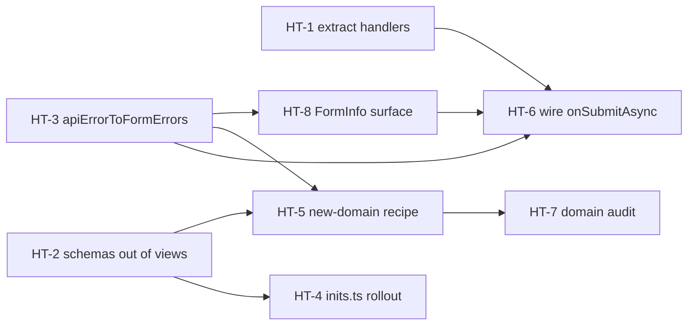

# Target Project — Create/Update Mechanics Analysis & Migration Playbook

> **Rev 2 — enriched 2026-07-19.** Original analysis 2026-07-19. Compares the
> NestJS+NextJS boilerplate form patterns (rev-11/12, committed `32ca551`+`e2ab2a6`)
> against the Evyos management frontend (the target project).
> Identifies gaps, similarities, and a recommended migration path for aligning
> the target project with production-ready create/update mechanics.
>
> **Rev-2 additions:** §3 exact boilerplate reference contracts (verified against
> source on this machine), §5 step-by-step how-to playbooks (HT-1…HT-8) with code,
> pitfalls, and verification steps, §6 migration order & dependency graph,
> §9 pitfalls catalogue, §10 verification protocol, appendix with the verified
> boilerplate source-file map.
>
> **Rev 2.1 — logic runtime-tested 2026-07-19** against the repo's installed
> packages (zod 4.4.3, @tanstack/form-core 1.33.0): `toFormPath` regex cases,
> the mapper's four decisions, the `partial→extend→superRefine` composition and
> its failure modes per zod version, the at-least-one guard (incl. flag-only
> updates), `errorMap.onSubmit` as the form-level error slot, and the HT-4/HT-7
> audit scripts. Corrections from testing are marked **[tested]** inline.
>
> **Rev 2.2 — boilerplate-side application audited 2026-07-19.** Commit `9044098`
> applied the playbooks to the boilerplate itself. §13 records the audit result:
> per-playbook status, **four open fixes (F-1…F-4)** with ready-to-apply code,
> and the intentional deviations. All F-fix code was applied to a scratch working
> tree on this machine and verified (`pnpm typecheck` clean, `pnpm lint` 0 errors)
> before being written down, then reverted — the fixes were **documented, not yet
> applied** at rev 2.2 time.
>
> **Rev 2.3 — F-1…F-4 applied 2026-07-19** in commit `b6ef35c`, verified in
> source and re-checked: `pnpm typecheck` clean, `pnpm lint` 0 errors
> (92 pre-existing warnings). Boilerplate-side application is **complete** except
> the two items that were always out of band: N-4 unit tests and the §10 manual
> QA matrix (see §13.4).
>
> **Scope:** schema layer, form view layer, API client layer, error handling.
> Does not cover auth, routing, or deployment.
>
> ⚠️ **Environment note (rev 2):** the target project path is **not mounted on this
> machine** (`berkay-server`). All boilerplate-side snippets below were re-verified
> against source at enrichment time; target-side shapes are carried over from the
> rev-1 analysis. Anything extrapolated beyond what rev-1 recorded is marked
> `ASSUMPTION` — re-verify those against the target repo before coding.

---

## Table of Contents

1. [Architecture Overview — Target Project](#1-architecture-overview--target-project)
2. [Boilerplate vs Target — Side by Side](#2-boilerplate-vs-target--side-by-side)
3. [Boilerplate Reference Contracts (verified)](#3-boilerplate-reference-contracts-verified)
4. [Required Changes — Rationale](#4-required-changes--rationale)
5. [How-To Playbooks (HT-1 … HT-8)](#5-how-to-playbooks)
6. [Migration Order & Dependency Graph](#6-migration-order--dependency-graph)
7. [Concrete Changes Checklist](#7-concrete-changes-checklist)
8. [Reference Implementation — Full Domain Example](#8-reference-implementation--full-domain-example)
9. [Pitfalls & Gotchas Catalogue](#9-pitfalls--gotchas-catalogue)
10. [Verification Protocol](#10-verification-protocol)
11. [Summary of Recommendations](#11-summary-of-recommendations)
12. [Appendix — Verified Boilerplate Source Map](#12-appendix--verified-boilerplate-source-map)
13. [Boilerplate Application Status — Rev 2.2 Audit & Open Fixes](#13-boilerplate-application-status--rev-22-audit--open-fixes)

---

## 1. Architecture Overview — Target Project

```
src/
  schemas/<domain>/           ← Zod schemas (validation + response)
    mutation.ts               Core field schemas + createSchema(errors) factory
    create.ts                 createRequestSchema = { data: mutationSchema, ... }
    update.ts                 partial mutation + uuid + superRefine
    list.ts                   Re-exports pagination list request schema
    row.ts                    Response row + createResponseSchema / updateResponseSchema / etc.
    inits.ts                  createInitialValues(row?) for form defaults
  queries/
    server/<domain>/          createServerFn (TanStack Start) → graphqlFetcher()
    client/<domain>/query.ts  useQuery hooks (list + find)
    client/<domain>/mutation.ts useMutation hooks (create + update)
  components/form/            useAppForm (TanStack React Form)
    SubmitButton / FormHeader / FormInfo
  views/forms/                Form view pages (mode: "create" | "update")
  lib/form.ts                 getFieldError, createApiMessageWithLang
  types/form/                 ApiErrorBucket, SectionMessages
```

### 1.1 Schema Layer — Detailed (`src/schemas/building/`)

| File | Pattern |
|---|---|
| `mutation.ts` | Core fields with helpers (`requiredString`, `requiredInteger`, `optionalUuidString`). Exports `buildMutationSchema` + `createSchema(errors)` factory |
| `create.ts` | `createRequestSchema = z.object({ data: buildMutationSchema, siteGovAddressCode, buildTypesUUID })` |
| `update.ts` | `buildUpdateDataSchema = buildMutationSchema.partial().extend({ isActive, isConfirmed, isDeleted }).superRefine(at-least-one-field)` + `updateRequestSchema = validatedUUIDSchema.extend({ data: buildUpdateDataSchema, ... })` |
| `row.ts` | Full response schema (`uuid`, `name`, `maxFloor`, …) + `listSchema`, `createResponseSchema`, `updateResponseSchema`, `findResponseSchema` |
| `inits.ts` | `defaultValues: schemaInputType` + `createInitialValues(building?)` — returns defaults or maps existing record to form shape |

### 1.2 Form View Layer (`activity-form-page.tsx`)

```tsx
type ActivityFormPageProps = {
  activityId?: string
  initialValues?: ActivityFormValues
  mode: 'create' | 'update'
}
```

- Schema built inline via `buildSchema(t)` — not in `src/schemas/`
- `onSubmit` **inline** (not extracted as module-level function)
- Uses `useAppForm` from `@tanstack/react-form`
- MUI `TextField`, `Select`, `Switch` via `form.AppField`
- Preview record created after submit
- No real API call (demo data only)

### 1.3 API Client Layer (`src/queries/`)

- **Server:** `createServerFn({ method: 'POST' }).inputValidator(schema).handler(async (ctx) => { ... })` wrapping `graphqlFetcher()` with raw GraphQL queries
- **Client query:** `useBuildingList` → `usePaginatedList`, `useGraphQlBuildingFind` → `useQuery`
- **Client mutation:** `useGraphQlBuildingCreate` / `useGraphQlBuildingUpdate` → `useMutation` with `onSuccess: () => queryClient.invalidateQueries(...)`
- **Error response:** `EntityClientResponse<T>` — discriminated union `{ error: false, data: T }` | `{ error: true, bucket: ApiErrorBucket }` — no exception throwing

### 1.4 Boilerplate Architecture (pattern source, verified paths)

For reference, the boilerplate side that the how-to's below quote from:

```
next-js-boilerplate/src/
  validators/forms/<domain>.ts        Zod schema + createXFieldSchemas(t) factory
  lib/api-client.ts                   apiFetch/apiFetchJson + ExceptionResponse envelope
  lib/exception-handler.ts            ExceptionCode → surface router + resolveByPath
  lib/forms/exception-to-form-errors.ts  exceptionToFormErrors(exc, messages)
  features/forms/form-hook.tsx        useAppForm + withFieldGroup (createFormHook)
  features/forms/ui/*.tsx             TextField/SelectField/… AppField components
  features/forms/actions/invite.ts    Server action via createServerValidate
  api/server/<domain>/<action>.ts     One file per endpoint, throws on failure
  api/client/<domain>/actions.ts      useXActions() hook: dynamic import + invalidateQueries
  views/forms/<page>/PageContent.tsx  Form views (profile = canonical module-level submit)
```

---

## 2. Boilerplate vs Target — Side by Side

| Aspect | Boilerplate (`nest-next-stack`) | Target Project (`evyos`) | Δ |
|---|---|---|---|
| **Form library** | `@tanstack/react-form` + `useAppForm` | `@tanstack/react-form` + `useAppForm` | ✅ Same |
| **HTTP client** | `apiFetch` / `apiFetchJson` (raw fetch) | `createServerFn` + `graphqlFetcher` (TanStack Start) | 🔄 Different stacks |
| **API response type** | `ExceptionResponse` (thrown, caught) | `EntityClientResponse<T>` (discriminated union) | ⚠️ Different philosophy |
| **Error → form mapping** | `exceptionToFormErrors(exc, messages)` → `{ form, fields }` | `createApiMessageWithLang(fieldLabels, errorMessages, apiError)` → bucket messages | ⚠️ Both exist, different shapes |
| **Error surface routing** | `getSurface(exc)` → `toast \| form-field \| full-page \| alert \| badge` | None — every error renders the same way | ❌ Target should add |
| **Schema location** | `src/validators/<domain>/<file>.ts` factory functions | `src/schemas/<domain>/mutation.ts` + `create.ts` + `update.ts` | 🔄 Different naming, same concept |
| **Create/Update schema** | Same schema for both | **Separate** — `create.ts` full, `update.ts` partial+uuid+superRefine | ✅ Target more rigorous |
| **Initial values** | `formOptions({ defaultValues })` with static object | `createInitialValues(row?)` — default or from existing record | ✅ Target more flexible |
| **Form schema factory** | `createXFieldSchemas(t: Record<string,string>)` in validators/ | `createSchema(errors: (key) => string)` in mutation.ts + `buildSchema(t)` inline in view | ✅ Conceptually same |
| **Submit handler** | **Module-level** extracted function | **Inline** in component body | ❌ Target should extract |
| **Response schemas** | Yes — `createResponseSchema`, `updateResponseSchema` in server layer | Yes — in `row.ts` per domain | ✅ Present in both |
| **Input validation** | Server layer validates with zod before API call | `createServerFn` `.inputValidator(schema)` | ✅ Present in both |
| **Cache invalidation** | Manual `invalidateQueries` in client actions hook | `useMutation` `onSuccess` callback | ✅ Both patterns |
| **File naming convention** | `api/server/<domain>/<action>.ts` + `api/client/<domain>/actions.ts` | `queries/server/<domain>/<action>.ts` + `queries/client/<domain>/mutation.ts` | 🔄 Different naming |
| **i18n** | `useTranslations` → `Record<string, string>` → factory | `useTranslations` → `t(key)` → inline `buildSchema(t)` | ✅ Both support i18n |

---

## 3. Boilerplate Reference Contracts (verified)

These are the **exact** contracts the migration replicates, re-read from source at
rev-2 time. Copy semantics, not file names.

### 3.1 The error envelope — `ExceptionResponse`

`next-js-boilerplate/src/lib/api-client.ts`:

```ts
export type ExceptionFieldError = {
  field: string;   // dot path, e.g. "billingAddress.postalCode" or "items.0.name"
  msg: string;     // English fallback message
  key: string;     // i18n key resolved against the messages tree
};

export type ExceptionResponse = {
  statusCode: number;
  exc: string;                     // machine code, e.g. "EX_VALIDATION_FORM"
  msg: string;                     // top-level fallback message
  key: string;                     // top-level i18n key
  field?: string;                  // single-field shorthand
  fields?: ExceptionFieldError[];  // multi-field errors
};
```

Errors are **thrown** by the fetch layer with the parsed body attached as
`err.exception`, so every catch site does:

```ts
const exc = (err as { exception?: ExceptionResponse }).exception;
```

**Target equivalence:** `EntityClientResponse<T>`'s `bucket: ApiErrorBucket` plays
the role of `ExceptionResponse` but is *returned*, not thrown. That is fine — the
mapping utility in HT-3 absorbs the difference. Keep the union; do not switch the
target to throwing.

### 3.2 The surface router — one error, five destinations

`next-js-boilerplate/src/lib/exception-handler.ts`:

```ts
export type ExceptionSurface = "toast" | "alert" | "badge" | "form-field" | "full-page";

const EXC_TO_SURFACE: Record<ExceptionCode, ExceptionSurface> = {
  EX_VALIDATION_FORM: "form-field",
  EX_AUTH_INVALID_CREDENTIALS: "toast",
  EX_AUTH_EMAIL_TAKEN: "form-field",
  EX_AUTH_ACCOUNT_LOCKED: "toast",
  EX_CONFLICT_DUPLICATE: "toast",
  EX_NOT_FOUND: "full-page",
  EX_FORBIDDEN: "full-page",
  EX_WS_UNSTABLE: "badge",
  EX_TIER_INSUFFICIENT: "full-page",
  EX_INTERNAL: "toast",
};

export function getSurface(exc: string): ExceptionSurface {
  return EXC_TO_SURFACE[exc as ExceptionCode] ?? "toast";  // unknown → toast, never crash
}
```

This is the piece the target is missing entirely: a **declarative table** deciding
*where* an error renders, so form views never hand-pick between toast and field
error ad hoc. Note the fallback: unknown codes degrade to toast.

### 3.3 The mapper — `exceptionToFormErrors`

`next-js-boilerplate/src/lib/forms/exception-to-form-errors.ts`, quoted in full
because every line carries a decision:

```ts
import { resolveByPath } from "@/lib/exception-handler";
import type { ExceptionResponse } from "@/lib/api-client";

// Backend sends "items.0.name"; TanStack Form addresses arrays as "items[0].name".
const toFormPath = (field: string) => field.replace(/\.(\d+)(?=\.|$)/g, "[$1]");

export function exceptionToFormErrors(
  exc: ExceptionResponse,
  messages: Record<string, unknown>,
): { form: string | null; fields: Record<string, string> } {
  const resolve = (key: string, fallback: string) =>
    (resolveByPath(messages, key) as string | undefined) ?? fallback;
  const targets = exc.fields?.length
    ? exc.fields
    : exc.field
      ? [{ field: exc.field, msg: exc.msg, key: exc.key }]
      : [];
  const fields = Object.fromEntries(
    targets.map((t) => [toFormPath(t.field), resolve(t.key, t.msg)]),
  );
  return targets.length
    ? { form: null, fields }
    : { form: resolve(exc.key, exc.msg), fields: {} };
}
```

Decisions encoded here, all of which HT-3 must preserve:

1. **`fields[]` wins over `field`** — multi-field takes priority; single-field is
   normalized into the same array shape.
2. **`toFormPath`** rewrites numeric dot segments to bracket indices so array
   fields (`items.0.name` → `items[0].name`) land on the right `AppField`.
3. **i18n key resolution with English fallback** — `resolveByPath(messages, key) ?? msg`.
   Never render a raw key; never drop the message if the key is missing.
4. **Mutually exclusive output** — either a form-level banner (`form`) or field
   errors (`fields`), never both from one envelope.

### 3.4 The canonical submit flow — `validators.onSubmitAsync`

The rev-12-verified canonical pattern (checkout `PageContent.tsx:111–128`,
profile `PageContent.tsx:52–90`). The submit *validator* returns errors instead of
throwing; TanStack Form normalizes the `{ form, fields }` return (**[tested]**
form-core 1.33 `normalizeError`) — `fields` land on the named fields' error
state, `form` lands in `form.state.errorMap.onSubmit`
(`getErrorMapKey('submit') → 'onSubmit'` in form-core). Note the boilerplate's
views today render the form-level half via local `formError` state +
`FormErrorBanner`; subscribing to `errorMap.onSubmit` (HT-8) is the cleaner
target-side wiring.

```tsx
// Module-level, outside the component (profile view, verbatim structure):
async function submitProfile(
  { value }: { value: typeof profileFormOpts.defaultValues },
  deps: {
    updateProfile: (data: ProfileUpdate) => Promise<void>;
    toast: ReturnType<typeof useToast>["toast"];
    messages: Record<string, unknown>;
  },
) {
  try {
    await deps.updateProfile({ /* map form values → API payload */ });
    deps.toast({ description: "Profile updated successfully", variant: "default" });
    return null;                                              // success ⇒ null
  } catch (err) {
    const exc = (err as { exception?: ExceptionResponse }).exception;
    if (!exc) return { form: "An unexpected error occurred", fields: {} };
    if (getSurface(exc.exc) === "toast") {                    // route non-form errors away
      deps.toast({ description: exceptionHandler(exc, deps.messages), variant: "destructive" });
      return null;                                            // toast shown ⇒ no form error
    }
    return exceptionToFormErrors(exc, deps.messages);         // form ⇒ { form, fields }
  }
}

// Inside the component:
const form = useAppForm({
  ...profileFormOpts,
  validators: {
    onSubmitAsync: ({ value }) =>
      submitProfile({ value }, { updateProfile, toast, messages: allMessages }),
  },
});
```

The contract of the handler, in one line:

> **`Promise<null | { form: string | null; fields: Record<string, string> }>` —
> `null` = success or already-surfaced (toast); an object = render in the form.**

Note the **deps object**: hooks results (`toast`, actions, messages) are passed in
as a second argument, keeping the handler a plain testable async function with
zero hook calls inside.

### 3.5 `formOptions` + `satisfies z.input`

Checkout `PageContent.tsx:82–91`:

```ts
const checkoutFormOpts = formOptions({
  defaultValues: {
    shippingAddress: ADDRESS_DEFAULTS,
    billingAddress: ADDRESS_DEFAULTS,
    sameAsShipping: false,
    email: "",
    confirmEmail: "",
    paymentMethod: "stripe",
  } satisfies z.input<typeof checkoutSchema>,   // ← compile-time drift guard
});
```

`satisfies z.input<…>` makes the defaults break the build the moment the schema
gains/renames a field. The target's `inits.ts` `defaultValues: schemaInputType`
annotation achieves the same; keep whichever, but **never** leave defaults
untyped.

### 3.6 Two-layer API — server file + client actions hook

Server (`api/server/posts/create.ts`): one exported async function per endpoint,
no hooks, throws on failure.

Client (`api/client/posts/actions.ts`): a `useXActions()` hook that
**dynamically imports** the server function (keeps it out of the client bundle
until used) and invalidates after every mutation:

```ts
export function usePostActions() {
  const queryClient = useQueryClient();
  const invalidate = () =>
    Promise.all([
      queryClient.invalidateQueries({ queryKey: ["feed"] }),
      queryClient.invalidateQueries({ queryKey: ["posts"] }),
    ]);

  const createPost = async (title: string, content: string, imageUrl?: string) => {
    const { createPostServer } = await import("@/api/server/posts/create");
    await createPostServer(title, content, imageUrl);
    await invalidate();
  };
  // updatePost / deletePost follow identically
  return { createPost, updatePost, deletePost /* … */ };
}
```

**Target equivalence:** `queries/client/<domain>/mutation.ts` with
`useMutation({ onSuccess: () => queryClient.invalidateQueries(...) })` is the same
idea with react-query's mutation wrapper. No change needed (see §4.4) — but the
*invalidation-after-every-mutation* rule is non-negotiable in both stacks.

### 3.7 Server actions variant (optional) — `createServerValidate`

For progressive-enhancement forms (`features/forms/actions/invite.ts`):

```ts
const serverValidate = createServerValidate({
  ...inviteFormOpts,
  onServerValidate: ({ value }) => {
    const result = inviteSchema.safeParse(value);
    if (!result.success) return result.error.issues.map((i) => i.message).join(", ");
    return null;
  },
});

export async function inviteAction(prev: unknown, formData: FormData) {
  try {
    await serverValidate(merged);
    return initialFormState;
  } catch (e) {
    if (e instanceof ServerValidateError) return e.formState;
    throw e;
  }
}
```

Only relevant to the target if it adopts Next-style server actions; with TanStack
Start's `createServerFn().inputValidator(schema)` the same guarantee already
exists. Listed for completeness — **not** part of the migration checklist.

---

## 4. Required Changes — Rationale

### 4.1 Extract Submit Handlers to Module Level

**Why:** Inline `onSubmit` handlers in the component body force recreating the
function on every render, prevent independent testing, and accumulate complexity
as the handler grows. The boilerplate's profile view (§3.4) is the proof of the
alternative: a plain async function with a deps object, unit-testable without
rendering anything.

→ Full steps: **[HT-1](#ht-1--extract-submit-handlers-to-module-level)**.

### 4.2 Move Schema Factories from Views to `src/schemas/`

**Why:** Boilerplate convention keeps all zod schemas in dedicated files, not
inline in views. The target already has `src/schemas/` with excellent structure —
the views should reuse it rather than define `buildSchema(t)` inline. Inline
schemas also can't be shared with `createServerFn().inputValidator()`, so the
server ends up validating a *different* schema than the form — drift waiting to
happen.

→ Full steps: **[HT-2](#ht-2--move-schema-factories-into-srcschemas)**.

### 4.3 Wire API Error Mapping to Form Fields

**Why:** The boilerplate's `exceptionToFormErrors` (§3.3) maps backend
field-level errors to specific form fields. The target's
`createApiMessageWithLang(...) → string | undefined` collapses everything to one
message — field-level information from the backend is thrown away before it can
reach the form. The `EntityClientResponse.bucket` union is cleaner than throwing;
it just needs a `bucket → { form, fields }` mapper and the `onSubmitAsync` wiring.

→ Full steps: **[HT-3](#ht-3--apierrortoformerrors-utility)** and
**[HT-6](#ht-6--wire-onsubmitasync-in-every-form-view)**.

### 4.4 Standardize Two-Layer API Naming

**Why:** The target's `src/queries/server/` + `src/queries/client/` pattern works
but diverges from the boilerplate's `src/api/server/` + `src/api/client/` naming.
Both are valid — the key is consistency within the project.

**Verdict: no structural change.** The target already has a solid two-layer
architecture (server: `createServerFn` → `graphqlFetcher`; client:
`useMutation`/`useQuery`). Renaming directories would churn dozens of imports for
zero behavioral gain. The existing pattern is production-ready. Do enforce the
two rules from §3.6: (1) server functions never call hooks; (2) every mutation
hook invalidates its domain's query keys on success.

### 4.5 Create/Update Schema Pattern — Keep as Is

**Why:** The target's `create.ts` vs `update.ts` separation is **more rigorous**
than the boilerplate (which uses a single schema for both):

| Feature | Target `update.ts` | Boilerplate |
|---|---|---|
| All fields optional | ✅ `.partial()` | N/A (single schema) |
| UUID required | ✅ `validatedUUIDSchema` | Passed as separate param |
| Status flags on update only | ✅ `.extend({ isActive, isConfirmed, isDeleted })` | N/A |
| At-least-one-field guard | ✅ `.superRefine()` | N/A |

**Recommendation:** Keep the target's separation. It is the superior pattern —
and it becomes the template every *new* domain follows (**[HT-5](#ht-5--stamp-out-a-new-domain-createupdate-schema-pair)**).

### 4.6 `inits.ts` — the `createInitialValues` Pattern

**Why:** `createInitialValues(record?) → default or mapped values` elegantly
solves the dual purpose of form initial values:

- **Create mode:** `createInitialValues()` → sanitized defaults
- **Update mode:** `createInitialValues(existingRecord)` → server row → form values

The boilerplate uses static `defaultValues` in `formOptions()` and `reset()` with
fetched data for updates — workable, but the target's version is better because
the row→form mapping lives in one named, testable place instead of being
scattered across `useEffect` + `reset` calls.

**Recommendation:** Keep and extend — every domain gets an `inits.ts`
(**[HT-4](#ht-4--roll-out-initsts-to-every-domain)**).

---

## 5. How-To Playbooks

Each playbook: **Goal → Preconditions → Steps → Pitfalls → Verify.** Estimated
effort assumes familiarity with the codebase. Do them in the order given in §6,
not in numeric order.

---

### HT-1 — Extract submit handlers to module level

**Goal:** every form view's submit logic is a module-level
`handleXSubmit(ctx, deps)` function following the §3.4 contract.
**Effort:** ~20 min per view. **Depends on:** nothing (can start immediately).

#### Steps

1. **Identify the views.** Every file under `src/views/forms/` that calls
   `useAppForm` with an inline `onSubmit` or inline `validators.onSubmitAsync`
   closure containing more than a delegation call:

   ```bash
   grep -rn "onSubmit\s*:" src/views/forms --include="*.tsx" -A2 | grep -B1 "await\|setPreview\|parse"
   ```

2. **List the closure's captures.** Read the inline handler and write down every
   identifier it captures from component scope. They split into two groups:
   - *submit context:* `value` (and `formApi` if used) — stays as arg 1
   - *dependencies:* hook results (`toast`, mutation hooks, `t`/messages,
     `setPreview`, `router`), props (`mode`, `activityId`) — become arg 2

3. **Write the module-level function** above the component, typed against the
   schema's inferred values type:

   ```tsx
   type ActivitySubmitDeps = {
     mode: 'create' | 'update'
     activityId?: string
     createActivity: (input: CreateActivityRequest) => Promise<EntityClientResponse<ActivityRow>>
     updateActivity: (input: UpdateActivityRequest) => Promise<EntityClientResponse<ActivityRow>>
     setPreview: Dispatch<SetStateAction<ActivityRecord | null>>
     resetForm: (values: ActivityFormValues) => void
     messages: SectionMessages          // whatever createApiMessageWithLang consumes today
   }

   async function handleActivitySubmit(
     { value }: { value: ActivityFormValues },
     deps: ActivitySubmitDeps,
   ): Promise<null | { form: string | null; fields: Record<string, string> }> {
     const result = deps.mode === 'create'
       ? await deps.createActivity({ data: value })
       : await deps.updateActivity({ uuid: deps.activityId!, data: value })

     if (result.error) {
       return apiErrorToFormErrors(result.bucket, deps.messages)   // HT-3
     }

     deps.setPreview(createPreviewRecord(value, deps.activityId))
     if (deps.mode === 'update') deps.resetForm(value)
     return null
   }
   ```

4. **Wire it as the submit validator**, not `onSubmit` (errors returned from
   `onSubmit` are ignored by TanStack Form; only `validators.onSubmitAsync`
   feeds the error map):

   ```tsx
   const form = useAppForm({
     defaultValues: createInitialValues(existingRecord),
     validators: {
       onChange: schema,
       onSubmitAsync: ({ value }) =>
         handleActivitySubmit({ value }, {
           mode, activityId, createActivity, updateActivity,
           setPreview, resetForm: form.reset, messages,
         }),
     },
     onSubmit: () => {
       // success-only side effects (toast, navigation) — runs only when
       // onSubmitAsync returned null
     },
   })
   ```

5. **Delete the inline closure** and re-run the form manually in both modes.

#### Pitfalls

- **Don't pass `form` itself into the deps type as `ReturnType<typeof useAppForm>`**
  — that type is generic-erased and circular in practice. Pass the narrow
  capabilities the handler needs (`resetForm: (v: T) => void`), as the profile
  view does with its `deps` object.
- **`onSubmit` vs `onSubmitAsync`:** returning `{ fields }` from `onSubmit` does
  nothing. Error mapping **must** go through `validators.onSubmitAsync`.
  `onSubmit` still runs afterwards on success — keep success-only effects there.
- **Success = `null`, not `undefined` with side effects half-done.** If the
  handler surfaced the error itself (e.g. toast), it must still return `null` so
  the form doesn't also render a stale error.

#### Verify

- `pnpm typecheck` clean.
- Manual: submit a create with a server-rejected value → field shows the error;
  fix it → error clears on next submit; success path resets/previews as before.
- The handler is now importable in a unit test with stub deps — write one per
  domain when the API wiring lands (create success, update success, bucket with
  field errors, bucket with form-only error).

---

### HT-2 — Move schema factories into `src/schemas/`

**Goal:** no `z.object(...)` literals inside `src/views/forms/`; views import
from `src/schemas/<domain>/mutation.ts`.
**Effort:** ~30 min per domain. **Depends on:** nothing.

#### Steps

1. **Find the inline schemas:**

   ```bash
   grep -rn "z\.object\|buildSchema" src/views/forms --include="*.tsx"
   ```

2. **Create/extend `src/schemas/<domain>/mutation.ts`.** Move the inline
   `buildSchema(t)` body verbatim, renamed to `create<Domain>Schema(t)`. Keep the
   `(key: string) => string` error-factory signature the schemas layer already
   uses (`createSchema(errors)`) — do **not** invent a third convention:

   ```ts
   // src/schemas/activities/mutation.ts
   export function createActivitySchema(t: (key: string) => string) {
     return z.object({
       title: z.string().trim().min(3, t('title-min')),
       owner: z.string().trim().min(2, t('owner-min')),
       // … moved verbatim from the view
     })
   }
   export type ActivityFormValues = z.infer<ReturnType<typeof createActivitySchema>>
   ```

3. **Export the inferred types from the schema file** (`ActivityFormValues`
   above) and delete any duplicate type definitions in the view.

4. **In the view, memoize the built schema on the translator:**

   ```tsx
   const schema = useMemo(() => createActivitySchema(t), [t])
   ```

   Without `useMemo`, a new schema instance per render makes TanStack Form
   re-validate on every render and defeats referential comparisons.

5. **Point the server input validator at the same source.** Where
   `createServerFn(...).inputValidator(...)` currently uses a hand-rolled schema,
   compose it from `create.ts`/`update.ts` (which themselves import
   `mutation.ts`). One source of truth, three consumers (form, server fn,
   request/response types).

6. **Constants next to schemas.** Enum option lists used by both schema and view
   (`ACTIVITY_CHANNELS`, statuses…) go to `src/schemas/<domain>/constants.ts` so
   the view imports labels/options and the schema imports the value tuple from
   the same file.

#### Pitfalls

- **The `t` identity trap:** if the i18n hook returns a new function each render,
  `useMemo(() => createActivitySchema(t), [t])` recomputes every render anyway.
  Check the hook's contract; if unstable, key the memo on the locale instead.
- **Error-message factories must degrade.** Server-side usage of the same schema
  has no translator. The boilerplate handles this with
  `t.key ?? "English fallback"`; the target's `createSchema(errors)` style should
  either accept `() => ''` (as `create.ts` does today) or ship a
  default-messages implementation. Never let a missing key produce `undefined`
  as a zod message.
- **Don't move view-only formatting helpers** (preview builders, label maps) into
  `schemas/` — only validation and types live there.

#### Verify

- `grep -rn "z.object" src/views/forms` returns nothing.
- `pnpm typecheck` clean; form still shows translated messages in both locales.

---

### HT-3 — `apiErrorToFormErrors` utility

**Goal:** a single `bucket → { form, fields }` mapper, semantically identical to
the boilerplate's `exceptionToFormErrors` (§3.3), consumed by every form view.
**Effort:** ~1–2 h including tests. **Depends on:** nothing; blocks HT-6.

> Decision from rev-1 §3.3 ("either (a) extend `createApiMessageWithLang` or
> (b) new `apiErrorToFormErrors`") — **resolved: (b), new utility.**
> `createApiMessageWithLang → string | undefined` has existing call sites relying
> on the scalar return; changing its shape would ripple. A new function with the
> boilerplate's return contract is additive and lets old call sites migrate
> one by one.

#### Steps

1. **Pin down `ApiErrorBucket`'s real shape** in `src/types/form/`.
   `ASSUMPTION` (re-verify): it carries at minimum a machine code / message /
   i18n key at the top level and optionally a list of per-field entries. Map its
   actual property names onto the envelope roles from §3.1:

   | Role (boilerplate name) | Find in `ApiErrorBucket` |
   |---|---|
   | `exc` — machine code | ← e.g. `code` / `errorCode` |
   | `key` + `msg` — top-level message | ← e.g. `messageKey` / `message` |
   | `fields[] { field, key, msg }` | ← e.g. `fieldErrors[]` / GraphQL `extensions.validation` |

2. **Create `src/lib/form-errors.ts`** (new file — keep `lib/form.ts` untouched):

   ```ts
   import type { ApiErrorBucket } from '#/types/form'

   export type FormErrorMap = { form: string | null; fields: Record<string, string> }

   // Backend "items.0.name" → TanStack Form "items[0].name"
   const toFormPath = (field: string) => field.replace(/\.(\d+)(?=\.|$)/g, '[$1]')

   export function apiErrorToFormErrors(
     bucket: ApiErrorBucket,
     messages: Record<string, unknown>,          // same tree createApiMessageWithLang reads
   ): FormErrorMap {
     const resolve = (key: string | undefined, fallback: string) =>
       (key && resolveByPath(messages, key)) || fallback

     const targets = bucket.fieldErrors ?? []     // ← adapt to the real property name
     if (targets.length) {
       return {
         form: null,
         fields: Object.fromEntries(
           targets.map((t) => [toFormPath(t.field), resolve(t.key, t.message)]),
         ),
       }
     }
     return { form: resolve(bucket.messageKey, bucket.message), fields: {} }
   }
   ```

   Port `resolveByPath` (dot-path lookup into the nested messages object,
   returning `undefined` on any miss) if the target has no equivalent.

3. **Preserve all four §3.3 decisions:** fields-over-form priority, `toFormPath`
   rewriting, key-resolution-with-fallback, mutually exclusive output.

4. **Add a surface router if/when the backend sends machine codes.** Start
   minimal — a `getSurface(code)` with a two-entry table
   (`VALIDATION → 'form-field'`, default `'toast'`) mirroring §3.2, and grow the
   table as codes appear. This keeps toast-worthy errors (auth, conflict,
   internal) out of the form banner from day one.

5. **Unit-test the mapper** — this is the one pure function in the whole
   migration, test it exhaustively:
   - multi-field bucket → `{ form: null, fields: {...} }`
   - single top-level error → `{ form: '…', fields: {} }`
   - array path `items.0.name` → key `items[0].name`
   - unknown i18n key → English fallback used
   - empty/undefined `fieldErrors` → form-level output

#### Pitfalls

- **Do not resolve messages at fetch time.** The mapper takes the messages tree
  as an argument precisely so locale switching re-resolves; baking strings into
  the bucket in the query layer freezes the language.
- **GraphQL nesting:** if errors arrive under `errors[0].extensions`, normalize
  to `ApiErrorBucket` **once**, in `graphqlFetcher` — the mapper should never
  know about GraphQL envelopes.
- **Field paths must match `form.AppField name=` exactly** post-`toFormPath` — a
  silent mismatch renders nothing. The HT-6 verification step catches this.

#### Verify

- Unit tests above green.
- Temporarily hard-return a fake bucket from one mutation and confirm the right
  input shows the message.

---

### HT-4 — Roll out `inits.ts` to every domain

**Goal:** every `src/schemas/<domain>/` has an `inits.ts` exporting typed
`defaultValues` + `createInitialValues(record?)`.
**Effort:** ~15 min per domain. **Depends on:** HT-2 (types must live in schemas).

#### Steps

1. **Audit which domains lack it:**

   ```bash
   for d in src/schemas/*/; do [ -f "$d/inits.ts" ] || echo "MISSING: $d"; done
   ```

2. **Stamp the pattern** (building's `inits.ts` is the template):

   ```ts
   import type { ActivityFormValues } from './mutation'
   import type { ActivityRow } from './row'

   export const defaultValues: ActivityFormValues = {
     title: '', owner: '', channel: 'email', status: 'open',
     urgent: false, notes: '',
     followUpAt: toDateTimeLocalValue(new Date().toISOString()),
   }

   export function createInitialValues(record?: ActivityRow): ActivityFormValues {
     if (!record) return { ...defaultValues }
     return {
       title: record.title,
       owner: record.owner,
       channel: record.channel as ActivityFormValues['channel'],
       status: record.status as ActivityFormValues['status'],
       urgent: record.urgent,
       notes: record.notes,
       followUpAt: toDateTimeLocalValue(record.followUpAt),
     }
   }
   ```

3. **Annotate `defaultValues` with the form-values type** (or
   `satisfies z.input<…>` per §3.5) so schema drift breaks the build here, not at
   runtime.

4. **All row→form value coercions live here** and nowhere else: ISO string →
   `datetime-local` value, `null` → `''`, number → string for text inputs, row
   enums (usually widened to `string` in `row.ts`) narrowed back to the form
   union. If the backend can return enum values the form doesn't know,
   prefer a guarded narrow over a blind cast:

   ```ts
   channel: ACTIVITY_CHANNELS.includes(record.channel as never)
     ? (record.channel as ActivityFormValues['channel'])
     : defaultValues.channel,
   ```

5. **Views stop hand-building defaults:** create mode passes
   `createInitialValues()`, update mode `createInitialValues(row)` — and the
   update page keys the form component on the record uuid (`key={row.uuid}`) or
   calls `form.reset(createInitialValues(row))` when the fetch resolves, so a
   late-arriving row actually populates the form.

#### Pitfalls

- **`defaultValues` mutation:** always spread (`{ ...defaultValues }`) — TanStack
  Form will otherwise share and mutate the module-level object across mounts.
- **Date defaults are evaluated at module load** if written inline in
  `defaultValues` (`new Date()` runs once per bundle, not per form open). If
  "now" matters, compute it inside `createInitialValues()` instead.

#### Verify

- `pnpm typecheck`; open one update form and confirm every field is populated,
  including date/enum/boolean fields; open create and confirm defaults.

---

### HT-5 — Stamp out a new domain (create/update schema pair)

**Goal:** a repeatable recipe for adding a domain with the full six-file layout.
**Effort:** ~1 h per domain. **Depends on:** HT-2, HT-3 (for the view wiring).

#### Steps — file order matters (each imports the previous)

1. `constants.ts` — value tuples for enums (`export const ACTIVITY_CHANNELS = ['email','phone','meeting'] as const`).
2. `mutation.ts` — `create<Domain>Schema(t)` factory + `<Domain>FormValues` type (HT-2 shape).
3. `row.ts` — response row schema + `listSchema` + `createResponseSchema` /
   `updateResponseSchema` / `findResponseSchema`. Row enums may stay `z.string()`
   (server is trusted); form schemas stay strict.
4. `create.ts` — `createRequestSchema = z.object({ data: <mutation>, …siblings })`.
5. `update.ts` — the rigorous pattern (§4.5), in this exact composition order:

   ```ts
   export const updateDataSchema = create<Domain>Schema(() => '')
     .partial()                                    // 1. everything optional
     .extend({ isActive: z.boolean().optional(),  // 2. update-only flags
               isConfirmed: z.boolean().optional(),
               isDeleted: z.boolean().optional() })
     .superRefine((value, ctx) => {                // 3. at-least-one guard LAST
       if (!Object.values(value).some((v) => v !== undefined)) {
         ctx.addIssue({ code: z.ZodIssueCode.custom, message: 'At least one field required' })
       }
     })

   export const updateRequestSchema = validatedUUIDSchema.extend({ data: updateDataSchema })
   ```

6. `inits.ts` — HT-4 shape.
7. `list.ts` — re-export the shared pagination request schema.
8. Then the query layer: `queries/server/<domain>/create.ts` + `update.ts`
   (each `createServerFn().inputValidator(createRequestSchema | updateRequestSchema)`),
   `queries/client/<domain>/mutation.ts` (`useMutation` + `invalidateQueries` on
   the domain's list/find keys), `query.ts` (list + find).
9. Finally the view, wired per HT-1/HT-6.

#### Pitfalls

- **`.partial()` before `.superRefine()`, never after** — **[tested]** the
  failure mode is zod-version dependent but the rule is not: on zod 3,
  `superRefine` returns a `ZodEffects` with no `.partial()` (compile error); on
  zod 4 (probed on 4.4.3), `.partial()` exists but **throws at runtime**:
  `".partial() cannot be used on object schemas containing refinements"`.
- **`.extend()` after `.superRefine()`** — zod 3: compile error (same
  `ZodEffects` reason). zod 4: **[tested]** it works *and preserves the
  refinement* — but keep flags before the guard anyway (the order above is the
  only one valid on both majors, and it keeps the guard reading the final shape).
- **The at-least-one guard must ignore the flags or not**, decide explicitly: if
  toggling `isActive` alone is a legal update (it usually is), the guard as
  written already accepts it since the flag is a defined value. Document the
  intent in the schema file.
- **Invalidate both list and find keys** on update, else a just-edited detail
  page shows stale data.

#### Verify

- `pnpm typecheck && pnpm lint`.
- Round-trip: create via the form → appears in list; open update form → fields
  prefilled (HT-4); submit empty update → blocked by the superRefine message;
  submit one changed field → succeeds, list + detail both fresh.

---

### HT-6 — Wire `onSubmitAsync` in every form view

**Goal:** every form view routes API failures through
`apiErrorToFormErrors` via `validators.onSubmitAsync`; field errors land on
fields, form-level errors in the form banner, toast-class errors in toasts.
**Effort:** ~20 min per view. **Depends on:** HT-1, HT-3.

#### Steps

1. In each view's module-level handler (HT-1), replace the placeholder/preview
   API section with the real mutation and the HT-3 mapper (see the HT-1 step-3
   snippet — it is already the final form).
2. **Confirm the form-level channel renders.** The `{ form: '…' }` half of the
   map surfaces at `form.state.errorMap.onSubmit` (**[tested]** — form-core's
   `getErrorMapKey('submit')`); `FormInfo` (or the target's equivalent) must
   subscribe to it:

   ```tsx
   <form.Subscribe selector={(s) => s.errorMap.onSubmit}>
     {(error) => error ? <FormErrorBanner message={String(error)} /> : null}
   </form.Subscribe>
   ```

   If `FormInfo` only renders per-field errors today, extend it (checklist P6).
   (The boilerplate's own views still use local `formError` state +
   `FormErrorBanner` for this — the subscribe form is the recommended upgrade,
   not the copied-verbatim pattern.)
3. **Confirm per-field rendering.** Each `AppField` component should already read
   `field.state.meta.errors`; submit-async errors appear there keyed by the
   mapped path. Spot-check one nested path (`billingAddress.postalCode`-style)
   and one array path if the domain has them.
4. **Route toast-class errors away from the form** (§3.4): if the bucket's code
   maps to `toast`, show the toast and return `null`.
5. **Error clearing:** **[tested]** form-core 1.33 clears submit-cause errors
   automatically whenever a *later validation pass of another cause* completes
   with zero errors — so with `onChange: schema` wired, correcting the field
   clears the API error as soon as the schema passes, without waiting for a
   resubmit (`FormApi` resets `errorMap.onSubmit` when `cause !== "submit" &&
   !hasErrored`). A new submit also replaces them. Don't add manual clearing
   logic; it's built in.

#### Pitfalls

- Returning the error map from **`onSubmit`** instead of
  **`validators.onSubmitAsync`** — silently does nothing (most common wiring
  mistake; already called out in HT-1 but it is *the* failure mode of this step).
- **Path mismatch** between backend field names and form field names (e.g.
  backend `name`, form `title`). The mapper is 1:1 by design; if a domain's API
  names differ from its form names, add an explicit `fieldNameMap` argument for
  that domain rather than renaming form fields ad hoc.
- **Double-surfacing:** handler toasts *and* returns `{ form }` for the same
  error. One error, one surface — the §3.4 contract.

#### Verify

Per view, force each class once (a validation bucket, a top-level-only bucket, a
network failure):

- field error renders under the named field and clears after a corrected resubmit
- form-level error renders in the banner
- network failure → generic form error, no crash, no unhandled rejection in console

---

### HT-7 — Domain schema audit (existing domains)

**Goal:** every existing `src/schemas/<domain>/` matches the six-file layout;
gaps enumerated and stamped.
**Effort:** ~30 min audit + per-gap fixes. **Depends on:** HT-5 recipe.

#### Steps

1. **Run the audit:**

   ```bash
   for d in src/schemas/*/; do
     for f in mutation create update row inits list; do
       [ -f "$d$f.ts" ] || echo "$(basename $d): missing $f.ts"
     done
   done
   ```

2. **Triage each gap** — not every domain needs every file (a read-only domain
   needs no `create.ts`/`update.ts`/`inits.ts`). Record intentional gaps in this
   doc's checklist table rather than creating empty files.
3. **For each real gap,** stamp the missing file from the HT-5 recipe, reusing
   the domain's existing `mutation.ts` field definitions.
4. **Consistency pass** while in there: `createSchema(errors)` signature uniform;
   `superRefine` guard present in every `update.ts`; `row.ts` exports all four
   response schemas its query layer actually parses.

#### Verify

- Audit script prints only documented-intentional gaps.
- `pnpm typecheck` clean.

---

### HT-8 — `FormInfo` / form-level error surface

**Goal:** the shared form components render the `{ form }` half of the error map
and the submitting/dirty state consistently.
**Effort:** ~1 h once, shared by all views. **Depends on:** HT-3 contract.

#### Steps

1. Extend `components/form/FormInfo.tsx` to subscribe to the form-level submit
   error (HT-6 step-2 snippet) in addition to whatever it renders today.
2. Give it a dismiss affordance that clears only the *displayed* state — the
   authoritative error still lives in form state until the next submit.
3. `SubmitButton`: ensure it subscribes to `isSubmitting` (disable + spinner
   during `onSubmitAsync`) — async submit validators make slow submits visible
   in a way instant demo submits never did.
4. Accessibility: the banner gets `role="alert"`; field errors are associated to
   inputs via `aria-describedby` (verify the existing `AppField` wrappers already
   do this; add where missing).

#### Verify

- One slow (throttled) submit shows the disabled/spinner state.
- Screen-reader spot check: banner announced on appearance.

---

## 6. Migration Order & Dependency Graph



**Recommended sequence** (each stage leaves the app shippable):

| Stage | Work | Why this order |
|---|---|---|
| 1 | HT-3 (+ unit tests) and HT-8 | Pure additions, zero risk, unblock everything downstream |
| 2 | HT-1 + HT-2 on **one pilot view** (activity form) | Prove the pattern end-to-end on the view this doc already dissected |
| 3 | HT-6 on the pilot | First real error-mapped submit; shake out bucket-shape assumptions from HT-3 step 1 |
| 4 | HT-4 across domains, then HT-1/HT-2/HT-6 across remaining views | Mechanical repetition of the proven pattern |
| 5 | HT-7 audit, then HT-5 for the new `activities` domain | Audit last so it checks the *finished* layout |

---

## 7. Concrete Changes Checklist

### Priority 1 — Align form views with boilerplate conventions

| # | File | Change | Playbook |
|---|---|---|---|
| P1 | `views/forms/activity-form-page.tsx` | Extract `onSubmit` to module-level `handleActivitySubmit` | HT-1 |
| P2 | `views/forms/activity-form-page.tsx` | Move `buildSchema(t)` to `schemas/activities/mutation.ts` | HT-2 |
| P3 | `views/forms/activity-form-page.tsx` | Create `schemas/activities/inits.ts` with `defaultValues` + `createInitialValues()` | HT-4 |
| P4 | All form views | Extract `onSubmit` handlers to module-level functions | HT-1 |

### Priority 2 — Error mapping integration

| # | File | Change | Playbook |
|---|---|---|---|
| P5 | new `lib/form-errors.ts` | Add `apiErrorToFormErrors(bucket, messages) → { form, fields }` (+ unit tests) | HT-3 |
| P6 | `components/form/FormInfo.tsx` | Render the form-level submit error; a11y roles | HT-8 |
| P7 | `queries/client/**/mutation.ts` | Standardize `useMutation` to return `EntityClientResponse` consistently; invalidate list+find keys | §3.6 rules |

### Priority 3 — Schema organization

| # | File | Change | Playbook |
|---|---|---|---|
| P8 | `schemas/<domain>/` | Audit every domain against the six-file layout; document intentional gaps | HT-7 |
| P9 | `schemas/activities/` | **Create new domain** following the building pattern | HT-5 |

### Priority 4 — Form component refinements

| # | File | Change | Playbook |
|---|---|---|---|
| P10 | `components/form/` | Ensure `useAppForm` views use `validators.onSubmitAsync` returning `{ form, fields }` | HT-1/HT-6 |
| P11 | `views/forms/*` | Wire `validators.onSubmitAsync` with `apiErrorToFormErrors` for field-level API error mapping | HT-6 |

---

## 8. Reference Implementation — Full Domain Example

### New domain: `schemas/activities/`

```ts
// schemas/activities/constants.ts
export const ACTIVITY_CHANNELS = ['email', 'phone', 'meeting'] as const
export const ACTIVITY_STATUSES = ['open', 'in-progress', 'closed'] as const
```

```ts
// schemas/activities/mutation.ts
import { z } from 'zod'
import { ACTIVITY_CHANNELS, ACTIVITY_STATUSES } from './constants'

export function createActivitySchema(t: (key: string) => string) {
  return z.object({
    title: z.string().trim().min(3, t('title-min')),
    owner: z.string().trim().min(2, t('owner-min')),
    channel: z.enum(ACTIVITY_CHANNELS),
    status: z.enum(ACTIVITY_STATUSES),
    urgent: z.boolean(),
    notes: z.string().trim().min(10, t('notes-min')),
    followUpAt: z.string().min(1, t('followUpAt-required'))
      .refine((value) => !Number.isNaN(new Date(value).getTime()), { message: t('followUpAt-invalid') }),
  })
}

export type ActivityFormValues = z.infer<ReturnType<typeof createActivitySchema>>
```

```ts
// schemas/activities/row.ts
import { z } from 'zod'
import { paginatedList } from '#/schemas/commons/pagination'

export const schema = z.object({
  id: z.string(),
  title: z.string(),
  owner: z.string(),
  channel: z.string(),
  status: z.string(),
  urgent: z.boolean(),
  notes: z.string(),
  followUpAt: z.string(),
  updatedAt: z.string(),
})

export const listSchema = paginatedList(schema)
export const createResponseSchema = z.object({ data: z.object({ createActivity: schema }) })
export const updateResponseSchema = z.object({ data: z.object({ updateActivity: schema }) })
export const findResponseSchema = z.object({ data: z.object({ activity: schema }) })
export type ActivityRow = z.infer<typeof schema>
```

```ts
// schemas/activities/create.ts
import { z } from 'zod'
import { createActivitySchema } from './mutation'

export const createRequestSchema = z.object({
  data: createActivitySchema(() => ''), // base schema; runtime messages come from the factory
})

export type CreateActivityRequest = z.infer<typeof createRequestSchema>
```

```ts
// schemas/activities/update.ts
import { z } from 'zod'
import { createActivitySchema } from './mutation'

export const validatedUUIDSchema = z.object({ uuid: z.string().uuid() })

// Composition order is load-bearing: partial → extend → superRefine (see HT-5)
export const updateDataSchema = createActivitySchema(() => '')
  .partial()
  .superRefine((value, ctx) => {
    if (!Object.values(value).some((v) => v !== undefined)) {
      ctx.addIssue({ code: z.ZodIssueCode.custom, message: 'At least one field required' })
    }
  })

export const updateRequestSchema = validatedUUIDSchema.extend({ data: updateDataSchema })
export type UpdateActivityRequest = z.infer<typeof updateRequestSchema>
```

```ts
// schemas/activities/inits.ts
import { toDateTimeLocalValue } from '#/utils/form-utils'
import { ACTIVITY_CHANNELS, ACTIVITY_STATUSES } from './constants'
import type { ActivityFormValues } from './mutation'
import type { ActivityRow } from './row'

export const defaultValues: ActivityFormValues = {
  title: '',
  owner: '',
  channel: 'email',
  status: 'open',
  urgent: false,
  notes: '',
  followUpAt: '',
}

export function createInitialValues(record?: ActivityRow): ActivityFormValues {
  if (!record) {
    // "now" computed per call, not per module load (HT-4 pitfall)
    return { ...defaultValues, followUpAt: toDateTimeLocalValue(new Date().toISOString()) }
  }
  return {
    title: record.title,
    owner: record.owner,
    channel: ACTIVITY_CHANNELS.includes(record.channel as never)
      ? (record.channel as ActivityFormValues['channel'])
      : defaultValues.channel,
    status: ACTIVITY_STATUSES.includes(record.status as never)
      ? (record.status as ActivityFormValues['status'])
      : defaultValues.status,
    urgent: record.urgent,
    notes: record.notes,
    followUpAt: toDateTimeLocalValue(record.followUpAt),
  }
}
```

### Updated Form View

```tsx
// views/forms/activity-form-page.tsx
import { useMemo, useState } from 'react'
import type { Dispatch, SetStateAction } from 'react'
import { createActivitySchema, type ActivityFormValues } from '#/schemas/activities/mutation'
import { createInitialValues } from '#/schemas/activities/inits'
import type { ActivityRow } from '#/schemas/activities/row'
import { apiErrorToFormErrors, type FormErrorMap } from '#/lib/form-errors'
import { useAppForm } from '#/components/form'

type ActivityFormPageProps = {
  activityId?: string
  record?: ActivityRow
  mode: 'create' | 'update'
}

type ActivitySubmitDeps = {
  mode: 'create' | 'update'
  activityId?: string
  createActivity: (input: { data: ActivityFormValues }) => Promise<EntityClientResponse<ActivityRow>>
  updateActivity: (input: { uuid: string; data: ActivityFormValues }) => Promise<EntityClientResponse<ActivityRow>>
  setPreview: Dispatch<SetStateAction<ActivityRow | null>>
  resetForm: (values: ActivityFormValues) => void
  messages: Record<string, unknown>
}

// Module-level: plain async function, no hooks, unit-testable with stub deps (HT-1)
async function handleActivitySubmit(
  { value }: { value: ActivityFormValues },
  deps: ActivitySubmitDeps,
): Promise<FormErrorMap | null> {
  const result = deps.mode === 'create'
    ? await deps.createActivity({ data: value })
    : await deps.updateActivity({ uuid: deps.activityId!, data: value })

  if (result.error) {
    return apiErrorToFormErrors(result.bucket, deps.messages)   // HT-3
  }

  deps.setPreview(result.data)
  if (deps.mode === 'update') deps.resetForm(value)
  return null
}

export default function ActivityFormPage({ activityId, record, mode }: ActivityFormPageProps) {
  const pageT = useTranslations('forms.page')
  const messages = useAllMessages()
  const { createActivity, updateActivity } = useActivityMutations()
  const [preview, setPreview] = useState<ActivityRow | null>(null)

  const schema = useMemo(() => createActivitySchema(pageT), [pageT])

  const form = useAppForm({
    defaultValues: createInitialValues(record),
    validators: {
      onChange: schema,
      onSubmitAsync: ({ value }) =>
        handleActivitySubmit({ value }, {
          mode, activityId, createActivity, updateActivity,
          setPreview, resetForm: form.reset, messages,
        }),
    },
    onSubmit: () => {
      // success-only: onSubmitAsync returned null if we got here
    },
  })

  // ... render JSX (unchanged from current pattern); FormInfo renders the
  // form-level error via form.Subscribe (HT-8)
}
```

---

## 9. Pitfalls & Gotchas Catalogue

Collected from the playbooks plus lessons already paid for in the boilerplate:

| # | Pitfall | Consequence | Guard |
|---|---|---|---|
| G1 | Returning error map from `onSubmit` instead of `validators.onSubmitAsync` | Errors silently ignored — form looks stuck | HT-1/HT-6; grep for `onSubmit:.*return {` in review |
| G2 | `.partial()` after `.superRefine()` | zod 3: compile error (`ZodEffects`); zod 4 **[tested 4.4.3]**: runtime throw. (`.extend()` after refine *works* on zod 4 and keeps the refinement — still compose flags before the guard) | HT-5 composition order |
| G3 | Unmemoized `createXSchema(t)` in render | Re-validation every render, perf + focus glitches | `useMemo(..., [t])`; check `t` identity stability |
| G4 | Backend `items.0.name` vs form `items[0].name` | Field error never renders, no warning | `toFormPath` in the mapper; array-path test case |
| G5 | Resolving i18n at fetch time / baking strings into the bucket | Locale switch shows stale language | Mapper takes `messages` as an argument (HT-3) |
| G6 | Handler toasts **and** returns `{ form }` for one error | Same error surfaced twice | §3.4: one error, one surface; return `null` after toast |
| G7 | Untyped `defaultValues` | Schema drift discovered at runtime | `satisfies z.input<…>` / typed `inits.ts` (§3.5, HT-4) |
| G8 | Shared module-level `defaultValues` object mutated by form | Ghost values across form mounts | Always spread in `createInitialValues` |
| G9 | `new Date()` inside module-level `defaultValues` | "Now" frozen at bundle load | Compute inside `createInitialValues()` |
| G10 | Update mutation invalidates list but not find key (or vice versa) | Stale detail/list after edit | Invalidate both (§3.6, HT-5 step 8) |
| G11 | Blind `as` casts row enum → form enum | Backend adds a value → form crashes or submits invalid | Guarded narrow with default (HT-4 step 4) |
| G12 | Unconditional boolean `data-*` attrs on field components (`data-disabled={bool}`) with Tailwind presence selectors (`data-[disabled]:…`) | Selector matches `data-disabled="false"` too — killed pointer-events in prod (2026-07-18 combobox bug, boilerplate) | Only set the attribute when true: `data-disabled={disabled || undefined}` |
| G13 | Server fn validating a different schema than the form | "Valid" form rejected server-side with unmappable errors | One schema source: `create.ts`/`update.ts` feed both (HT-2 step 5) |

---

## 10. Verification Protocol

Run per stage of §6, not once at the end.

### Automated (every stage)

```bash
pnpm typecheck
pnpm lint
pnpm generate-i18n-types   # boilerplate convention — substitute the target's i18n codegen, if any
```

Unit tests to add along the way (cheap, high-leverage):

- `apiErrorToFormErrors` — the five HT-3 cases (only pure function; test hard)
- one `handleXSubmit` per domain with stub deps — create success, update
  success, field-error bucket, form-only bucket
- `createInitialValues` — no-arg defaults; full-row mapping; out-of-enum row value

### Manual QA matrix (per migrated view)

| Scenario | Expected |
|---|---|
| Create, all valid | Success surface (toast/preview), form resets per spec, list refreshed |
| Create, client-invalid field | Blocked before network; translated message under field |
| Create, server rejects a field | Message under exactly that field; clears after corrected resubmit |
| Create, server top-level error | Form banner (or toast, per surface table) — never both |
| Update, load existing | All fields prefilled incl. dates/enums/booleans |
| Update, no changes submitted | Blocked by at-least-one superRefine message |
| Update, one field changed | Succeeds; list **and** detail views fresh |
| Network down | Generic form error; no crash; no unhandled rejection in console |
| Locale switch, then re-trigger an error | Message in the new locale |
| Slow submit (throttle) | SubmitButton disabled + spinner for the duration |

### Definition of done (whole migration)

- `grep -rn "z.object" src/views/forms` → empty
- No inline multi-statement submit closures in `src/views/forms`
- HT-7 audit script prints only documented-intentional gaps
- All unit tests green; QA matrix passes on the pilot + one more view minimum

---

## 11. Summary of Recommendations

| Decision | Verdict | Rationale |
|---|---|---|
| Keep `src/schemas/<domain>/create.ts` vs `update.ts` separation | ✅ Keep | More rigorous than boilerplate's single-schema approach |
| Keep `src/schemas/<domain>/inits.ts` pattern | ✅ Keep | Elegant `createInitialValues(record?)` dual-purpose |
| Keep `src/queries/server/` + `src/queries/client/` two-layer | ✅ Keep | Solid; renaming = churn for zero gain (§4.4) |
| Keep `EntityClientResponse` union (no exception throwing) | ✅ Keep | Cleaner than throw/catch; mapper absorbs the difference (§3.1) |
| Move schema factories from views to `src/schemas/<domain>/mutation.ts` | 🔄 Migrate | Centralizes validation; one schema feeds form **and** server fn (HT-2) |
| Extract submit handlers to module-level functions with deps object | 🔄 Migrate | Boilerplate O3 convention; enables unit testing (HT-1) |
| Add `apiErrorToFormErrors()` in new `lib/form-errors.ts` | ➕ Add | Maps `bucket` → TanStack Form field errors; option (b) chosen (HT-3) |
| Add minimal error-surface router (`getSurface`) | ➕ Add | Keeps toast-class errors out of the form banner (§3.2) |
| Wire `validators.onSubmitAsync` with error mapping | 🔄 Migrate | Boilerplate O6/O7 convention — the canonical checkout flow (HT-6) |
| Response schemas in `row.ts` | ✅ Keep | Already done — excellent pattern |

**Total new files:** ~7 (`lib/form-errors.ts` + tests, activities domain:
constants, mutation, create, update, inits, row, list)
**Total modified files:** ~8+ (activity-form-page.tsx, other form views,
`components/form/FormInfo.tsx`, `queries/client/**/mutation.ts` touch-ups)
**No structural changes** to the existing architecture.

---

## 12. Appendix — Verified Boilerplate Source Map

Files re-read on `berkay-server` at rev-2 time; quote-accurate as of commit
`c50fcc7`:

| Contract | File | Key lines |
|---|---|---|
| `ExceptionResponse` / `ExceptionFieldError` envelope | `next-js-boilerplate/src/lib/api-client.ts` | 3–16 |
| `ExceptionCode`, `ExceptionSurface`, `EXC_TO_SURFACE`, `getSurface`, `resolveByPath` | `next-js-boilerplate/src/lib/exception-handler.ts` | 3–45 |
| `exceptionToFormErrors` + `toFormPath` | `next-js-boilerplate/src/lib/forms/exception-to-form-errors.ts` | 1–23 |
| Canonical module-level submit + deps object (`submitProfile`) | `next-js-boilerplate/src/views/forms/profile/PageContent.tsx` | 52–90 |
| Canonical `onSubmitAsync` with surface routing (rev-12 O7) | `next-js-boilerplate/src/views/forms/checkout/PageContent.tsx` | 99–133 |
| `formOptions` + `satisfies z.input` | `next-js-boilerplate/src/views/forms/checkout/PageContent.tsx` | 82–91 |
| Field-schema factory with fallbacks | `next-js-boilerplate/src/validators/forms/profile.ts` | 24–31 |
| Server endpoint file shape | `next-js-boilerplate/src/api/server/posts/create.ts` | whole file |
| Client actions hook (dynamic import + invalidate) | `next-js-boilerplate/src/api/client/posts/actions.ts` | whole file |
| Server action via `createServerValidate` (optional variant) | `next-js-boilerplate/src/features/forms/actions/invite.ts` | whole file |
| Rev-11/12 O1–O7 register (convention provenance) | `docs/progress/archive/steps/form-implementations.md` | status section |
| `{form, fields}` normalization + `errorMap.onSubmit` slot + auto-clear on later clean pass | `@tanstack/form-core@1.33.0` `dist/cjs/FormApi.cjs` | `normalizeError`, `getErrorMapKey` (~1195–1223), submit-key reset (~312–324) |
| zod composition probes (partial/extend/superRefine order, enum tuples, guard behavior, `ZodIssueCode.custom`) | `zod@4.4.3` (workspace install) | runtime-tested 2026-07-19, 18-case suite |

Target-side shapes (`EntityClientResponse`, `ApiErrorBucket`,
`createApiMessageWithLang`, building domain schemas) are from the rev-1 analysis;
the target repo is not mounted on this machine — re-verify the `ASSUMPTION`
blocks in HT-3 before implementing.

---

## 13. Boilerplate Application Status — Rev 2.2 Audit & Open Fixes

Commit `9044098` ("feat(forms): apply HT-1 through HT-8 playbooks to boilerplate")
applied the playbooks to the boilerplate itself. This section is the audit of that
commit, run 2026-07-19: static review of every view under `src/views/forms/`, git
history checks, `pnpm typecheck`, `pnpm lint`.

All paths below are relative to `next-js-boilerplate/`. Every fix marked
**[tested]** was applied to the working tree, verified with
`pnpm typecheck` (clean) + `pnpm lint` (0 errors, 92 pre-existing warnings), and
then reverted — copy the code as-is.

### 13.1 Status by playbook

| Playbook | Status | Evidence |
|---|---|---|
| HT-1 module-level submit handlers | ✅ Done | `submitProfile`, `submitCheckout`, `submitContent`, `submitTeamInvite`, `handleCouponBlur` all module-level with deps objects; no multi-statement inline closures remain (api-key's single delegation call → §13.3 N-1) |
| HT-2 schemas out of views | ✅ Done | `grep -rn "z.object" src/views/forms` → empty |
| HT-3 error mapper | ✅ Pre-existing | `lib/forms/exception-to-form-errors.ts` — **no unit tests yet** (§13.3 N-4) |
| HT-4 inits rollout | ⚠️ One gap | All 5 domains have `validators/forms/<domain>-inits.ts` + `create<X>InitialValues(record?)`; profile defaults untyped → **F-4** |
| HT-5 new-domain recipe | ✅ Done | `docs/recipes/new-form-domain.md` |
| HT-6 onSubmitAsync everywhere | ⚠️ One gap | profile / checkout / content-editor / team-invite wired with surface routing; checkout has no form-level render → **F-2** |
| HT-7 domain audit | ✅ Done | billing / checkout / editor / invite / profile each have schema + inits pair; `field-states.ts`, `filters.ts`, `table.ts`, `simulate-error.ts` are demo/util schemas — intentional gaps |
| HT-8 form-level surface | ⚠️ Three gaps | `FormLevelError` created + used in profile / content-editor / team-invite; lint error in its types → **F-1**, missing in checkout → **F-2**, `SubmitButton` not subscribed → **F-3** |

Verification snapshot at `9044098`: `pnpm typecheck` ✅ · `pnpm lint` ❌
(1 error, 93 warnings). With F-1…F-4 applied **[tested]**: typecheck ✅ · lint
0 errors, 92 warnings.

### 13.2 Open fixes

#### F-1 — `pnpm lint` red: `any`-typed `FormLevelError` prop + misplaced disable comment

**Files:** `src/types/ui/FormLevelError-types.ts` (whole file),
`src/components/ui/form-level-error/form-level-error.tsx`.

**Symptom:** `pnpm lint` exits 1 with
`FormLevelError-types.ts 3:9 error Unexpected any`. The
`eslint-disable-next-line` comment sits on line 1, so it suppresses line 2 (the
`interface` declaration) — the `any` it was meant to cover is on line **3**. This
is the only lint *error* in the repo; it makes the §10 verification protocol red.

**Fix (recommended) [tested]** — type the prop structurally instead of `any`.
This also deletes the `(form as any)` cast inside the component. Replace
`src/types/ui/FormLevelError-types.ts` entirely:

```ts
import type { ReactNode } from "react";

type FormLevelErrorState = { errorMap: { onSubmit?: unknown } };

export interface FormLevelErrorProps {
  form: {
    Subscribe: (props: {
      selector: (state: FormLevelErrorState) => unknown;
      children: (error: unknown) => ReactNode;
    }) => ReactNode | Promise<ReactNode>;
    setErrorMap: (errorMap: { onSubmit: undefined }) => void;
  };
}
```

⚠️ The `| Promise<ReactNode>` on `Subscribe`'s return is **load-bearing
[tested]**: form-core's `Subscribe` returns `ReactNode | Promise<ReactNode>`, and
declaring plain `ReactNode` fails TS2322 at every `<FormLevelError form={form} />`
call site. Every view's differently-generic `useAppForm` instance is assignable to
this structural type — that is the whole point of not using
`ReturnType<typeof useAppForm>` (HT-1 pitfall: generic-erased and circular).

Replace `src/components/ui/form-level-error/form-level-error.tsx` entirely:

```tsx
"use client";

import { FormErrorBanner } from "@/components/ui/FormErrorBanner";
import type { FormLevelErrorProps } from "@/types/ui/FormLevelError-types";

export function FormLevelError({ form }: FormLevelErrorProps) {
  return (
    <form.Subscribe selector={(state) => state.errorMap.onSubmit}>
      {(onSubmitError) =>
        onSubmitError ? (
          <FormErrorBanner
            message={String(onSubmitError)}
            onDismiss={() => form.setErrorMap({ onSubmit: undefined })}
          />
        ) : null
      }
    </form.Subscribe>
  );
}
```

**Fix (minimal fallback):** if for some reason the typed version must wait, move
the disable comment from line 1 to directly above `form: any;` — that alone turns
lint green. Do not ship this as the end state.

**Verify:** `pnpm lint` → 0 errors; `pnpm typecheck` clean.

#### F-2 — Checkout renders no form-level error surface (HT-6 step 2)

**File:** `src/views/forms/checkout/PageContent.tsx`.

**Symptom:** `submitCheckout` returns `{ form: "Order failed", fields: {} }` when
the caught error carries no `.exception` (network/unknown failure, line ~95), and
`exceptionToFormErrors` can also return a form-level-only map. Those land in
`form.state.errorMap.onSubmit` — and **nothing in the checkout view subscribes to
it**. The user sees a form that silently does nothing. Git history confirms
checkout never had a banner; `9044098` added `FormLevelError` to profile /
content-editor / team-invite but missed checkout.

**Fix [tested]** — two edits:

1. Add the import after the `Label` import (line 11):

   ```tsx
   import { FormLevelError } from "@/components/ui/FormLevelError";
   ```

2. Insert the surface between the heading block and `<form.AppForm>`
   (between lines 143 and 145):

   ```tsx
         <div>
           <h2 className="text-sm font-semibold">{t.checkoutTab.heading}</h2>
         </div>

         <FormLevelError form={form} />

         <form.AppForm>
   ```

**Non-issue, recorded so nobody "fixes" it:** checkout's `onChange` validator
returns a `{ form }` half for the email-mismatch case — that lands in
`errorMap.onChange`, which `FormLevelError` deliberately does not read. The
`confirmEmail` field error renders the same message, so nothing is lost.

**Verify:** temporarily make `submitCheckout` return
`{ form: "test banner", fields: {} }` unconditionally → banner appears above the
form with `role="alert"`, dismiss works; restore. Then postal code `00000` →
errors still land under the address fields, no banner (fields-over-form
priority, §3.3).

#### F-3 — `SubmitButton` never shows its submitting state (HT-8 step 3)

**File:** `src/features/forms/ui/SubmitButton.tsx` (line 9).

**Symptom:** the component reads `form.state.isSubmitting` directly during
render. `form.state` is a plain snapshot getter — no subscription — and the form
context value is stable, so the component **never re-renders** when submission
starts or ends. The disable + "Saving..." state is dead code today. Affects the
views using `SubmitButton`: profile and api-key. HT-8 step 3 ("ensure it
subscribes to `isSubmitting`") was not done in `9044098`.

**Fix [tested]** — subscribe via `useStore` (re-exported by
`@tanstack/react-form`). Replace the file:

```tsx
"use client";

import { useStore } from "@tanstack/react-form";
import { useFormContext } from "@/lib/forms/form-context";
import { Button } from "@/components/ui/Button";
import type { SubmitButtonProps } from "@/types/forms/SubmitButton-types";

export function SubmitButton({ label, loadingLabel }: SubmitButtonProps) {
  const form = useFormContext();
  const isSubmitting = useStore(form.store, (state) => state.isSubmitting);
  return (
    <Button type="submit" disabled={isSubmitting} aria-busy={isSubmitting}>
      {isSubmitting ? loadingLabel ?? "Saving..." : label ?? "Submit"}
    </Button>
  );
}
```

**Optional follow-up:** checkout, team-invite and content-editor submit via plain
`<Button type="submit">` — swapping those to `SubmitButton` extends the spinner
behavior everywhere, which is HT-8 step 3's actual intent.

**Verify:** throttle the network (DevTools) or add latency to the demo API,
submit the profile form → button disabled + loading label for the duration of
`onSubmitAsync`, re-enabled after.

#### F-4 — Profile defaults not guarded against schema drift (G7)

**File:** `src/validators/forms/profile-inits.ts`.

**Symptom:** billing / editor / invite inits carry `satisfies z.input<…>`;
checkout applies it at its `formOptions` site. Profile has it **nowhere** — its
type is self-referential (`type ProfileFormValues = typeof profileDefaultValues`),
so a renamed or retyped schema field surfaces at runtime, not compile time.

**Fix [tested]** — add two imports and the `satisfies` clause:

```ts
import { z } from "zod";
import { profileSchema } from "./profile";

export const profileDefaultValues = {
  // … existing fields unchanged …
  notificationPrefs: { email: true, push: false, sms: false },
} satisfies z.input<typeof profileSchema>;
```

(Everything else in the file, including `createProfileInitialValues`, stays as
is.)

**Caveat:** `profileSchema` types `avatar` as `z.array(z.any()).optional()` and
`meetingTime` as `z.any().optional()`, so the guard is soft on those two fields.
It still catches rename/removal/retype of every strict field, which is what G7
is about. Tightening those two `z.any()`s is a separate, optional improvement.

**Verify:** `pnpm typecheck` clean; temporarily rename `firstName` in
`profileSchema` → the inits file must now fail to compile; revert.

### 13.3 Deviations & intentional gaps (no action planned)

| # | Where | What | Verdict |
|---|---|---|---|
| N-1 | `views/forms/api-key/PageContent.tsx` | Inline `onSubmitAsync` is a single fire-and-forget delegation (`createMutation.mutate(value)` — not awaited); errors surface via react-query callbacks + local `formError` state, bypassing `errorMap.onSubmit`, and `isSubmitting` never turns true | Accepted — it deliberately demos the react-query-callback pattern. If ever aligned: `await mutateAsync`, return the mapper output, swap local banner for `FormLevelError` |
| N-2 | `views/forms/error-lab/PageContent.tsx` | Local `formError` + `FormErrorBanner` | Intentional — the lab demonstrates the surfaces manually |
| N-3 | `FormLevelError` dismiss | Clears the *authoritative* error (`form.setErrorMap({ onSubmit: undefined })`) instead of display-only state (HT-8 step 2 as written) | Accepted deviation — simpler, and the error legitimately reappears on the next failing submit |
| N-4 | §10 unit tests | Mapper 5-case suite, per-domain submit-handler tests, `createInitialValues` tests — none written | Open; Berkay runs/writes tests separately. Blocks the §10 definition of done, not the fixes above |

### 13.4 Definition-of-done delta

Outstanding for the boilerplate-side application to be truly complete:

1. ✅ Apply **F-1…F-4** — done in `b6ef35c`, verified in source (rev 2.3).
2. ✅ Re-run §10 automated checks — typecheck clean, lint 0 errors
   (92 pre-existing warnings), 2026-07-19.
3. ⏳ N-4 unit tests (Berkay, out of band).
4. ⏳ Manual QA matrix (§10) on checkout + profile — specifically the two
   just-fixed behaviors: form-level banner on unknown failure, submit-button
   spinner on slow submit.
